### CAS

### 一、原子类

#### 1.1 何为原子类

即为java.util.concurrent.atomic包下的所有相关类和API


#### 1.2 没有CAS之前

- 多线程环境**不使用**原子类保证线程安全i++（基本数据类型）

常用`synchronized`锁，但是它比较重 ，牵扯到了用户态和内核态的切换,效率不高。

```java
public class T3
{
    volatile int number = 0;
    //读取
    public int getNumber()
    {
        return number;
    }
    //写入加锁保证原子性
    public synchronized void setNumber()
    {
        number++;
    }
}
```

#### 1.3 使用CAS之后

- 多线程情况下**使用原子类**保证线程安全（基本数据类型）

```java
public class T3
{
    volatile int number = 0;
    //读取
    public int getNumber()
    {
        return number;
    }
    //写入加锁保证原子性
    public synchronized void setNumber()
    {
        number++;
    }
    //=================================
    //下面是新版本
    //=================================
    AtomicInteger atomicInteger = new AtomicInteger();

    public int getAtomicInteger()
    {
        return atomicInteger.get();
    }

    public void setAtomicInteger()
    {
        atomicInteger.getAndIncrement();//先读再加
    }
}

```

#### 1.4 CAS是什么

**compare and swap **的缩写，中文翻译成比较并交换,实现并发算法时常用到的一种技术。它包含三个操作数——**内存位置**、**预期原值**及**更新值**。

- 执行CAS操作的时候，将内存位置的值与预期原值比较：

- 如果相匹配，那么处理器会自动将该位置值更新为新值，

- 如果不匹配，处理器不做任何操作，多个线程同时执行CAS操作只有一个会成功。
  

#### 1.5 CAS原理

CAS （CompareAndSwap）
CAS有3个操作数，位置内存值`V`，旧的预期值`A`，要修改的更新值`B`。
当且仅当旧的预期值`A`和内存值`V`**相同**时，将内存值`V`**修改**为`B`，否则什么都不做或重来

当它重来重试的这种行为成为—**自旋！**

- eg

线程A读取了值为5，想要更新为6，想要将值写回的时候发现线程B和C都进行了操作，已经变成了7，这个时候A不能成功，可能会发生**自旋**


#### 1.6 CASDemo代码

多线程情况下**使用原子类**保证线程安全（基本数据类型）

```java
public class CompletableFutureAPIDemo {
    public static void main(String[] args) throws ExecutionException, InterruptedException {

        AtomicInteger atomicInteger = new AtomicInteger(5);

        System.out.println(atomicInteger.compareAndSet(5, 2020)+"\t"+atomicInteger.get());
        System.out.println(atomicInteger.compareAndSet(5, 1024)+"\t"+atomicInteger.get());


        true	2020
        false	2020
    }
}
```

#### 1.7 硬件级别保证

对总线加锁，效率比synchronized效率高。

```properties
CAS是JDK提供的非阻塞原子性操作，它通过硬件保证了比较-更新的原子性。

它是非阻塞的且自身原子性，也就是说这玩意效率更高且通过硬件保证，说明这玩意更可靠。

CAS是一条CPU的**原子指令* *（`cmpxchg指令`），不会造成所谓的数据不一致问题，`Unsafe`提供的`CAS方法`（如compareAndSwapXXX）底层实现即为CPU指令cmpxchg。

执行cmpxchg指令的时候，会判断当前系统是否为多核系统，如果是就**给总线加锁* *，**只有一个**线程会对总线加锁**成功* *，加锁成功之后会执行cas操作，也就是说CAS的原子性实际上是**CPU实现的* *， 其实在这一点上还是有排他锁的，只是比起用synchronized， 这里的排他时间要短的多， 所以在多线程情况下性能会比较好

```

#### 1.8 源码分析

```java
//compareAndSet
//发现它调用了Unsafe类
public final boolean compareAndSet(int expect, int update) {
        return unsafe.compareAndSwapInt(this, valueOffset, expect, update);
    }

//compareAndSwapInt
//发现它调用了native方法
public final native boolean compareAndSwapInt(Object var1, long var2, int var4, int var5);

```

```java
//这三个方法是类似的
public final native boolean compareAndSwapObject(Object var1, long var2, Object var4, Object var5);

public final native boolean compareAndSwapInt(Object var1, long var2, int var4, int var5);

public final native boolean compareAndSwapLong(Object var1, long var2, long var4, long var6);

```

上面三个方法都是类似的，主要对4个参数做一下说明。
var1：表示要操作的对象
var2：表示要操作对象中属性地址的偏移量
var4：表示需要修改数据的期望的值
var5/var6：表示需要修改为的新值

> 引出来一个问题：Unsafe类是什么？

#### 1.9 CAS底层原理？如果知道，谈谈你对UnSafe的理解

```java
public class AtomicInteger extends Number implements java.io.Serializable {
    private static final long serialVersionUID = 6214790243416807050L;

    // setup to use Unsafe.compareAndSwapInt for updates
    private static final Unsafe unsafe = Unsafe.getUnsafe();
    static {
        try {
            valueOffset = unsafe.objectFieldOffset
                (AtomicInteger.class.getDeclaredField("value"));
        } catch (Exception ex) { throw new Error(ex); }
    }

    private volatile int value;//保证变量修改后多线程之间的可见性
    }

```

1. Unsafe

CAS这个理念 ，落地就是Unsafe类

它是CAS的核心类，由于Java方法无法直接访问底层系统，需要通过本地（native）方法来访问，Unsafe相当于一个后门 ，基于该类可以直接操作特定内存\ 的数据 。Unsafe类存在于sun.misc包中，其内部方法操作可以像C的指针一样直接操作内存，因为Java中CAS操作的执行依赖于Unsafe类的方法。

注意Unsafe类中的所有方法都是 \ 修饰的，也就是说Unsafe类中的方法都直接调用操作系统底层资源执行相应任务 。

打开rt.jar包（最基本的包）
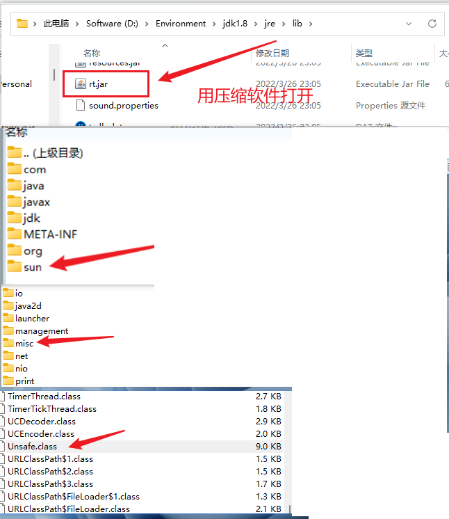

2. 变量`valueOffset`，表示该变量值在内存中的偏移地址，因为Unsafe就是根据内存偏移地址获取数据的。

```java
 public final int getAndIncrement() {
        return unsafe.getAndAddInt(this, valueOffset, 1);
    }

```

3. 变量value用volatile修饰

我们知道i++线程不安全的，那atomicInteger.getAndIncrement()
CAS的全称为Compare-And-Swap，它是一条CPU并发原语。
它的功能是判断内存某个位置的值是否为预期值，如果是则更改为新的值，这个过程是原子的。
AtomicInteger 类主要利用 CAS (compare and swap) + volatile 和 native 方法来保证原子操作，从而避免 synchronized 的高开销，执行效率大为提升。


CAS并发原语体现在JAVA语言中就是sun.misc.Unsafe类中的各个方法。调用UnSafe类中的CAS方法，JVM会帮我们实现出CAS汇编指令 。这是一种完全依赖于硬件的功能，通过它实现了原子操作。再次强调，由于CAS是一种系统原语 ，原语属于操作系统用语范畴，是由若干条指令组成的，用于完成某个功能的一个过程，并且原语的执行必须是连续的，在执行过程中不允许被中断，也就是说CAS是一条CPU的原子指令，不会造成所谓的数据不一致问题。

#### 1.10 源码分析

```java
new AtomicInteger().getAndIncrement();


//AtomicInteger.java
public final int getAndIncrement() {
        return unsafe.getAndAddInt(this, valueOffset, 1);
    }


//Unsafe.class
public final int getAndAddInt(Object var1, long var2, int var4) {
        int var5;
        do {
            var5 = this.getIntVolatile(var1, var2);
        } while(!this.compareAndSwapInt(var1, var2, var5, var5 + var4));

        return var5;
    }

//Unsafe.class
public final native boolean compareAndSwapInt(Object var1, long var2, int var4, int var5);

```

若在OpenJDK源码中查看Unsafe.java*

- 这里while体现了自旋的思想*
- 假如是ture,取反false退出循环；假如是false，取反true要继续循环。


##### 1.10.1 原理

假设线程A和线程B两个线程同时执行getAndAddInt操作（分别跑在不同CPU上）：

1 AtomicInteger里面的value原始值为3，即主内存中AtomicInteger的value为3，根据JMM模型，线程A和线程B各自持有一份值为3的value的副本分别到各自的工作内存。

2 线程A通过getIntVolatile(var1, var2)拿到value值3，这时线程A被**挂起* *。

3 线程B也通过getIntVolatile(var1, var2)方法获取到value值3，此时刚好线程B没有被挂起并执行compareAndSwapInt方法比较内存值也为3，成功修改内存值为4，线程B打完收工，一切OK。

4 这时线程A恢复，执行compareAndSwapInt方法比较，发现自己手里的值数字3和主内存的值数字4不一致，说明该值已经被其它线程抢先一步修改过了，那A线程本次修改失败，只能重新读取重新来一遍了。

5 线程A重新获取value值，因为变量value被volatile修饰，所以其它线程对它的修改，线程A总是能够看到，线程A继续执行compareAndSwapInt进行比较替换，直到成功。

##### 1.10.2 总结

你只需要记住：CAS是靠硬件实现的从而在硬件层面提升效率，最底层还是交给硬件来保证原子性和可见性

实现方式是基于硬件平台的汇编指令，在intel的CPU中(X86机器上)，使用的是汇编指令cmpxchg指令。

核心思想就是：比较要更新变量的值V和预期值E（compare），相等才会将V的值设为新值N（swap）如果不相等自旋再来。

#### 1.11 自定义原子引用

- 譬如AtomicInteger原子整型，可否有其他原子类型?比如AtomicBook、AtomicOrder*
- 可以！
- 丢入泛型中`Class AtomicReference<V>`


```java

import lombok.AllArgsConstructor;
import lombok.Getter;
import lombok.ToString;

import java.util.concurrent.atomic.AtomicReference;

@Getter
@ToString
@AllArgsConstructor
class User
{
    String userName;
    int    age;
}


public class AtomicReferenceDemo
{
    public static void main(String[] args)
    {
        User z3 = new User("z3",24);
        User li4 = new User("li4",26);
//将类型丢入泛型即可
        AtomicReference<User> atomicReferenceUser = new AtomicReference<>();

        atomicReferenceUser.set(z3);//将这个原子类设置为张三
        //张三换位李四
        System.out.println(atomicReferenceUser.compareAndSet(z3,li4)+"\t"+atomicReferenceUser.get().toString());
        //true   User(userName=li4，age=28)
        System.out.println(atomicReferenceUser.compareAndSet(z3,li4)+"\t"+atomicReferenceUser.get().toString());
        //false   User(userName=li4，age=28)
    }
}
```

#### 1.12 CAS与自旋锁，借鉴CAS思想*

CAS落地的重要应用-自旋锁

是什么
自旋锁（spinlock）

是指尝试获取锁的线程不会立即阻塞，而是采用循环的方式去尝试**获取锁* *，

当线程发现锁被占用时，会不断循环判断锁的状态，直到获取。这样的好处是减少线程上下文切换的消耗，缺点是循环会消耗CPU。

若在OpenJDK源码中查看Unsafe.java

这里while体现了自旋的思想

假如是ture,取反false退出循环；假如是false，取反true要继续循环。


#### 1.13 自己实现一个自旋锁SpinLockDemo

```properties
题目：实现一个自旋锁
自旋锁好处：循环比较获取没有类似wait的阻塞。
 
通过CAS操作完成自旋锁，A线程先进来调用myLock方法自己持有锁5秒钟，B随后进来后发现
当前有线程持有锁，不是null，所以只能通过自旋等待，直到A释放锁后B随后抢到。

```

```java
//利用cas实现自旋锁
    public class SpinLockDemo
    {
        AtomicReference<Thread> atomicReference = new AtomicReference<>();

        public void Lock()
        {
            Thread thread = Thread.currentThread();
            System.out.println(Thread.currentThread().getName()+"\t"+"-----come in");
            while(!atomicReference.compareAndSet(null,thread))//用这个循环实现自旋
            {

            }
            //如果是空的，那我们把thread放进去

        }

        public void UnLock()
        {
            Thread thread = Thread.currentThread();
            atomicReference.compareAndSet(thread,null);//把当前线程踢出去，置为null
            System.out.println(Thread.currentThread().getName()+"\t"+"-------task over,unLock.....");
        }

        public static void main(String[] args)
        {
            SpinLockDemo spinLockDemo = new SpinLockDemo();
            new Thread(() -> {
                spinLockDemo.Lock();
                try { TimeUnit.SECONDS.sleep( 5 ); } catch (InterruptedException e) { e.printStackTrace(); }
                spinLockDemo.UnLock();
            },"A").start();

            //暂停一会儿线程，保证A线程先于B线程启动并完成
            try { TimeUnit.MILLISECONDS.sleep( 500); } catch (InterruptedException e) { e.printStackTrace(); }

            new Thread(() -> {
                spinLockDemo.Lock();//B  -----come in  B只是尝试去抢锁，但是一直在自旋。

                spinLockDemo.UnLock();//A结束后 B立马抢到锁，然后马上结束了
            },"B").start();

        }
    }
    //A  -----come in
    //B  -----come in
    //A  -------task over,unLock.....
    //B  -------task over,unLock.....

```

#### 1.14 CAS缺点

##### 1.14.1  循环时间长开销很大

- `do while `如果它一直自旋会一直占用CPU时间，造成较大的开销

- 如果CAS失败，会一直进行尝试。如果CAS长时间一直不成功，可能会给CPU带来很大的开销。

##### 1.14.2 引出来ABA问题

- 什么是ABA问题

CAS会导致“ABA问题”。

CAS算法实现一个重要前提需要取出内存中某时刻的数据并在当下时刻比较并替换，那么在这个时间差类会导致数据的变化。

比如说一个线程one从内存位置V中取出A，这时候另一个线程two也从内存中取出A，并且线程two进行了一些操作将值变成了B，

然后线程two又将V位置的数据变成A，这时候线程one进行CAS操作发现内存中仍然是A，然后线程one操作成功。

尽管线程one的CAS操作成功，但是不代表这个过程就是没有问题的。


- 如何解决

`AtomicStampedReference`版本号 （注意区分前面的`Class AtomicReference<V>`）

`Class AtomicStampedReference<V> `相关API

```java
AtomicStampedReference(V initialRef, int initialStamp)
创建一个新的 AtomicStampedReference与给定的初始值。

```

```java
public boolean weakCompareAndSet(V expectedReference,//旧值
                                 V newReference,//新值
                                 int expectedStamp,//旧版本号
                                 int newStamp)//新版本号
以原子方式设置该引用和邮票给定的更新值的值，如果当前的参考是==至预期的参考，并且当前标志等于预期标志。
May fail spuriously and does not provide ordering guarantees ，所以只是很少适合替代compareAndSet 。

参数
expectedReference - 参考的预期值
newReference - 参考的新值
expectedStamp - 邮票的预期值
newStamp - 邮票的新值
结果
true如果成功
```*

```

```java
  //基本情况
    @NoArgsConstructor
    @AllArgsConstructor
    @Data
    class Book{
        private  int id;
        private String bookName;
    }

    public class AtomicStampedDemo {
        public static void main(String[] args) {
            Book javaBook = new Book(1, "javaBook");
            AtomicStampedReference<Book> stampedReference = new AtomicStampedReference<>(javaBook,1);
            System.out.println(stampedReference.getReference()+"\t"+stampedReference.getReference());
            Book mysqlBook = new Book(2, "mysqlBook");
            boolean b;
                    b= stampedReference.compareAndSet(javaBook, mysqlBook, stampedReference.getStamp(), stampedReference.getStamp() + 1);
            System.out.println(b+"\t"+stampedReference.getReference()+"\t"+stampedReference.getStamp());
        }
    }
    //Book(id=1, bookName=javaBook)  Book(id=1, bookName=javaBook)
    //true  Book(id=2, bookName=mysqlBook)  2
  

   //ABA复现（单线程情况下）

    ```java
    public class AtomicStampedDemo {
        public static void main(String[] args) {
            Book javaBook = new Book(1, "javaBook");
            AtomicStampedReference<Book> stampedReference = new AtomicStampedReference<>(javaBook,1);
            System.out.println(stampedReference.getReference()+"\t"+stampedReference.getReference());
            Book mysqlBook = new Book(2, "mysqlBook");
            boolean b;
                    b= stampedReference.compareAndSet(javaBook, mysqlBook, stampedReference.getStamp(), stampedReference.getStamp() + 1);
            System.out.println(b+"\t"+stampedReference.getReference()+"\t"+stampedReference.getStamp());
            b= stampedReference.compareAndSet(mysqlBook,javaBook, stampedReference.getStamp(), stampedReference.getStamp() + 1);
            System.out.println(b+"\t"+stampedReference.getReference()+"\t"+stampedReference.getStamp());
        }
    }
    //Book(id=1, bookName=javaBook)  Book(id=1, bookName=javaBook) --------
    //true  Book(id=2, bookName=mysqlBook)  2
    //true  Book(id=1, bookName=javaBook)  3  --------虽然1.3行内容是一样的，但是版本号不一样


   //ABA复现（多线程情况下）
    public class ABADemo
    {
        static AtomicInteger atomicInteger = new AtomicInteger(100);
        static AtomicStampedReference atomicStampedReference = new AtomicStampedReference(100,1);

        public static void main(String[] args)
        {
            new Thread(() -> {
                atomicInteger.compareAndSet(100,101);
                atomicInteger.compareAndSet(101,100);//这里 中间就有人动过了，虽然值是不变的，假如不检查版本号，CAS就直接能成功了
            },"t1").start();

            new Thread(() -> {
                //暂停一会儿线程
                try { Thread.sleep( 500 ); } catch (InterruptedException e) { e.printStackTrace(); };            
                System.out.println(atomicInteger.compareAndSet(100, 2022)+"\t"+atomicInteger.get());
            },"t2").start();
            
            //-------------------- true-2022

            //暂停一会儿线程,main彻底等待上面的ABA出现演示完成。
            try { Thread.sleep( 2000 ); } catch (InterruptedException e) { e.printStackTrace(); }

            System.out.println("============以下是ABA问题的解决=============================");

            new Thread(() -> {
                int stamp = atomicStampedReference.getStamp();
                System.out.println(Thread.currentThread().getName()+"\t 首次版本号:"+stamp);//1-----------初始获得一样的版本号
                //暂停500毫秒，保证t4线程初始化拿到的版本号和我一样,
                try { TimeUnit.MILLISECONDS.sleep( 500 ); } catch (InterruptedException e) { e.printStackTrace(); }
                atomicStampedReference.compareAndSet(100,101,atomicStampedReference.getStamp(),atomicStampedReference.getStamp()+1);
                System.out.println(Thread.currentThread().getName()+"\t 2次版本号:"+atomicStampedReference.getStamp());
                atomicStampedReference.compareAndSet(101,100,atomicStampedReference.getStamp(),atomicStampedReference.getStamp()+1);
                System.out.println(Thread.currentThread().getName()+"\t 3次版本号:"+atomicStampedReference.getStamp());
            },"t3").start();

            new Thread(() -> {
                int stamp = atomicStampedReference.getStamp();//记录一开始的版本号，并且写死
                System.out.println(Thread.currentThread().getName()+"\t 首次版本号:"+stamp);//1------------初始获得一样的版本号
                //暂停1秒钟线程，等待上面的t3线程，发生了ABA问题
                try { TimeUnit.SECONDS.sleep(1); } catch (InterruptedException e) { e.printStackTrace(); }
                boolean result = atomicStampedReference.compareAndSet(100,2019,stamp,stamp+1);//这个还是初始的版本号，但是实际上版本号被T3修改了，所以肯定会失败
                System.out.println(Thread.currentThread().getName()+"\t"+result+"\t"+atomicStampedReference.getReference());
            },"t4").start();
        }
    }
    //t3 首次版本号：1
    //t4 首次版本号：1
    //t3 2次版本号：2
    //t3 3次版本号：3
    //false 100 3   -----因为版本号实际上已经被修改了

```

### 二、原子操作值18个增强类


- 阿里巴巴Java开发手册

volatile解决多线程内存不可见问题。对于一写多读，是可以解决变量同步问题，但是如果多写，同样无法解决线程安全问题。

说明：如果是count ++ 操作，使用如下类实现：AtomicInteger count = new AtomicInteger();count.AndGet(1);如果JDK8，推荐使用LongAdder对象，比AtomicLong性能更好（减少乐观锁的重试次数）。

- 为什么说是18个呢，却只有16个类。

#### 2.1 在分类

##### 2.1.1 基本类型原子类

```java
AtomicInteger
AtomicBoolean
AtomicLong
```

##### 2.1.2 常用API

```java
public final int get()
public final int getAndSet(int new Value)
public final int getAndIncrement()
public final int getAndDecrement()
public final int getAndAdd(int delta)
public comapreAndSet(int expect,int update)//如果

```

##### 2.1.3 Case-CountDownLatch

- 案例

```java
class MyNumber{
    AtomicInteger atomicInteger = new AtomicInteger();
    public void addPlusPlus(){
        atomicInteger.getAndIncrement();
    }
}

public class AtomicIntegerDemo {
    public static final int SIZE = 50;
    public static void main(String[] args) {
        MyNumber myNumber = new MyNumber();
        for(int i = 1;i <= SIZE;i ++){
            new Thread(() -> {
                for(int j = 1;j <= 1000;j ++){
                    myNumber.addPlusPlus();
                }
            },String.valueOf(i)).start();
        }
        System.out.println(Thread.currentThread().getName()+"\t"+"result: "+myNumber.atomicInteger);
    }
}
//本来应该是50000
//1试-main  result: 39000
//2试-main  result: 40178
//?是不是我们的程序有问题？

//因为上面的50*  1000个计算还没结束，他就去get数值了
```*

   解决

```java
//方法一（不推荐，做做Demo还行）
public class AtomicIntegerDemo {
    public static final int SIZE = 50;
    public static void main(String[] args) {
        MyNumber myNumber = new MyNumber();
        for(int i = 1;i <= SIZE;i ++){
            new Thread(() -> {
                for(int j = 1;j <= 1000;j ++){
                    myNumber.addPlusPlus();
                }
            },String.valueOf(i)).start();
        }
        try {
            TimeUnit.SECONDS.sleep(2);
        } catch (InterruptedException e) {
            e.printStackTrace();
        }
        System.out.println(Thread.currentThread().getName()+"\t"+"result: "+myNumber.atomicInteger);
    }
}

//方法二-减法计数器CountDownLatch
public class AtomicIntegerDemo {
    public static final int SIZE = 50;
    public static void main(String[] args) throws InterruptedException {
        MyNumber myNumber = new MyNumber();
        CountDownLatch countDownLatch = new CountDownLatch(SIZE);
        for(int i = 1;i <= SIZE;i ++){
            new Thread(() -> {
                try {
                    for(int j = 1;j <= 1000;j ++){
                        myNumber.addPlusPlus();
                    }
                } finally {
                    countDownLatch.countDown();
                }
            },String.valueOf(i)).start();
        }
        countDownLatch.await();
        System.out.println(Thread.currentThread().getName()+"\t"+"result: "+myNumber.atomicInteger);
    }
}
//main  result: 50000

```

##### 2.1.4 数组类原子类

基本原理同上

```java
AtomicIntegerArray
AtomicLongArray
AtomicRreferenceArray
```

- 案例

```java
public class AtomicIntegerArrayDemo
{
    public static void main(String[] args)
    {
        AtomicIntegerArray atomicIntegerArray = new AtomicIntegerArray(new int[5]);//0 0 0 0 0
        //AtomicIntegerArray atomicIntegerArray = new AtomicIntegerArray(5);
        //AtomicIntegerArray atomicIntegerArray = new AtomicIntegerArray(new int[]{1,2,3,4,5});//1 2 3 4 5 

        for (int i = 0; i <atomicIntegerArray.length(); i++) {
            System.out.println(atomicIntegerArray.get(i));
        }
        System.out.println();
        System.out.println();
        System.out.println();
        int tmpInt = 0;

        tmpInt = atomicIntegerArray.getAndSet(0,1122);
        System.out.println(tmpInt+"\t"+atomicIntegerArray.get(0));
        atomicIntegerArray.getAndIncrement(1);
        atomicIntegerArray.getAndIncrement(1);
        tmpInt = atomicIntegerArray.getAndIncrement(1);
        System.out.println(tmpInt+"\t"+atomicIntegerArray.get(1));
    }
}

```

##### 2.1.5 引用类型原子类

这三个相对比较重要

```java
AtomicReference
AtomicStampedReference
AtomicMarkableReference
```*

   `AtomicReference` 可以带泛型（前面讲过）

`AtomicReference<xxx> `*

   `AtomicStampedReference` 带版本号以防CAS中的ABA问题（前面讲过）

携带版本号的引用类型原子类，可以解决ABA问题。解决修改过几次的问题。*

   `AtomicMarkableReference`类似于上面的 ，但解决**一次性**问题

构造方法`AtomicMarkableReference(V initialRef, boolean initialMark)`

原子更新带有标记位的引用类型对象

解决是否修改过，它的定义就是将`状态戳`**简化**为`true|false`，类似一次性筷子

```java
//来个案例
public class AtomicMarkableReferenceDemo {

    static AtomicMarkableReference markableReference = new AtomicMarkableReference(100,false);

    public static void main(String[] args) {
        new Thread(()->{
            boolean marked = markableReference.isMarked();
            System.out.println(Thread.currentThread().getName()+"\t"+"默认标识"+marked);
            //暂停1秒钟线程，等待后面的T2线程和我拿到一样的模式flag标识，都是false
            try {TimeUnit.SECONDS.sleep(1);} catch (InterruptedException e) {e.printStackTrace();}
            markableReference.compareAndSet(100, 1000, marked, !marked);
        },"t1").start();

        new Thread(()->{
            boolean marked = markableReference.isMarked();
            System.out.println(Thread.currentThread().getName()+"\t"+"默认标识"+marked);
            //这里停2秒，让t1先修改,然后t2试着修改
            try {TimeUnit.SECONDS.sleep(2);} catch (InterruptedException e) {e.printStackTrace();}
            boolean t2Result = markableReference.compareAndSet(100, 1000, marked, !marked);
            System.out.println(Thread.currentThread().getName()+"\t"+"t2线程result--"+t2Result);
            System.out.println(Thread.currentThread().getName()+"\t"+markableReference.isMarked());
            System.out.println(Thread.currentThread().getName()+"\t"+markableReference.getReference());

        },"t2").start();
    }
}


```

##### 2.1.6 对象的属性修改原子类

- 关键词FieldUpdater

```java
AtomicIntegerFieldUpdater//原子更新对象中int类型字段的值
AtomicLongFieldUpdater//原子更新对象中Long类型字段的值
AtomicReferenceFieldUpdater//原子更新引用类型字段的值
```


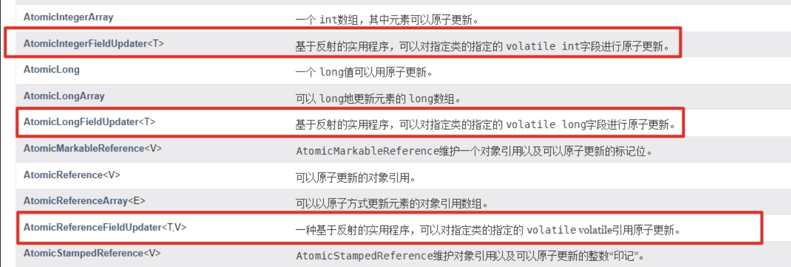


##### 2.1.7 使用目的

- 以一种现场安全带方式操作非线程安全对象内的某些字段

举个例子（它是更加细粒度的/影像某个字段，而不用锁住整个对象）


##### 2.1.8 使要求

- 更新的对象属性必须使用public volatile 修饰符。

因为对象的属性修改类型原子类都是 抽象类。所以每次使用都必须使用静态方法 newUpdater()创建一个更新器，并且需要设置想要更新的类和属性。

- 案例

`AtomicIntegerFieldUpdater`-这个针对int类型

~~~java
class BankAccount{
    String bankName = "CCB";
    public volatile int money = 0;//条件一

    //synchronized版本
//    public synchronized void add(){
//        money++;
//    }
    //AtomicIntegerFieldUpdater版本
    AtomicIntegerFieldUpdater<BankAccount> fieldUpdater =
            AtomicIntegerFieldUpdater.newUpdater(BankAccount.class,"money");//只限制了money这个字段，条件二

    public void transMoney(BankAccount bankAccount){
        fieldUpdater.getAndIncrement(bankAccount);
    }

}

public class AtomicIntegerFieldUpdaterDemo {
    public static void main(String[] args) throws InterruptedException {
        BankAccount bankAccount = new BankAccount();
        CountDownLatch countDownLatch = new CountDownLatch(10);
        for(int i = 1;i <= 10;i ++){
            new Thread(()->{
                try {
                    for(int j = 1;j <= 1000;j ++){
                       // bankAccount.add();
                        bankAccount.transMoney(bankAccount);
                    }
                } finally {
                    countDownLatch.countDown();
                }
            },String.valueOf(i)).start();
        }
        countDownLatch.await();
        System.out.println(Thread.currentThread().getName()+"\t"+"result: "+bankAccount.money);
    }
}
//main  result: 10000

```*

   `AtomicReferenceFieldUpdater`-适用度更广

```java
//比如这个案例中是针对boolean类型的
class MyVar{
    public volatile Boolean isInit = Boolean.FALSE;
    AtomicReferenceFieldUpdater<MyVar,Boolean> referenceFieldUpdater =
            AtomicReferenceFieldUpdater.newUpdater(MyVar.class,Boolean.class,"isInit");
    public void init(MyVar myVar){
        if(referenceFieldUpdater.compareAndSet(myVar,Boolean.FALSE,Boolean.TRUE)){
            System.out.println(Thread.currentThread().getName()+"\t"+"-----start init,needs 3 seconds");
            try {TimeUnit.SECONDS.sleep(3);} catch (InterruptedException e) {e.printStackTrace();}
            System.out.println(Thread.currentThread().getName()+"\t"+"-----over init");
        }else{
            System.out.println(Thread.currentThread().getName()+"\t"+"抱歉，已经有其他线程进行了初始化");
        }
    }
}

public class AtomicReferenceFieldUpdaterDemo {
    public static void main(String[] args) {
        MyVar myVar = new MyVar();
        for(int i = 1;i <= 5;i ++){
            new Thread(()->{
                myVar.init(myVar);
            },String.valueOf(i)).start();
        }
    }
}
//1  -----start init,needs 3 seconds
//5  抱歉，已经有其他线程进行了初始化
//4  抱歉，已经有其他线程进行了初始化
//2  抱歉，已经有其他线程进行了初始化
//3  抱歉，已经有其他线程进行了初始化
//1  -----over init
~~~

##### 2.1.9 面试

面试官问你：你在哪里用来volatile？

在AtomicReferenceFieldUpdater中，因为是规定好的必须由volatile修饰的

还有的话之前我们在DCL单例中，也用了volatile保证了可见性

##### 2.1.10 原子操作增强类原理深度解析

开篇的时候我们将原子类分为了红框和蓝框，这里就是蓝框的内容

```java
//这几个都是java8开始有的，前面的都是java5就有了
DoubleAccumulator
DoubleAdder
LongAccumulator
LongAdder
```


1. 热点商品点赞计算器，点赞数加加统计，不要求实时精确
2. 一个很大的List，里面都是int类型，如何实现加加，说说思路

##### 2.1.11 模拟下点赞计数器，看看性能

- 要求：热点商品点赞计算器，点赞数加加统计，不要求实时精确

看看这个LongAdder

- 看看这个LongAccumulator

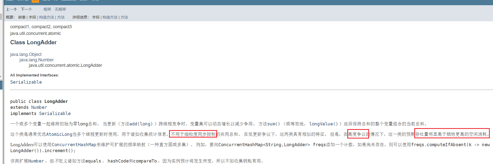


常用API


##### 2.1.12 入门讲解

LongAdder只能用来计算加法 *。且从零开始计算*

LongAccumulator提供了自定义的函数操作 (利用lambda表达式)

```java
public class LongAdderAPIDemo {
    public static void main(String[] args) {
        LongAdder longAdder = new LongAdder();

        longAdder.increment();
        longAdder.increment();
        longAdder.increment();

        System.out.println(longAdder.longValue());//3

        LongAccumulator longAccumulator = new LongAccumulator((x, y) -> x + y, 0);//lambda表达式
        longAccumulator.accumulate(1);//1
        longAccumulator.accumulate(3);//4
        System.out.println(longAccumulator.get());//4
    }
}

```

##### 2.1.13 LongAdder 高性能对比Code演示

```java
package com.yooome.springcloud.controller;

import java.util.concurrent.CountDownLatch;
import java.util.concurrent.atomic.AtomicLong;
import java.util.concurrent.atomic.LongAccumulator;
import java.util.concurrent.atomic.LongAdder;

//需求：50个线程，每个线程100w次，计算总点赞数
class ClickNumber{
    int number = 0;
    public synchronized void add1(){
        number++;
    }

    AtomicLong atomicLong =  new AtomicLong(0);
    public void add2(){
        atomicLong.incrementAndGet();
    }

    LongAdder longAdder =new LongAdder();
    public void add3(){
        longAdder.increment();
    }

    LongAccumulator longAccumulator = new  LongAccumulator((x, y) -> x + y,0);
    public void add4(){
        longAccumulator.accumulate(1);
    }
}
public class CompletableFutureAPIDemo {
    public static final int _1W = 1000000;
    public static final int threadNumber = 50;
    public static void main(String[] args) throws InterruptedException {

        ClickNumber clickNumber = new ClickNumber();
        Long startTime;
        Long endTime;
        CountDownLatch countDownLatch1 = new CountDownLatch(50);
        CountDownLatch countDownLatch2 = new CountDownLatch(50);
        CountDownLatch countDownLatch3 = new CountDownLatch(50);
        CountDownLatch countDownLatch4 = new CountDownLatch(50);

        startTime = System.currentTimeMillis();
        for(int i = 1;i <= threadNumber;i ++){
            new Thread(()->{
                try {
                    for(int j = 1;j <=_1W;j ++){
                        clickNumber.add1();
                    }
                } finally {
                    countDownLatch1.countDown();
                }
            },String.valueOf(i)).start();
        }
        countDownLatch1.await();
        endTime = System.currentTimeMillis();
        System.out.println("costTime---"+(endTime-startTime)+"毫秒"+"\t"+"synchronized---"+clickNumber.number);

        startTime = System.currentTimeMillis();
        for(int i = 1;i <= threadNumber;i ++){
            new Thread(()->{
                try {
                    for(int j = 1;j <=_1W;j ++){
                        clickNumber.add2();
                    }
                } finally {
                    countDownLatch2.countDown();
                }
            },String.valueOf(i)).start();
        }
        countDownLatch2.await();
        endTime = System.currentTimeMillis();
        System.out.println("costTime---"+(endTime-startTime)+"毫秒"+"\t"+"atomicLong---"+clickNumber.atomicLong);

        startTime = System.currentTimeMillis();
        for(int i = 1;i <= threadNumber;i++){
            new Thread(()->{
                try {
                    for(int j = 1;j <=_1W;j++){
                        clickNumber.add3();
                    }
                } finally {
                    countDownLatch3.countDown();
                }
            },String.valueOf(i)).start();
        }
        countDownLatch3.await();
        endTime = System.currentTimeMillis();
        System.out.println("costTime---"+(endTime-startTime)+"毫秒"+"\t"+"LongAdder---"+clickNumber.longAdder.sum());

        startTime = System.currentTimeMillis();
        for(int i = 1;i <= threadNumber;i ++){
            new Thread(()->{
                try {
                    for(int j = 1;j <=_1W;j++){
                        clickNumber.add4();
                    }
                } finally {
                    countDownLatch4.countDown();
                }
            },String.valueOf(i)).start();
        }
        countDownLatch4.await();
        endTime = System.currentTimeMillis();
        System.out.println("costTime---"+(endTime-startTime)+"毫秒"+"\t"+"LongAccumulator---"+clickNumber.longAccumulator.longValue());
    }
//    costTime---1411毫秒	synchronized---50000000
//    costTime---1454毫秒	atomicLong---50000000
//    costTime---104毫秒	LongAdder---50000000
//    costTime---227毫秒	LongAccumulator---50000000
}//印证了阿里卡法手册中说的 【如果是JDK8，推荐使用LongAdder对象，比AtomicLong性能更好（减少乐观锁的重试次数）】
```

##### 2.1.14 源码、原理分析

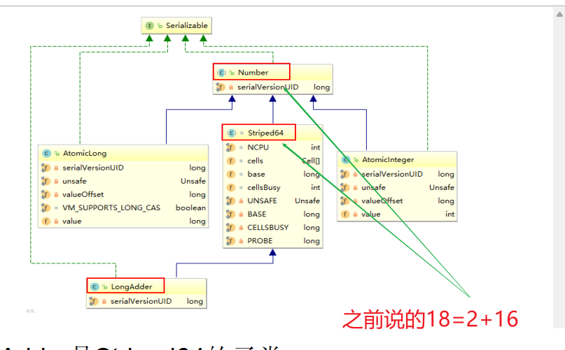

LongAdder是Striped64的子类

```java
public class LongAdder extends Striped64 implements Serializable {
    private static final long serialVersionUID = 7249069246863182397L;
 //---------------------------
 abstract class Striped64 extends Number {

```

##### 2.1.15 原理(LongAdder为什么这么快)


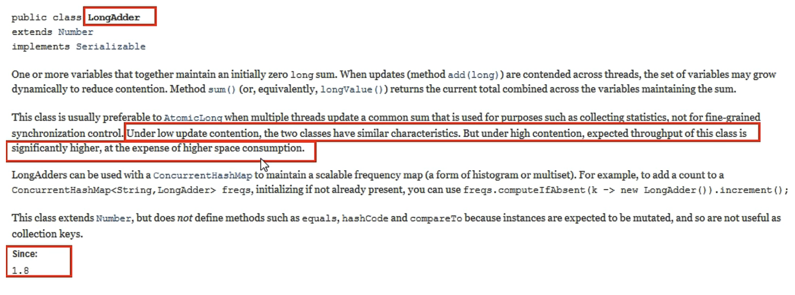

##### 2.1.16 LongAdder是Striped64的子类

Striped64

- 重要的成员函数

```java
//Number of CPUS, to place bound on table size       
// CPU数量，即cells数组的最大长度 
static final int NCPU = Runtime.getRuntime().availableProcessors();


//Table of cells. When non-null, size is a power of 2.
//单元格数组|cells数组，为2的幂，2,4,8,16.....，方便以后位运算
transient volatile Cell[] cells;

//基础value值，当并发较低时，只累加该值主要用于没有竞争的情况，通过CAS更新。
//Base value, used mainly when there is no contention, but also as
//a fallback during table initialization races. Updated via CAS.
transient volatile long base;

//创建或者扩容Cells数组时使用的自旋锁变量调整单元格大小（扩容），创建单元格时使用的锁。
//Spinlock (locked via CAS) used when resizing and/or creating Cells. 
transient volatile int cellsBusy;
```

最重要的两个


- Striperd64中一些变量或者方法的定义


- Cell

是java.util.concurrent.atomic下Striped64的一个静态内部类

```java
@sun.misc.Contended static final class Cell {
        volatile long value;
        Cell(long x) { value = x; }
        final boolean cas(long cmp, long val) {
            return UNSAFE.compareAndSwapLong(this, valueOffset, cmp, val);
        }

        // Unsafe mechanics
        private static final sun.misc.Unsafe UNSAFE;
        private static final long valueOffset;
        static {
            try {
                UNSAFE = sun.misc.Unsafe.getUnsafe();
                Class<?> ak = Cell.class;
                valueOffset = UNSAFE.objectFieldOffset
                    (ak.getDeclaredField("value"));
            } catch (Exception e) {
                throw new Error(e);
            }
        }
    }
```

##### 2.1.17 LongAdder为什么这么快

其实在小并发下情况差不多；但在高并发情况下，在AtomicLong中，等待的线程会不停的自旋，导致效率比较低；而LongAdder用cell[]分了几个块出来，最后统计总的结果值（base+所有的cell值），分散热点。

举个形象的例子，火车站买火车票，AtomicLong 只要一个窗口，其他人都在排队；而LongAdder 利用cell开了多个卖票窗口，所以效率高了很多。
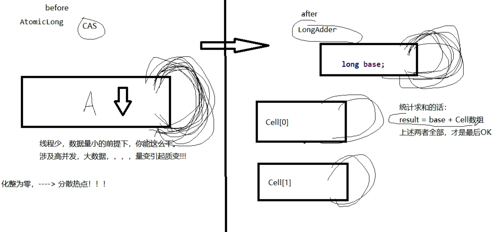

一句话

LongAdder的基本思路就是分散热点 ，将value值分散到一个Cell数组中，不同线程会命中到数组的不同槽中，各个线程只对自己槽中的那个值进行CAS操作，这样热点就被分散了，冲突的概率就小很多。如果要获取真正的long值，只要将各个槽中的变量值累加返回。

sum()会将所有Cell数组中的value和base累加作为返回值，核心的思想就是将之前AtomicLong一个value的更新压力分散到多个value中去，从而降级更新热点 。


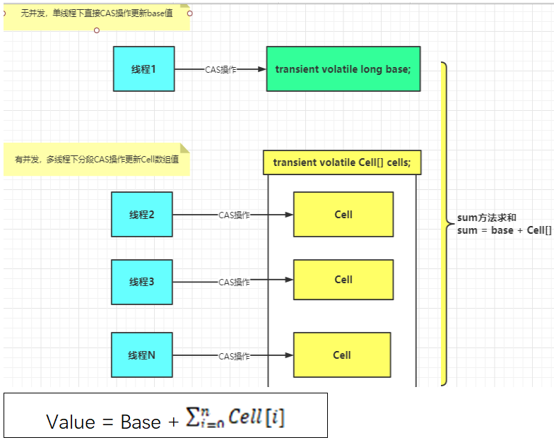


- 数学表达

内部有一个base变量，一个Cell[]数组。

base变量：非竞态条件下，直接累加到该变量上

Cell[]数组：竞态条件下，累加各个线程自己的槽Cell[i]中

##### 2.1.18 源码解读深度分析

**小总结**

LongAdder在无竞争的情况，跟AtomicLong一样，对同一个base进行操作，当出现竞争关系时则是采用化整为零的做法，从空间换时间，用一个数组 \ \ ，将一个value拆分进这个数组cells。多个线程需要同时对value进行操作时候，可以对线程id进行hash得到hash值，再根据hash值映射到这个数组cells的某个下标，再对该下标所对应的值进行自增操作。当所有线程操作完毕，将数组cells的所有值和无竞争值base都加起来作为最终结果。


##### 2.1.21 LongAdder.increment()

- 1-add(1L)

```java
public class LongAdder extends Striped64 implements Serializable {
    private static final long serialVersionUID = 7249069246863182397L;

    /***     
 Creates a new adder with initial sum of zero.*     
/
    public LongAdder() {
    }

    /***     
 Adds the given value.**     

      @param x the value to add*     
/
    public void add(long x) {
        Cell[] as; long b, v; int m; Cell a;
        if ((as = cells) != null || !casBase(b = base, b + x)) {
            boolean uncontended = true;
            if (as == null || (m = as.length - 1) < 0 ||
                (a = as[getProbe() & m]) == null ||
                !(uncontended = a.cas(v = a.value, v + x)))
                longAccumulate(x, null, uncontended);
        }
    }
    //真正干活的是longAccumulate
    //as表示cells引用
    //b表示获取的base值
    //v表示期望值
    //m表示cells数组的长度
    //a表示当前线程命中的cell单元格
   
```

uncontended代表没有冲突。

我们点进这个casBase发现他也是个CAS

```java
final boolean casBase(long cmp, long val) {
        return UNSAFE.compareAndSwapLong(this, BASE, cmp, val);
    }

```

一开始竞争小的时候CAS能成功，也就是casBase能成功，然后cells也是空的，所以不会进到循环


竞争大的时候，他会`Cell[] rs = new Cell[2];` 新建两个cell, 此时≠ null ，条件满足了，进入循环。

然后这里还有一层循环，这里是多个if并排

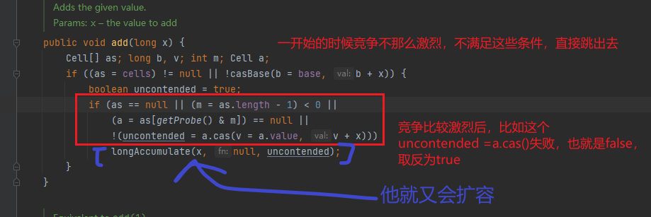

> 总结一下
> 1.最初无竞争时只更新base;
> 2.如果更新base失败后，首次新建一个Cell[]数组
> 3.当多个线程竞争同一个Cell比价激烈时，可能就要利用`longAccumulate`对Cell[]扩容。

> 再次小总结

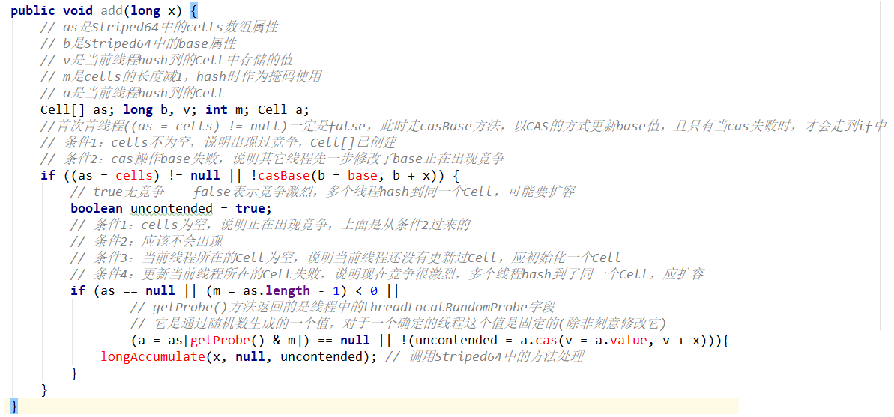


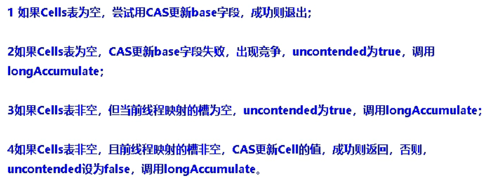

- 2-longAccumulate

```java
    final void longAccumulate(long x, LongBinaryOperator fn,
                              boolean wasUncontended) {
        int h;
        if ((h = getProbe()) == 0) {
            ThreadLocalRandom.current(); // force initialization
            h = getProbe();
            wasUncontended = true;
        }
        boolean collide = false;                // True if last slot nonempty
        for (;;) {
            Cell[] as; Cell a; int n; long v;
            if ((as = cells) != null && (n = as.length) > 0) {
            //这里是③ Cell数组不再为空且可能存在Cell数组扩容
                if ((a = as[(n - 1) & h]) == null) {
                    if (cellsBusy == 0) {       // Try to attach new Cell
                        Cell r = new Cell(x);   // Optimistically create
                        if (cellsBusy == 0 && casCellsBusy()) {
                            boolean created = false;
                            try {               // Recheck under lock
                                Cell[] rs; int m, j;
                                if ((rs = cells) != null &&
                                    (m = rs.length) > 0 &&
                                    rs[j = (m - 1) & h] == null) {
                                    rs[j] = r;
                                    created = true;
                                }
                            } finally {
                                cellsBusy = 0;
                            }
                            if (created)
                                break;
                            continue;           // Slot is now non-empty
                        }
                    }
                    collide = false;
                }
                else if (!wasUncontended)       // CAS already known to fail
                    wasUncontended = true;      // Continue after rehash
                else if (a.cas(v = a.value, ((fn == null) ? v + x :
                                             fn.applyAsLong(v, x))))
                    break;
                else if (n >= NCPU || cells != as)//不能超过cpu核数
                    collide = false;            // At max size or stale
                else if (!collide)
                    collide = true;
                else if (cellsBusy == 0 && casCellsBusy()) {
                    try {
                        if (cells == as) {      // Expand table unless stale
                            Cell[] rs = new Cell[n << 1];//扩容-左移一位，相当于x2
                            for (int i = 0; i < n; ++i)
                                rs[i] = as[i];
                            cells = rs;
                        }
                    } finally {
                        cellsBusy = 0;
                    }
                    collide = false;
                    continue;                   // Retry with expanded table
                }
                h = advanceProbe(h);
            }
            else if (cellsBusy == 0 && cells == as && casCellsBusy()) {
            //这里是①初始化
                boolean init = false;
                try {                           // Initialize table
                    if (cells == as) {
                        Cell[] rs = new Cell[2];
                        rs[h & 1] = new Cell(x);
                        cells = rs;
                        init = true;
//------可以先看这里，进行了初始化，长度是2
//------cells数组，为2的幂，2，4，8，16，方便以后位运算
                    }
                } finally {
                    cellsBusy = 0;
                }
                if (init)
                    break;
            }
            else if (casBase(v = base, ((fn == null) ? v + x :
                                        fn.applyAsLong(v, x))))//这里是②兜底
                break;                          // Fall back on using base
        }
    }

```

- LongAccumulate入参说明


- Striped64中一些变量或者方法的定义


- 步骤
- 我们先讲这个`(a = as[getProbe() & m])`里的probe，这里其实拿了hash值，通过hash值知道我们去到哪个cell槽。

```java
static final int getProbe() {
        return UNSAFE.getInt(Thread.currentThread(), PROBE);
    }

//其实就是得到了线程的Hash值
```

所以最前面的这一段就像是新员工入职获取工号（hash值）一样


- 总纲


上述代码首先给当前线程分配一个hash值，然后进入一个for(;;)自旋，这个自旋分为三个分支：
CASE1：Cell[]数组已经初始化
CASE2：Cell[]数组未初始化(首次新建)
CASE3：Cell[]数组正在初始化中

- 计算

1. 刚刚要初始化Cell[]数组（首次新建）


如果上面条件都执行成功就会执行数组的初始化及赋值操作， Cell[] rs = new Cell[2]表示数组的长度为2，
rs[h & 1] = new Cell(x) 表示创建一个新的Cell元素，value是x值，默认为1。
h & 1类似于我们之前HashMap常用到的计算散列桶index的算法，通常都是hash & (table.len - 1)。同hashmap一个意思。

- 兜底

多个线程尝试CAS修改失败的线程会走到这个分支

```java
//排在最后面的
else if (casBase(v = base, ((fn == null) ? v + x :
                                        fn.applyAsLong(v, x))))
//该分支实现直接操作base基数，将值累加到base上，也即其它线程正在初始化，多个线程正在更新base的值。
```

- Cell数组不再为空且可能存在Cell数组扩容

多个线程同时命中一个cell的竞争,这个是**最复杂**的部分

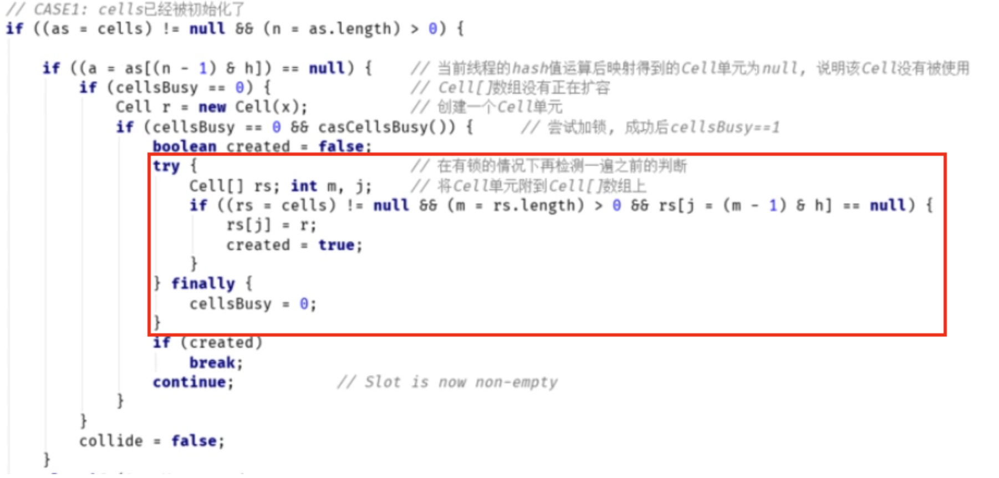

上面代码判断当前线程hash后指向的数据位置元素是否为空，
如果为空则将Cell数据放入数组中，跳出循环。
如果不空则继续循环。

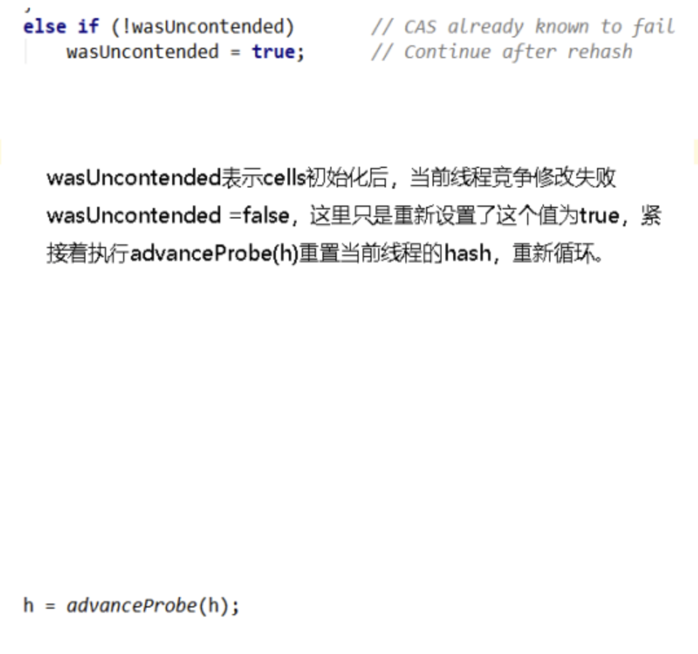

- 3


说明当前线程对应的数组中有了数据，也重置过hash值，
这时通过CAS操作尝试对当前数中的value值进行累加x操作，x默认为1，如果CAS成功则直接跳出循环。


- 4


- 5

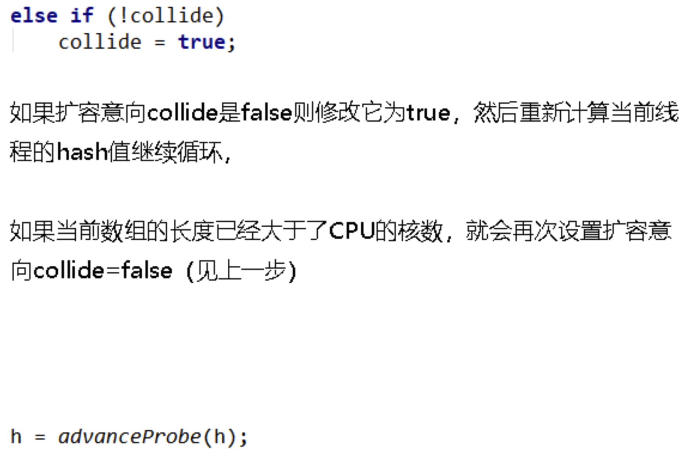

- 6

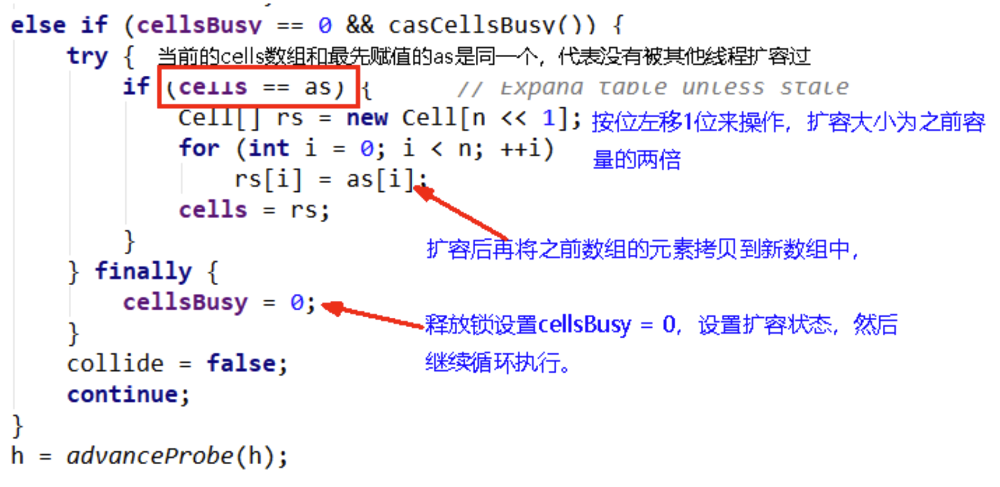

- 以上六步总结

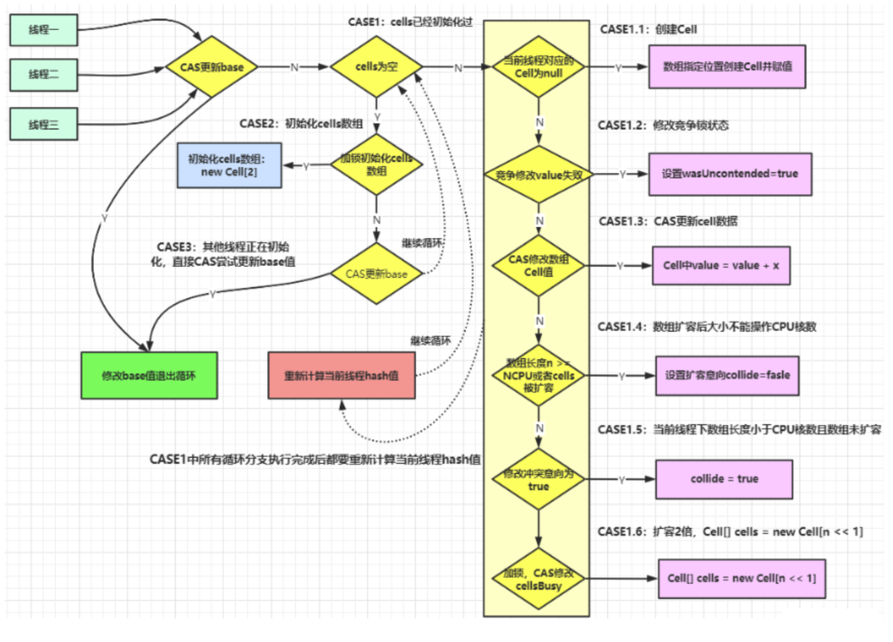

- sum()

```java
//LongAdder.java
public long sum() {
        Cell[] as = cells; Cell a;
        long sum = base;
        if (as != null) {
            for (int i = 0; i < as.length; ++i) {
                if ((a = as[i]) != null)
                    sum += a.value;
            }
        }
        return sum;
    }

```

sum()会将所有Cell数组中的**value和base累加**作为返回值。
核心的思想就是将之前AtomicLong一个value的更新压力分散到多个value中去，*从而降级更新热点* ()

> 为啥在并发情况下sum的值不精确？


sum执行时，并没有限制对base和cells的更新(一句要命的话)。所以LongAdder不是强一致性的，它是最终一致性的。

首先，最终返回的sum局部变量，初始被复制为base，而最终返回时，很可能base已经被更新了 ，而此时局部变量sum不会更新，造成不一致。
其次，这里对cell的读取也无法保证是最后一次写入的值。所以，sum方法在没有并发的情况下，可以获得正确的结果。

##### 2.1.22 使用总结

- AtomicLong
  线程安全，可允许一些性能损耗，要求高精度时可使用

​		保证精度，性能代价

​		AtomicLong是多个线程针对单个热点值value进行原子操作

- LongAdder
  当需要在高并发下有较好的性能表现，且对值的精确度要求不高时，可以使用

​		保证性能，精度代价

​		LongAdder是每个线程拥有自己的槽，各个线程一般只对自己槽中的那个值进行CAS操作

- 小总结

  AtomicLong

  原理

  CAS+自旋

incrementAndGet

- 场景
  低并发下的全局计算

​		AtomicLong能保证并发情况下计数的准确性，其内部通过CAS来解决并发安全性的问题

- 缺陷
  高并发后性能急剧下降

why?AtomicLong的自旋会称为瓶颈（N个线程CAS操作修改线程的值，每次只有一个成功过，其它N - 1失败，失败的不停的自旋直到成功，这样大量失败自旋的情况，一下子cpu就打高了。）

- LongAdder
  原理
  CAS+Base+Cell数组分散

- 空间换时间并分散了热点数据

- 场景
  高并发的全局计算

- 缺陷
  sum求和后还有计算线程修改结果的话，最后结果不够准确


