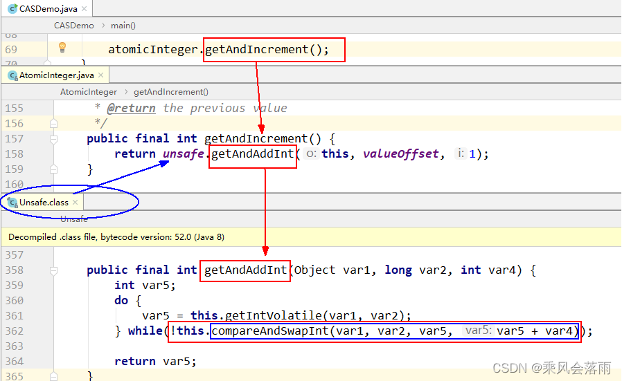

### CAS

### 一、原子类

#### 1.1 何为原子类

即为java.util.concurrent.atomic包下的所有相关类和API


#### 1.2 没有CAS之前

- 多线程环境**不使用**原子类保证线程安全i++（基本数据类型）

常用`synchronized`锁，但是它比较重 ，牵扯到了用户态和内核态的切换,效率不高。

```java
public class T3
{
    volatile int number = 0;
    //读取
    public int getNumber()
    {
        return number;
    }
    //写入加锁保证原子性
    public synchronized void setNumber()
    {
        number++;
    }
}
```

#### 1.3 使用CAS之后

- 多线程情况下**使用原子类**保证线程安全（基本数据类型）

```java
public class T3
{
    volatile int number = 0;
    //读取
    public int getNumber()
    {
        return number;
    }
    //写入加锁保证原子性
    public synchronized void setNumber()
    {
        number++;
    }
    //=================================
    //下面是新版本
    //=================================
    AtomicInteger atomicInteger = new AtomicInteger();

    public int getAtomicInteger()
    {
        return atomicInteger.get();
    }

    public void setAtomicInteger()
    {
        atomicInteger.getAndIncrement();//先读再加
    }
}

```

#### 1.4 CAS是什么

**compare and swap **的缩写，中文翻译成比较并交换,实现并发算法时常用到的一种技术。它包含三个操作数——**内存位置**、**预期原值**及**更新值**。

- 执行CAS操作的时候，将内存位置的值与预期原值比较：

- 如果相匹配，那么处理器会自动将该位置值更新为新值，

- 如果不匹配，处理器不做任何操作，多个线程同时执行CAS操作只有一个会成功。
  

#### 1.5 CAS原理

CAS （CompareAndSwap）
CAS有3个操作数，位置内存值`V`，旧的预期值`A`，要修改的更新值`B`。
当且仅当旧的预期值`A`和内存值`V`**相同**时，将内存值`V`**修改**为`B`，否则什么都不做或重来

当它重来重试的这种行为成为—**自旋！**

- eg

线程A读取了值为5，想要更新为6，想要将值写回的时候发现线程B和C都进行了操作，已经变成了7，这个时候A不能成功，可能会发生**自旋**


#### 1.6 CASDemo代码

多线程情况下**使用原子类**保证线程安全（基本数据类型）

```java
public class CompletableFutureAPIDemo {
    public static void main(String[] args) throws ExecutionException, InterruptedException {

        AtomicInteger atomicInteger = new AtomicInteger(5);

        System.out.println(atomicInteger.compareAndSet(5, 2020)+"\t"+atomicInteger.get());
        System.out.println(atomicInteger.compareAndSet(5, 1024)+"\t"+atomicInteger.get());


        true	2020
        false	2020
    }
}
```

#### 1.7 硬件级别保证

对总线加锁，效率比synchronized效率高。

```properties
CAS是JDK提供的非阻塞原子性操作，它通过硬件保证了比较-更新的原子性。

它是非阻塞的且自身原子性，也就是说这玩意效率更高且通过硬件保证，说明这玩意更可靠。

CAS是一条CPU的**原子指令* *（`cmpxchg指令`），不会造成所谓的数据不一致问题，`Unsafe`提供的`CAS方法`（如compareAndSwapXXX）底层实现即为CPU指令cmpxchg。

执行cmpxchg指令的时候，会判断当前系统是否为多核系统，如果是就**给总线加锁* *，**只有一个**线程会对总线加锁**成功* *，加锁成功之后会执行cas操作，也就是说CAS的原子性实际上是**CPU实现的* *， 其实在这一点上还是有排他锁的，只是比起用synchronized， 这里的排他时间要短的多， 所以在多线程情况下性能会比较好

```

#### 1.8 源码分析

```java
//compareAndSet
//发现它调用了Unsafe类
public final boolean compareAndSet(int expect, int update) {
        return unsafe.compareAndSwapInt(this, valueOffset, expect, update);
    }

//compareAndSwapInt
//发现它调用了native方法
public final native boolean compareAndSwapInt(Object var1, long var2, int var4, int var5);

```

```java
//这三个方法是类似的
public final native boolean compareAndSwapObject(Object var1, long var2, Object var4, Object var5);

public final native boolean compareAndSwapInt(Object var1, long var2, int var4, int var5);

public final native boolean compareAndSwapLong(Object var1, long var2, long var4, long var6);

```

上面三个方法都是类似的，主要对4个参数做一下说明。
var1：表示要操作的对象
var2：表示要操作对象中属性地址的偏移量
var4：表示需要修改数据的期望的值
var5/var6：表示需要修改为的新值

> 引出来一个问题：Unsafe类是什么？

#### 1.9 CAS底层原理？如果知道，谈谈你对UnSafe的理解

```java
public class AtomicInteger extends Number implements java.io.Serializable {
    private static final long serialVersionUID = 6214790243416807050L;

    // setup to use Unsafe.compareAndSwapInt for updates
    private static final Unsafe unsafe = Unsafe.getUnsafe();
    static {
        try {
            valueOffset = unsafe.objectFieldOffset
                (AtomicInteger.class.getDeclaredField("value"));
        } catch (Exception ex) { throw new Error(ex); }
    }

    private volatile int value;//保证变量修改后多线程之间的可见性
    }

```

1. Unsafe

CAS这个理念 ，落地就是Unsafe类

它是CAS的核心类，由于Java方法无法直接访问底层系统，需要通过本地（native）方法来访问，Unsafe相当于一个后门 ，基于该类可以直接操作特定内存\ 的数据 。Unsafe类存在于sun.misc包中，其内部方法操作可以像C的指针一样直接操作内存，因为Java中CAS操作的执行依赖于Unsafe类的方法。

注意Unsafe类中的所有方法都是 \ 修饰的，也就是说Unsafe类中的方法都直接调用操作系统底层资源执行相应任务 。

打开rt.jar包（最基本的包）


2. 变量`valueOffset`，表示该变量值在内存中的偏移地址，因为Unsafe就是根据内存偏移地址获取数据的。

```java
 public final int getAndIncrement() {
        return unsafe.getAndAddInt(this, valueOffset, 1);
    }

```

3. 变量value用volatile修饰

我们知道i++线程不安全的，那atomicInteger.getAndIncrement()
CAS的全称为Compare-And-Swap，它是一条CPU并发原语。
它的功能是判断内存某个位置的值是否为预期值，如果是则更改为新的值，这个过程是原子的。
AtomicInteger 类主要利用 CAS (compare and swap) + volatile 和 native 方法来保证原子操作，从而避免 synchronized 的高开销，执行效率大为提升。



CAS并发原语体现在JAVA语言中就是sun.misc.Unsafe类中的各个方法。调用UnSafe类中的CAS方法，JVM会帮我们实现出CAS汇编指令 。这是一种完全依赖于硬件的功能，通过它实现了原子操作。再次强调，由于CAS是一种系统原语 ，原语属于操作系统用语范畴，是由若干条指令组成的，用于完成某个功能的一个过程，并且原语的执行必须是连续的，在执行过程中不允许被中断，也就是说CAS是一条CPU的原子指令，不会造成所谓的数据不一致问题。

#### 1.10 源码分析

```java
new AtomicInteger().getAndIncrement();


//AtomicInteger.java
public final int getAndIncrement() {
        return unsafe.getAndAddInt(this, valueOffset, 1);
    }


//Unsafe.class
public final int getAndAddInt(Object var1, long var2, int var4) {
        int var5;
        do {
            var5 = this.getIntVolatile(var1, var2);
        } while(!this.compareAndSwapInt(var1, var2, var5, var5 + var4));

        return var5;
    }

//Unsafe.class
public final native boolean compareAndSwapInt(Object var1, long var2, int var4, int var5);

```

若在OpenJDK源码中查看Unsafe.java*

- 这里while体现了自旋的思想*
- 假如是ture,取反false退出循环；假如是false，取反true要继续循环。


##### 1.10.1 原理

假设线程A和线程B两个线程同时执行getAndAddInt操作（分别跑在不同CPU上）：

1 AtomicInteger里面的value原始值为3，即主内存中AtomicInteger的value为3，根据JMM模型，线程A和线程B各自持有一份值为3的value的副本分别到各自的工作内存。

2 线程A通过getIntVolatile(var1, var2)拿到value值3，这时线程A被**挂起* *。

3 线程B也通过getIntVolatile(var1, var2)方法获取到value值3，此时刚好线程B没有被挂起并执行compareAndSwapInt方法比较内存值也为3，成功修改内存值为4，线程B打完收工，一切OK。

4 这时线程A恢复，执行compareAndSwapInt方法比较，发现自己手里的值数字3和主内存的值数字4不一致，说明该值已经被其它线程抢先一步修改过了，那A线程本次修改失败，只能重新读取重新来一遍了。

5 线程A重新获取value值，因为变量value被volatile修饰，所以其它线程对它的修改，线程A总是能够看到，线程A继续执行compareAndSwapInt进行比较替换，直到成功。

##### 1.10.2 总结

你只需要记住：CAS是靠硬件实现的从而在硬件层面提升效率，最底层还是交给硬件来保证原子性和可见性

实现方式是基于硬件平台的汇编指令，在intel的CPU中(X86机器上)，使用的是汇编指令cmpxchg指令。

核心思想就是：比较要更新变量的值V和预期值E（compare），相等才会将V的值设为新值N（swap）如果不相等自旋再来。

#### 1.11 自定义原子引用

- 譬如AtomicInteger原子整型，可否有其他原子类型?比如AtomicBook、AtomicOrder*
- 可以！
- 丢入泛型中`Class AtomicReference<V>`


```java

import lombok.AllArgsConstructor;
import lombok.Getter;
import lombok.ToString;

import java.util.concurrent.atomic.AtomicReference;

@Getter
@ToString
@AllArgsConstructor
class User
{
    String userName;
    int    age;
}


public class AtomicReferenceDemo
{
    public static void main(String[] args)
    {
        User z3 = new User("z3",24);
        User li4 = new User("li4",26);
//将类型丢入泛型即可
        AtomicReference<User> atomicReferenceUser = new AtomicReference<>();

        atomicReferenceUser.set(z3);//将这个原子类设置为张三
        //张三换位李四
        System.out.println(atomicReferenceUser.compareAndSet(z3,li4)+"\t"+atomicReferenceUser.get().toString());
        //true   User(userName=li4，age=28)
        System.out.println(atomicReferenceUser.compareAndSet(z3,li4)+"\t"+atomicReferenceUser.get().toString());
        //false   User(userName=li4，age=28)
    }
}
```

#### 1.12 CAS与自旋锁，借鉴CAS思想*

CAS落地的重要应用-自旋锁

是什么
自旋锁（spinlock）

是指尝试获取锁的线程不会立即阻塞，而是采用循环的方式去尝试**获取锁* *，

当线程发现锁被占用时，会不断循环判断锁的状态，直到获取。这样的好处是减少线程上下文切换的消耗，缺点是循环会消耗CPU。

若在OpenJDK源码中查看Unsafe.java

这里while体现了自旋的思想

假如是ture,取反false退出循环；假如是false，取反true要继续循环。


#### 1.13 自己实现一个自旋锁SpinLockDemo

```properties
题目：实现一个自旋锁
自旋锁好处：循环比较获取没有类似wait的阻塞。
 
通过CAS操作完成自旋锁，A线程先进来调用myLock方法自己持有锁5秒钟，B随后进来后发现
当前有线程持有锁，不是null，所以只能通过自旋等待，直到A释放锁后B随后抢到。

```

```java
//利用cas实现自旋锁
    public class SpinLockDemo
    {
        AtomicReference<Thread> atomicReference = new AtomicReference<>();

        public void Lock()
        {
            Thread thread = Thread.currentThread();
            System.out.println(Thread.currentThread().getName()+"\t"+"-----come in");
            while(!atomicReference.compareAndSet(null,thread))//用这个循环实现自旋
            {

            }
            //如果是空的，那我们把thread放进去

        }

        public void UnLock()
        {
            Thread thread = Thread.currentThread();
            atomicReference.compareAndSet(thread,null);//把当前线程踢出去，置为null
            System.out.println(Thread.currentThread().getName()+"\t"+"-------task over,unLock.....");
        }

        public static void main(String[] args)
        {
            SpinLockDemo spinLockDemo = new SpinLockDemo();
            new Thread(() -> {
                spinLockDemo.Lock();
                try { TimeUnit.SECONDS.sleep( 5 ); } catch (InterruptedException e) { e.printStackTrace(); }
                spinLockDemo.UnLock();
            },"A").start();

            //暂停一会儿线程，保证A线程先于B线程启动并完成
            try { TimeUnit.MILLISECONDS.sleep( 500); } catch (InterruptedException e) { e.printStackTrace(); }

            new Thread(() -> {
                spinLockDemo.Lock();//B  -----come in  B只是尝试去抢锁，但是一直在自旋。

                spinLockDemo.UnLock();//A结束后 B立马抢到锁，然后马上结束了
            },"B").start();

        }
    }
    //A  -----come in
    //B  -----come in
    //A  -------task over,unLock.....
    //B  -------task over,unLock.....

```

#### 1.14 CAS缺点

##### 1.14.1  循环时间长开销很大

- `do while `如果它一直自旋会一直占用CPU时间，造成较大的开销

- 如果CAS失败，会一直进行尝试。如果CAS长时间一直不成功，可能会给CPU带来很大的开销。

##### 1.14.2 引出来ABA问题

- 什么是ABA问题

CAS会导致“ABA问题”。

CAS算法实现一个重要前提需要取出内存中某时刻的数据并在当下时刻比较并替换，那么在这个时间差类会导致数据的变化。

比如说一个线程one从内存位置V中取出A，这时候另一个线程two也从内存中取出A，并且线程two进行了一些操作将值变成了B，

然后线程two又将V位置的数据变成A，这时候线程one进行CAS操作发现内存中仍然是A，然后线程one操作成功。

尽管线程one的CAS操作成功，但是不代表这个过程就是没有问题的。


- 如何解决

`AtomicStampedReference`版本号 （注意区分前面的`Class AtomicReference<V>`）

`Class AtomicStampedReference<V> `相关API

```java
AtomicStampedReference(V initialRef, int initialStamp)
创建一个新的 AtomicStampedReference与给定的初始值。

```

```java
public boolean weakCompareAndSet(V expectedReference,//旧值
                                 V newReference,//新值
                                 int expectedStamp,//旧版本号
                                 int newStamp)//新版本号
以原子方式设置该引用和邮票给定的更新值的值，如果当前的参考是==至预期的参考，并且当前标志等于预期标志。
May fail spuriously and does not provide ordering guarantees ，所以只是很少适合替代compareAndSet 。

参数
expectedReference - 参考的预期值
newReference - 参考的新值
expectedStamp - 邮票的预期值
newStamp - 邮票的新值
结果
true如果成功
```*

```

```java
  //基本情况
    @NoArgsConstructor
    @AllArgsConstructor
    @Data
    class Book{
        private  int id;
        private String bookName;
    }

    public class AtomicStampedDemo {
        public static void main(String[] args) {
            Book javaBook = new Book(1, "javaBook");
            AtomicStampedReference<Book> stampedReference = new AtomicStampedReference<>(javaBook,1);
            System.out.println(stampedReference.getReference()+"\t"+stampedReference.getReference());
            Book mysqlBook = new Book(2, "mysqlBook");
            boolean b;
                    b= stampedReference.compareAndSet(javaBook, mysqlBook, stampedReference.getStamp(), stampedReference.getStamp() + 1);
            System.out.println(b+"\t"+stampedReference.getReference()+"\t"+stampedReference.getStamp());
        }
    }
    //Book(id=1, bookName=javaBook)  Book(id=1, bookName=javaBook)
    //true  Book(id=2, bookName=mysqlBook)  2
  

   //ABA复现（单线程情况下）

    ```java
    public class AtomicStampedDemo {
        public static void main(String[] args) {
            Book javaBook = new Book(1, "javaBook");
            AtomicStampedReference<Book> stampedReference = new AtomicStampedReference<>(javaBook,1);
            System.out.println(stampedReference.getReference()+"\t"+stampedReference.getReference());
            Book mysqlBook = new Book(2, "mysqlBook");
            boolean b;
                    b= stampedReference.compareAndSet(javaBook, mysqlBook, stampedReference.getStamp(), stampedReference.getStamp() + 1);
            System.out.println(b+"\t"+stampedReference.getReference()+"\t"+stampedReference.getStamp());
            b= stampedReference.compareAndSet(mysqlBook,javaBook, stampedReference.getStamp(), stampedReference.getStamp() + 1);
            System.out.println(b+"\t"+stampedReference.getReference()+"\t"+stampedReference.getStamp());
        }
    }
    //Book(id=1, bookName=javaBook)  Book(id=1, bookName=javaBook) --------
    //true  Book(id=2, bookName=mysqlBook)  2
    //true  Book(id=1, bookName=javaBook)  3  --------虽然1.3行内容是一样的，但是版本号不一样


   //ABA复现（多线程情况下）
    public class ABADemo
    {
        static AtomicInteger atomicInteger = new AtomicInteger(100);
        static AtomicStampedReference atomicStampedReference = new AtomicStampedReference(100,1);

        public static void main(String[] args)
        {
            new Thread(() -> {
                atomicInteger.compareAndSet(100,101);
                atomicInteger.compareAndSet(101,100);//这里 中间就有人动过了，虽然值是不变的，假如不检查版本号，CAS就直接能成功了
            },"t1").start();

            new Thread(() -> {
                //暂停一会儿线程
                try { Thread.sleep( 500 ); } catch (InterruptedException e) { e.printStackTrace(); };            
                System.out.println(atomicInteger.compareAndSet(100, 2022)+"\t"+atomicInteger.get());
            },"t2").start();
            
            //-------------------- true-2022

            //暂停一会儿线程,main彻底等待上面的ABA出现演示完成。
            try { Thread.sleep( 2000 ); } catch (InterruptedException e) { e.printStackTrace(); }

            System.out.println("============以下是ABA问题的解决=============================");

            new Thread(() -> {
                int stamp = atomicStampedReference.getStamp();
                System.out.println(Thread.currentThread().getName()+"\t 首次版本号:"+stamp);//1-----------初始获得一样的版本号
                //暂停500毫秒，保证t4线程初始化拿到的版本号和我一样,
                try { TimeUnit.MILLISECONDS.sleep( 500 ); } catch (InterruptedException e) { e.printStackTrace(); }
                atomicStampedReference.compareAndSet(100,101,atomicStampedReference.getStamp(),atomicStampedReference.getStamp()+1);
                System.out.println(Thread.currentThread().getName()+"\t 2次版本号:"+atomicStampedReference.getStamp());
                atomicStampedReference.compareAndSet(101,100,atomicStampedReference.getStamp(),atomicStampedReference.getStamp()+1);
                System.out.println(Thread.currentThread().getName()+"\t 3次版本号:"+atomicStampedReference.getStamp());
            },"t3").start();

            new Thread(() -> {
                int stamp = atomicStampedReference.getStamp();//记录一开始的版本号，并且写死
                System.out.println(Thread.currentThread().getName()+"\t 首次版本号:"+stamp);//1------------初始获得一样的版本号
                //暂停1秒钟线程，等待上面的t3线程，发生了ABA问题
                try { TimeUnit.SECONDS.sleep(1); } catch (InterruptedException e) { e.printStackTrace(); }
                boolean result = atomicStampedReference.compareAndSet(100,2019,stamp,stamp+1);//这个还是初始的版本号，但是实际上版本号被T3修改了，所以肯定会失败
                System.out.println(Thread.currentThread().getName()+"\t"+result+"\t"+atomicStampedReference.getReference());
            },"t4").start();
        }
    }
    //t3 首次版本号：1
    //t4 首次版本号：1
    //t3 2次版本号：2
    //t3 3次版本号：3
    //false 100 3   -----因为版本号实际上已经被修改了

```

