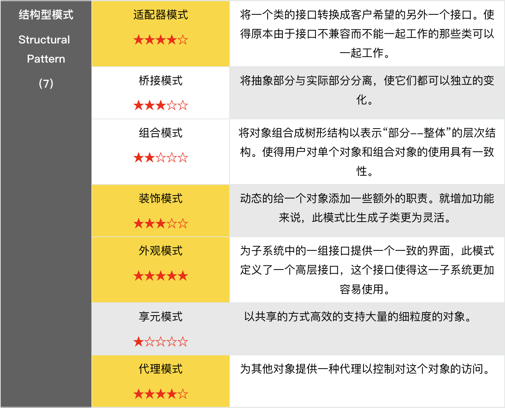
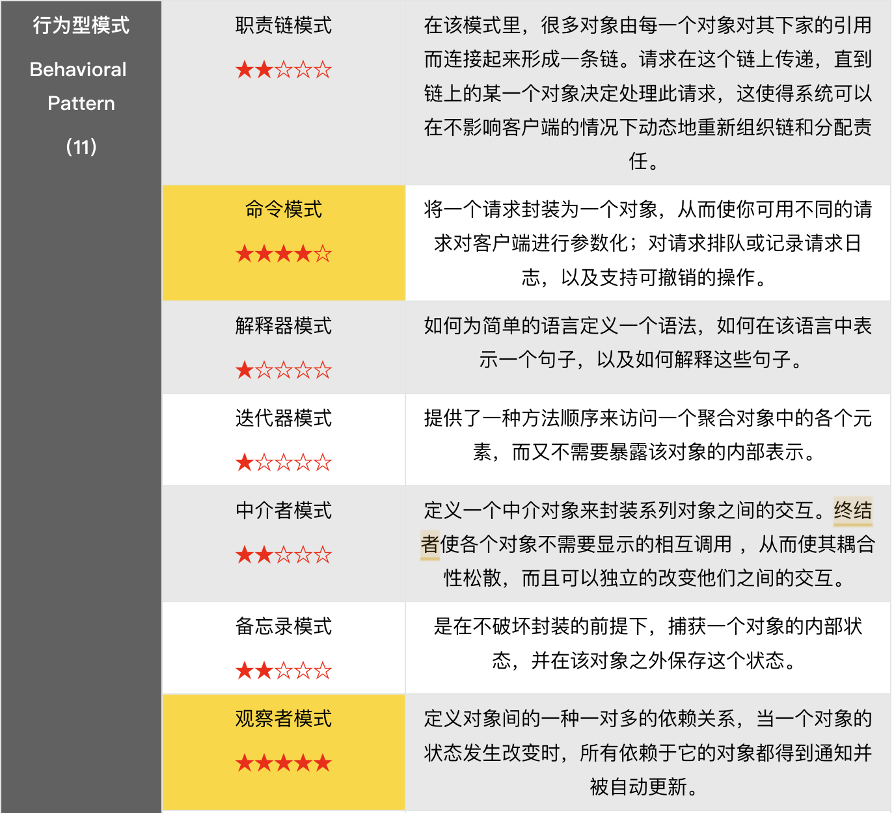
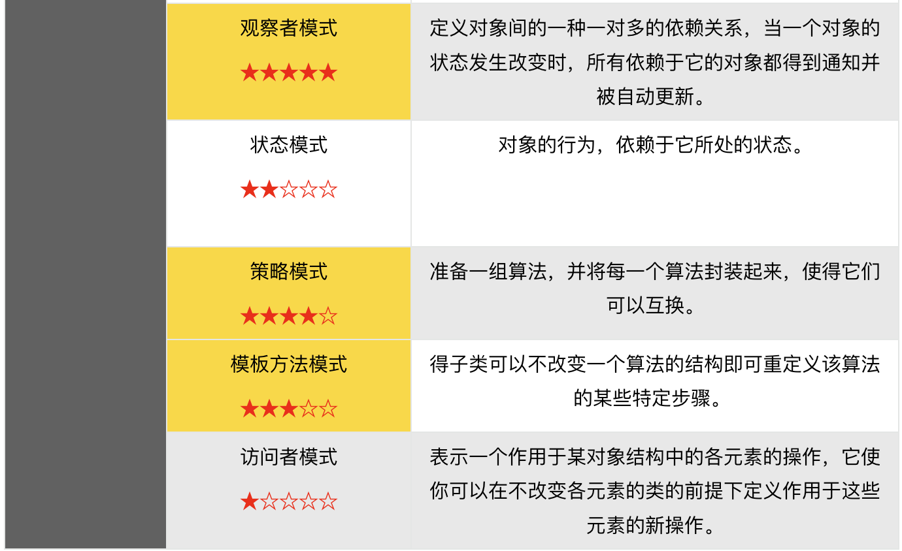
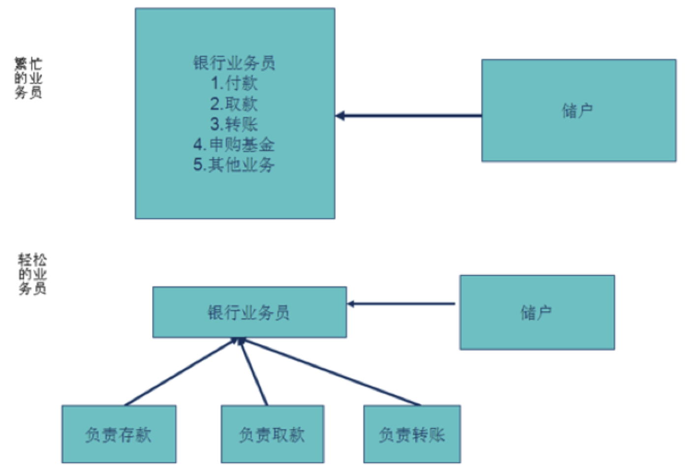
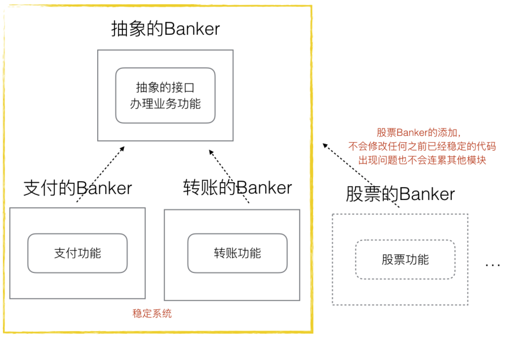
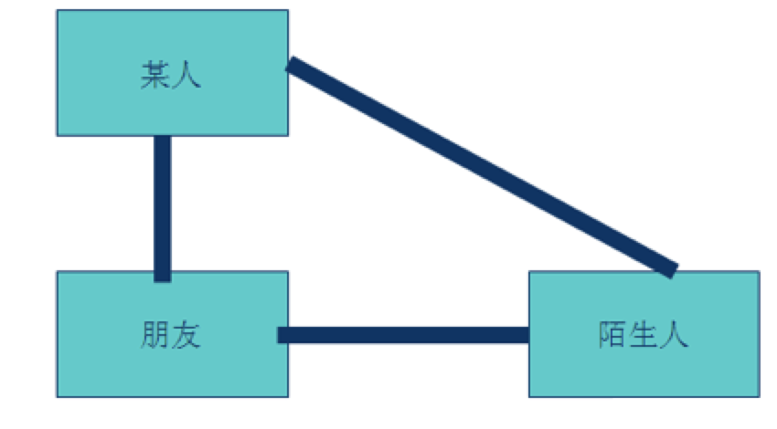
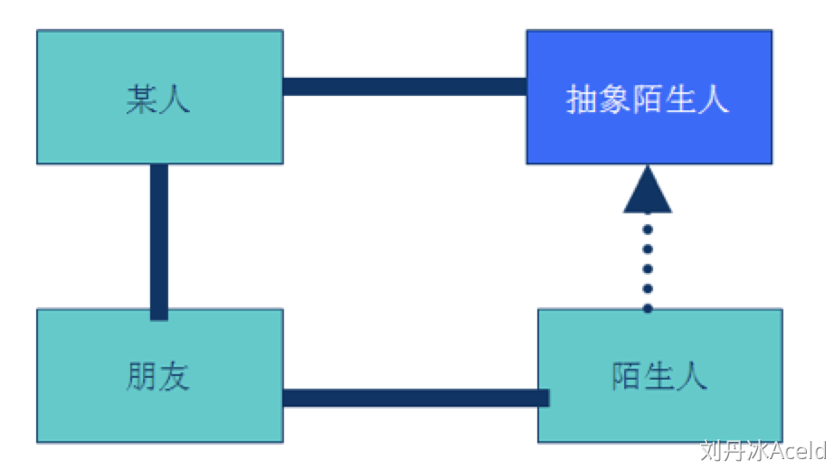
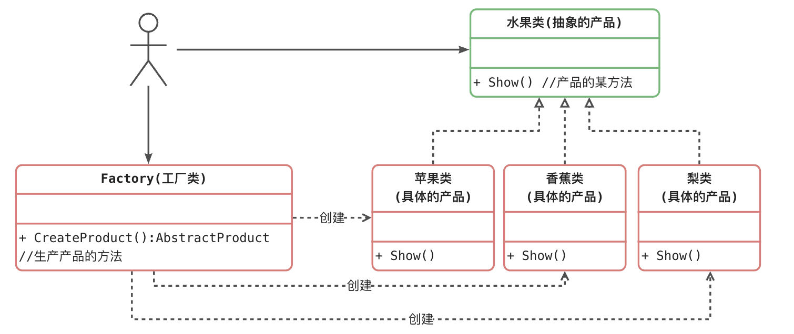
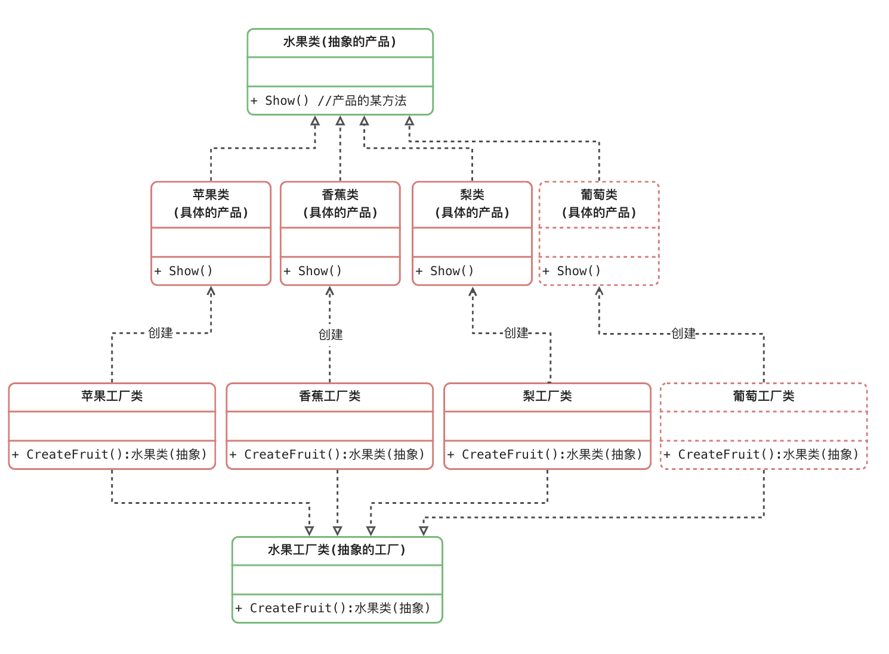
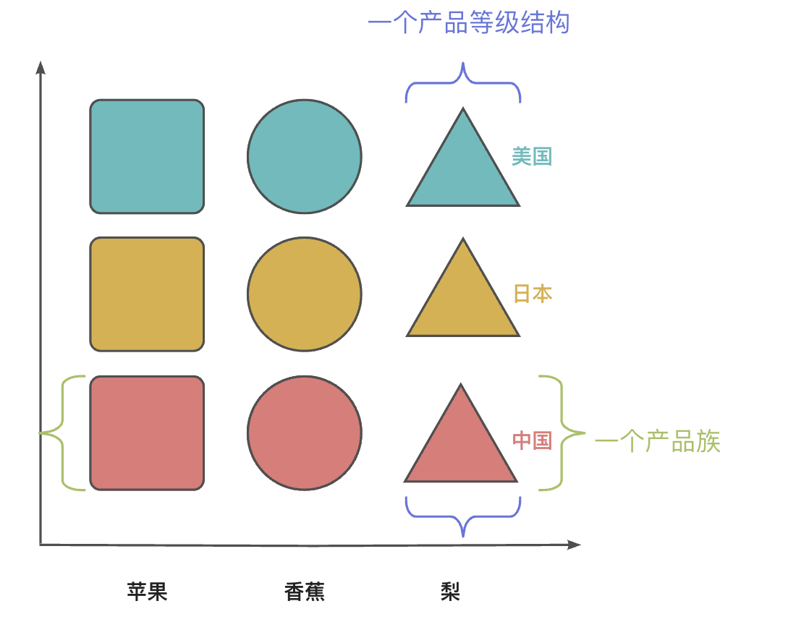

### Golang 设计模式

### 一、设计模式概述

#### 1.1 概述

如果把修习软件开发当做武功修炼的话，那么可以分为**招式**和**内功**。   

**招式：**

- Java、C#、C++、Golang、Rust等编程语言；
-  Eclipse、Visual Studio、Goland、Vim等开发工具；
-  Struts、Hibernate、JBPM、Gin、Istio、gRPC等框架技术；

**内功：**

- 数据结构
- 算法
- 设计模式
- 架构设计
- 软件工程

#### 1.2 软件设计模式又从何而来

GoF将模式的概念引入软件工程领域，这标志着软件模式的诞生。软件模式(Software Patterns)是将模式的一般概念应用于软件开发领域，即软件开发的总体指导思路或参照样板。软件模式并非仅限于设计模式，还包括架构模式、分析模式和过程模式等，实际上，在软件开发生命周期的每一个阶段都存在着一些被认同的模式。

​	软件模式与具体的应用领域无关，也就是说无论你从事的是移动应用开发、桌面应用开发、Web应用开发还是嵌入式软件的开发，都可以使用软件模式。无论你是使用Java、C#、Objective-C、VB.net、Smalltalk等纯面向对象编程语言，还是使用C++、PHP、Delphi、JavaScript等可支持面向对象编程的语言，你都需要了解软件设计模式！
​	GoF给软件设计模式提供了定义，如下：

“软件设计模式(Design Pattern)是一套被反复使用、多数人知晓的、经过分类编目的、代码设计经验的总结，使用设计模式是为了可重用代码、让代码更容易被他人理解并且保证代码可靠性。”

一句大白话可以总结：“在一定环境下，用固定套路解决问题。”

#### 1.3 软件设计模式的种类

GoF提出的设计模式有23个，包括：

1. 创建型（Creational）模式：如何创建对象。
2. 结构型（Structural）模式：如何实现类或对象的组合。
3. 行为型（Behavioral）模式：类或对象怎样交互以及怎样分配职责。

有一个 简单工厂模式 不属于GoF 23种涉及模式，但大部分的设计模式书籍都会对它进行专门的介绍。 

> 设计模式目前种类：GoF 的 23 种 + “简单工厂模式”  = 24 种。

#### 1.4 软件设计模式的作用

那么对于初学者来说，学习设计模式将有助于更加深入地理解面向对象思想，让你知道：

> 1. 如何将代码分散在几个不同的类中？
> 2. 为什么要有“接口”？
> 3. 何谓针对抽象编程？
> 4. 何时不应该使用继承？
> 5. 如果不修改源代码增加新功能？
> 6. 更好地阅读和理解现有类库与其他系统中的源代码。

学习设计模式会让你早点脱离面向对象编程的 “菜鸟期”。

#### 1.5 如何学号设计模式。

设计模式的基础是：多态。

初学者：积累案例，不要盲目的背类图。

初级开发人员：多思考，多梳理，归纳总结，尊重事物的认知规律，注意临界点的突破，不要浮躁。

中级开发人员：合适的开发环境，寻找合适的设计模式来解决问题。

多应用，对经典啧组合设计模式的大量，自由的运用。要不断的追求。

#### 1.6 设计模式总览表








### 二、面向对象设计原则

​	对于面向对象软件系统的设计而言，在支持可维护性的同时，提高系统的可复用性是一个至关重要的问题，**如何同时提高一个软件系统的可维护性和可复用性是面向对象设计需要解决的核心问题之一。**在面向对象设计中，可维护性的复用是以设计原则为基础的。每一个原则都蕴含一些面向对象设计的思想，可以从不同的角度提升一个软件结构的设计水平。

**面向对象设计原则为支持可维护性复用而诞生，这些原则蕴含在很多设计模式中，它们是从许多设计方案中总结出的指导性原则。**面向对象设计原则也是我们用于评价一个设计模式的使用效果的重要指标之一。

> 原则的目的： 高内聚，低耦合

#### 2.1 面向对象设计原则表

|                             名称                             | 定义                                                         |
| :----------------------------------------------------------: | :----------------------------------------------------------- |
| 单一职责原则                                                        （Single Responsibility Principle SRP） | 类的职责单一，对外只提供一种功能，而引起类变化的原因都应该只有一个 |
| 开闭原则                                                               （Open-Closed Principle,OCP） | 类的改动是通过增加代码进行的，而不是修改源代码。             |
| 里氏替换原则                                                                                                                                                                            （Liskov Substitution Principle, LSP） | 任何抽象类（interface接口）出现的地方都可以用他的实现类进行替换，实际就是虚拟机制，语言级别实现面向对象功能。 |
| 依赖倒转原则                                            (DependenceInversion Principle, DIP) | 依赖于抽象（接口），不要依赖具体的实现（类），也局势针对接口编程。 |
| 接口隔离原则                                                         (Interface Segregation Principle, ISP） | 不应该强迫用户的程序依赖他们不需要的接口方法。一个接口应该只提供一种对外功能，不应该把所有操作都封装到一个接口中去。 |
| 合成复用原则                                            （Composite Reuse Principle ，CRP） | 如果使用继承，会导致父类的任何变换都可能影响到子类的行为。如果使用对象组合，就降低了这种依赖关系。对于继承和组合，优先使用组合。 |
| 迪米特法则                                                             (Law of Demeter, LoD） | 一个对象应当对其他对象经可能的少的了解，从而降低各个对象之间的耦合，提高系统的可维护性。例如在一个从程序中，各个模块之间互相调用时，通常会提供一个统一的接口来实现。这样其他模块不需要了解另外一个模块的内部实现细节，这样一个模块内部的实现发生改变时，不会影响其他模块的使用。（黑盒原理） |

#### 2.2 单一职责原则

类的职责单一，对外只提供一种功能，而引起类变化的原因都应该只有一个

```go
package main

import "fmt"

type ClothesShop struct {}

func (cs *ClothesShop) OnShop() {
	fmt.Println("休闲的装扮")
}

type ClothesWork struct {}

func (cw *ClothesWork) OnWork() {
	fmt.Println("工作的装扮")
}

func main() {
	//工作的时候
	cw := new(ClothesWork)
	cw.OnWork()

	//shopping的时候
	cs := new(ClothesShop)
	cs.OnShop()
}
```

在面向对象编程的过程中，设计一个类，建议对外提供的功能单一，接口单一，硬性一个类的范围就只限定在这个一个接口上，一个类的一个接口具备这个类的功能含义，职责单一不复杂。

#### 2.3 开闭原则



##### 2.3.1 平铺式设计

那么作为 interface 数据类型，它存在的意义在哪里呢？实际上是为了满足一些面向对象的编程思想。我们知道，软件设计的最高目标就是 `高内聚，低耦合` 。那么其中有一个设计原则叫 `开闭原则` 。什么是开闭原则呢，接下来我们看一个例子：

```go
package main

import "fmt"

//我们要写一个类,Banker银行业务员
type Banker struct {
}

//存款业务
func (this *Banker) Save() {
	fmt.Println( "进行了 存款业务...")
}

//转账业务
func (this *Banker) Transfer() {
	fmt.Println( "进行了 转账业务...")
}

//支付业务
func (this *Banker) Pay() {
	fmt.Println( "进行了 支付业务...")
}

func main() {
	banker := &Banker{}

	banker.Save()
	banker.Transfer()
	banker.Pay()
}
```

代码很简单，就是一个银行业务员，他可能拥有很多的业务，比如`Save()`存款、`Transfer()`转账、`Pay()`支付等。那么如果这个业务员模块只有这几个方法还好，但是随着我们的程序写的越来越复杂，银行业务员可能就要增加方法，会导致业务员模块越来越臃肿。


这样的设计会导致，当我们去给 Banker 添加新的业务的时候，会直接修改原有的Banker代码，那么 Banker 模块的功能会越来越多，出现问题的几率也就越来越大，假如此时 Banker 已经有 99 个业务了，现在我们要添加第 100 个业务，可能由于一次的不小心，导致之前 99 个业务也一起崩溃，因为所有的业务都在一个 Banker 类里，他们的耦合度太高，Banker 的职责也不够单一，代码的维护成本随着业务的复杂正比成倍增大。

##### 2.3.2 开闭原则设计

那么，如果我们拥有接口，interface 这个东西，那么我们就可以抽象一层出来，制作一个抽象的 Banker 模块，然后提供一个抽象的方法。分别根据这个抽象的模块，去实现 `支付Banker（实现支付方法），转账Banker（实现转账方法）`



那么依然可以搞定程序的需求。然后，当我们想要给Banker太耐额外功能的时候，之前我们是直接修改Banker的内容，现在我们可以单独定义一个股票 Banker（实现股票方法），到这个系统中。而且股票 Banker 的实现成功或者失败都不会影响之前的稳定系统，他很单一，而且独立。

所以以上，当我们给一个系统天极爱一个功能的时候，不是通过修改代码，而是通过添加代码来完成，那么就开闭原则的核心思想了。所以要想满足上面的要求，是一定需要 interface 来提供一层抽象的接口的。

golang代码实现如下：

```go
package main

import "fmt"

//抽象的银行业务员
type AbstractBanker interface{
	DoBusi()	//抽象的处理业务接口
}

//存款的业务员
type SaveBanker struct {
	//AbstractBanker
}

func (sb *SaveBanker) DoBusi() {
	fmt.Println("进行了存款")
}

//转账的业务员
type TransferBanker struct {
	//AbstractBanker
}

func (tb *TransferBanker) DoBusi() {
	fmt.Println("进行了转账")
}

//支付的业务员
type PayBanker struct {
	//AbstractBanker
}

func (pb *PayBanker) DoBusi() {
	fmt.Println("进行了支付")
}


func main() {
	//进行存款
	sb := &SaveBanker{}
	sb.DoBusi()

	//进行转账
	tb := &TransferBanker{}
	tb.DoBusi()
	
	//进行支付
	pb := &PayBanker{}
	pb.DoBusi()

}
```

当然我们也可以根据`AbstractBanker`设计一个小框架

```go
//实现架构层(基于抽象层进行业务封装-针对interface接口进行封装)
func BankerBusiness(banker AbstractBanker) {
	//通过接口来向下调用，(多态现象)
	banker.DoBusi()
}
```

那么main中可以如下实现业务调用:

```go
func main() {
	//进行存款
	BankerBusiness(&SaveBanker{})

	//进行存款
	BankerBusiness(&TransferBanker{})

	//进行存款
	BankerBusiness(&PayBanker{})
}
```

> 再看开闭原则定义:
> 开闭原则:一个软件实体如类、模块和函数应该对扩展开放，对修改关闭。
> 简单的说就是在修改需求的时候，应该尽量通过扩展来实现变化，而不是通过修改已有代码来实现变化。

##### 2.3.3 接口的意义

好了，现在interface已经基本了解，那么接口的意义最终在哪里呢，想必现在你已经有了一个初步的认知，实际上接口的最大的意义就是实现多态的思想，就是我们可以根据interface类型来设计API接口，那么这种API接口的适应能力不仅能适应当下所实现的全部模块，也适应未来实现的模块来进行调用。调用未来可能就是接口的最爱意义所在，这也是为什么架构师那么值钱，因为架构师是可以针对 interface 设计一套框架，在未来许多年依然适用。

#### 2.4 依赖倒转原则

##### 2.4.1 耦合度极高的模块关系涉及


```go
package main

import "fmt"

// === > 奔驰汽车 <===
type Benz struct {

}

func (this *Benz) Run() {
	fmt.Println("Benz is running...")
}

// === > 宝马汽车  <===
type BMW struct {

}

func (this *BMW) Run() {
	fmt.Println("BMW is running ...")
}


//===> 司机张三  <===
type Zhang3 struct {
	//...
}

func (zhang3 *Zhang3) DriveBenZ(benz *Benz) {
	fmt.Println("zhang3 Drive Benz")
	benz.Run()
}

func (zhang3 *Zhang3) DriveBMW(bmw *BMW) {
	fmt.Println("zhang3 drive BMW")
	bmw.Run()
}

//===> 司机李四 <===
type Li4 struct {
	//...
}

func (li4 *Li4) DriveBenZ(benz *Benz) {
	fmt.Println("li4 Drive Benz")
	benz.Run()
}

func (li4 *Li4) DriveBMW(bmw *BMW) {
	fmt.Println("li4 drive BMW")
	bmw.Run()
}

func main() {
	//业务1 张3开奔驰
	benz := &Benz{}
	zhang3 := &Zhang3{}
	zhang3.DriveBenZ(benz)

	//业务2 李四开宝马
	bmw := &BMW{}
	li4 := &Li4{}
	li4.DriveBMW(bmw)
}
```

我们来看上面的代码和图中每个模块之间的依赖关系，实际上并没有用到任何的`interface`接口层的代码，显然最后我们的两个业务 `张三开奔驰`, `李四开宝马`，程序中也都实现了。但是这种设计的问题就在于，小规模没什么问题，但是一旦程序需要扩展，比如我现在要增加一个`丰田汽车` 或者 司机`王五`， 那么模块和模块的依赖关系将成指数级递增，想蜘蛛网一样越来越难维护和捋顺。

##### 2.4.2 面向抽象层依赖倒转


如上图所示，如果我们在设计一个系统的时候，将模块分为3个层次，抽象层、实现层、业务逻辑层。那么，我们首先将抽象层的模块和接口定义出来，这里就需要了`interface`接口的设计，然后我们依照抽象层，依次实现每个实现层的模块，在我们写实现层代码的时候，实际上我们只需要参考对应的抽象层实现就好了，实现每个模块，也和其他的实现的模块没有关系，这样也符合了上面介绍的开闭原则。这样实现起来每个模块只依赖对象的接口，而和其他模块没关系，依赖关系单一。系统容易扩展和维护。

我们在指定业务逻辑也是一样，只需要参考抽象层的接口来业务就好了，抽象层暴露出来的接口就是我们业务层可以使用的方法，然后可以通过多态的线下，接口指针指向哪个实现模块，调用了就是具体的实现方法，这样我们业务逻辑层也是依赖抽象成编程。

我们就将这种的设计原则叫做`依赖倒转原则`。

来一起看一下修改的代码：

```go
package main

import "fmt"

// ===== >   抽象层  < ========
type Car interface {
	Run()
}

type Driver interface {
	Drive(car Car)
}

// ===== >   实现层  < ========
type BenZ struct {
	//...
}

func (benz * BenZ) Run() {
	fmt.Println("Benz is running...")
}

type Bmw struct {
	//...
}

func (bmw * Bmw) Run() {
	fmt.Println("Bmw is running...")
}

type Zhang_3 struct {
	//...
}

func (zhang3 *Zhang_3) Drive(car Car) {
	fmt.Println("Zhang3 drive car")
	car.Run()
}

type Li_4 struct {
	//...
}

func (li4 *Li_4) Drive(car Car) {
	fmt.Println("li4 drive car")
	car.Run()
}


// ===== >   业务逻辑层  < ========
func main() {
	//张3 开 宝马
	var bmw Car
	bmw = &Bmw{}

	var zhang3 Driver
	zhang3 = &Zhang_3{}

	zhang3.Drive(bmw)

	//李4 开 奔驰
	var benz Car
	benz = &BenZ{}

	var li4 Driver
	li4 = &Li_4{}

	li4.Drive(benz)
}
```

#### 2.5 合成复用原则

如果使用继承，会导致父类的任何变换都可能影响到子类的行为。如果使用对象组合，就降低了这种依赖关系。对于继承和组合，优先使用组合。

```go
package main

import "fmt"

type Cat struct {}

func (c *Cat) Eat() {
	fmt.Println("小猫吃饭")
}

//给小猫添加一个 可以睡觉的方法 （使用继承来实现）
type CatB struct {
	Cat
}

func (cb *CatB) Sleep() {
	fmt.Println("小猫睡觉")
}

//给小猫添加一个 可以睡觉的方法 （使用组合的方式）
type CatC struct {
	C *Cat
}

func (cc *CatC) Sleep() {
	fmt.Println("小猫睡觉")
}


func main() {
	//通过继承增加的功能，可以正常使用
	cb := new(CatB)
	cb.Eat()
	cb.Sleep()

	//通过组合增加的功能，可以正常使用
	cc := new(CatC)
	cc.C = new(Cat)
	cc.C.Eat()
	cc.Sleep()
}
```

#### 2.6 迪米特法则

1. 和陌生人说话



2. 不和陌生人说话


3. 与依赖倒转原则结合 某人和 抽象陌生人说话  让某人和陌生人进行解耦合



### 三、创建型模式

#### 3.1 概述


目前标准的创建型设计模式共有6种（注：设计模式种类并非仅仅局限于此，设计模式实则是一种编程思想，开发者可以根据自身经验来总结出很多种设计模式思想，这6中创建型设计模式为早期官方认可的标准模式）

本章节主要介绍常用的“单例模式”、“简单工程模式”、“工厂方法模式”、“抽象工厂模式”等。“原型模式”、“建造者模式”思想类似，作为读者选修篇幅，本章暂时先不介绍。

#### 3.2 简单工厂模式

##### 3.2.1 为什么需要工厂模式

首先来看，如果没有工厂模式，在开发者创建一个类的对象时，如果有很多不同种类的对象将会如何实现，代码如下：

```go
package main

import "fmt"

//水果类
type Fruit struct {
	//...
	//...
	//...
}

func (f *Fruit) Show(name string) {
	if name == "apple" {
		fmt.Println("我是苹果")
	} else if name == "banana" {
		fmt.Println("我是香蕉")
	} else if name == "pear" {
		fmt.Println("我是梨")
	}
}

//创建一个Fruit对象
func NewFruit(name string) *Fruit {
	fruit := new(Fruit)

	if name == "apple" {
		//创建apple逻辑
	} else if name == "banana" {
		//创建banana逻辑
	} else if name == "pear" {
		//创建pear逻辑
	}

	return fruit
}

func main() {
	apple := NewFruit("apple")
	apple.Show("apple")

	banana := NewFruit("banana")
	banana.Show("banana")

	pear := NewFruit("pear")
	pear.Show("pear")
}
```

不难看出，Fruit类是一个“巨大的”类，在该类的设计中存在如下几个问题：

​	(1) 在Fruit类中包含很多“if…else…”代码块，整个类的代码相当冗长，代码越长，阅读难度、维护难度和测试难度也越大；而且大量条件语句的存在还将影响系统的性能，程序在执行过程中需要做大量的条件判断。

​	(2) Fruit类的职责过重，它负责初始化和显示所有的水果对象，将各种水果对象的初始化代码和显示代码集中在一个类中实现，违反了“单一职责原则”，不利于类的重用和维护；   

(3) 当需要增加新类型的水果时，必须修改Fruit类的构造函数NewFruit()和其他相关方法源代码，违反了“开闭原则”。

关键是来观察main()函数，main()函数与Fruit类是两个模块。当业务层希望创建一个对象的时候，将直接依赖Fruit类型的构造方法NewFruit()，这样随着Fruit的越来越复杂，那么业务层的开发逻辑也需要依赖Fruit模块的更新，且随之改变，这样将导致业务层开发需要观察Fruit模块做改动，影响业务层的开发效率和稳定性。整体的依赖关系为。

```go
业务逻辑层 ---> 基础类模块
```

那么如何将业务层创建对象与基础类模块做解耦呢，这里即可以在中间加一层工厂模块层，来降低业务逻辑层对基础模块层的直接依赖和耦合关联。

```go
业务逻辑层 ---> 工厂模块 ---> 基础类模块
```

这样就引出了需要对工厂模块的一些设计和加工生成基础模块对象的模式。

##### 3.2.2 简单工厂模式角色和职责

​	简单工厂模式并不属于GoF的23种设计模式。它是开发者自发认为的一种非常简易的设计模式，其角色和职责如下：

​	**工厂角色**：简单工厂模式的核心，它负责实现创建所有市里的内部逻辑。工厂类可以被外界直接调用，创建所需的产品对象。

​	**抽象产品角色**：简单工厂模式所创建的所有对象的父类，它负责描述所有实例所共有的公共接口。

​	**具体产品角色**：简单工厂模式所创建的具体事例对象。


##### 3.2.3 简单工厂模式实现

根据本章节的案例可以将标准的 ”简单工厂模式“ 类图改进如下：



简单工厂方法模式的实现代码如下：

```go
package main

import "fmt"

// ======= 抽象层 =========

//水果类(抽象接口)
type Fruit interface {
	Show()	 //接口的某方法
}
// ======= 基础类模块 =========

type Apple struct {
	Fruit  //为了易于理解显示继承(此行可以省略)
}

func (apple *Apple) Show() {
	fmt.Println("我是苹果")
}

type Banana struct {
	Fruit
}

func (banana *Banana) Show() {
	fmt.Println("我是香蕉")
}

type Pear struct {
	Fruit
}

func (pear *Pear) Show() {
	fmt.Println("我是梨")
}

// ========= 工厂模块  =========
//一个工厂， 有一个生产水果的机器，返回一个抽象水果的指针
type Factory struct {}

func (fac *Factory) CreateFruit(kind string) Fruit {
	var fruit Fruit

	if kind == "apple" {
		fruit = new(Apple)
	} else if kind == "banana" {
		fruit = new(Banana)
	} else if kind == "pear" {
		fruit = new(Pear)
	}

	return fruit
}


// ==========业务逻辑层==============
func main() {
	factory := new(Factory)

	apple := factory.CreateFruit("apple")
	apple.Show()

	banana := factory.CreateFruit("banana")
	banana.Show()

	pear := factory.CreateFruit("pear")
	pear.Show()
}
```

上述代码可以看出，业务逻辑层只会和工厂模块进行依赖，这样业务逻辑层将不再关心Fruit类是具体怎么创建基础对象的。

##### 3.1.4 简单工厂方法模式的优缺点

优点：

1. 实现了对象创建和使用的分离。
2. 不需要记住具体类名，记住参数即可，减少使用者记忆量。

缺点：

1. 对工厂类职责过重，一旦不能工作，系统受到影响。
2. 增加系统中类的个数，复杂度和理解度增加。
3. 违反“开闭原则”，添加新产品需要修改工厂逻辑，工厂越来越复杂。

适用场景：

1. 工厂类负责创建的对象比较少，由于创建的对象较少，不会造成工厂方法中的业务逻辑太过复杂。

2. 客户端只知道传入工厂类的参数，对于如何创建对象并不关心。

#### 3.2 工厂方法模式

##### 3.2.1 工厂方法模式中的角色和职责

**抽象工厂（Abstract Factory）角色**：工厂方法模式的核心，任何工厂类都必须实现这个接口。

**工厂（Concrete Factory）角色**：具体工厂类是抽象工厂的一个实现，负责实例化产品对象。

**抽象产品（Abstract Product）角色**：工厂方法模式所创建的所有对象的父类，它负责描述所有实例所共有的公共接口。	

**具体产品（Concrete Product）角色**：工厂方法模式所创建的具体实例对象。

```go
简单工厂模式  + “开闭原则” =    工厂方法模式
```

工厂方法模式的标准类图如下：

其标准的设计模式类图如下：


##### 3.2.2 工厂方法模式的视线

根据本章节的案例可以将标准的“工厂方法模式”类图改进如下：


实现代码如下：

```go
package main

import "fmt"

// ======= 抽象层 =========

//水果类(抽象接口)
type Fruit interface {
	Show()	 //接口的某方法
}

//工厂类(抽象接口)
type AbstractFactory interface {
	CreateFruit() Fruit //生产水果类(抽象)的生产器方法
}

// ======= 基础类模块 =========
type Apple struct {
	Fruit  //为了易于理解显示继承(此行可以省略)
}

func (apple *Apple) Show() {
	fmt.Println("我是苹果")
}

type Banana struct {
	Fruit
}

func (banana *Banana) Show() {
	fmt.Println("我是香蕉")
}

type Pear struct {
	Fruit
}

func (pear *Pear) Show() {
	fmt.Println("我是梨")
}

// ========= 工厂模块  =========
//具体的苹果工厂
type AppleFactory struct {
	AbstractFactory
}

func (fac *AppleFactory) CreateFruit() Fruit {
	var fruit Fruit

	//生产一个具体的苹果
	fruit = new(Apple)

	return fruit
}

//具体的香蕉工厂
type BananaFactory struct {
	AbstractFactory
}

func (fac *BananaFactory) CreateFruit() Fruit {
	var fruit Fruit

	//生产一个具体的香蕉
	fruit = new(Banana)

	return fruit
}


//具体的梨工厂
type PearFactory struct {
	AbstractFactory
}

func (fac *PearFactory) CreateFruit() Fruit {
	var fruit Fruit

	//生产一个具体的梨
	fruit = new(Pear)

	return fruit
}

//======= 业务逻辑层 =======
func main() {
	/*
		本案例为了突出根据依赖倒转原则与面向接口编程特性。
	    一些变量的定义将使用显示类型声明方式
	*/

	//需求1：需要一个具体的苹果对象
	//1-先要一个具体的苹果工厂
	var appleFac AbstractFactory
	appleFac = new(AppleFactory)
	//2-生产相对应的具体水果
	var apple Fruit
	apple = appleFac.CreateFruit()

	apple.Show()


	//需求2：需要一个具体的香蕉对象
	//1-先要一个具体的香蕉工厂
	var bananaFac AbstractFactory
	bananaFac = new(BananaFactory)
	//2-生产相对应的具体水果
	var banana Fruit
	banana = bananaFac.CreateFruit()

	banana.Show()

	//需求3：需要一个具体的梨对象
	//1-先要一个具体的梨工厂
	var pearFac AbstractFactory
	pearFac = new(PearFactory)
	//2-生产相对应的具体水果
	var pear Fruit
	pear = pearFac.CreateFruit()

	pear.Show()

	//需求4：需要一个日本的苹果？
}
```

上述代码是通过面向抽象层开发，业务逻辑层的main()函数逻辑，依然是只与工厂耦合，且只与抽象的工厂和抽象的水果类耦合，这样就遵循了面向抽象层接口编程的原则。

那么抽象的工厂方法模式如何体现“开闭原则”的。接下来可以尝试在原有的代码上添加一种新产品的生产，如“日本苹果”，具体的代码如下：

```go
package main

import "fmt"

// ======= 抽象层 =========

//水果类(抽象接口)
type Fruit interface {
	Show()	 //接口的某方法
}

//工厂类(抽象接口)
type AbstractFactory interface {
	CreateFruit() Fruit //生产水果类(抽象)的生产器方法
}

// ======= 基础类模块 =========
type Apple struct {
	Fruit  //为了易于理解显示继承(此行可以省略)
}

func (apple *Apple) Show() {
	fmt.Println("我是苹果")
}

type Banana struct {
	Fruit
}

func (banana *Banana) Show() {
	fmt.Println("我是香蕉")
}

type Pear struct {
	Fruit
}

func (pear *Pear) Show() {
	fmt.Println("我是梨")
}

//(+) 新增一个"日本苹果"
type JapanApple struct {
	Fruit
}

func (jp *JapanApple) Show() {
	fmt.Println("我是日本苹果")
}

// ========= 工厂模块  =========
//具体的苹果工厂
type AppleFactory struct {
	AbstractFactory
}

func (fac *AppleFactory) CreateFruit() Fruit {
	var fruit Fruit

	//生产一个具体的苹果
	fruit = new(Apple)

	return fruit
}

//具体的香蕉工厂
type BananaFactory struct {
	AbstractFactory
}

func (fac *BananaFactory) CreateFruit() Fruit {
	var fruit Fruit

	//生产一个具体的香蕉
	fruit = new(Banana)

	return fruit
}


//具体的梨工厂
type PearFactory struct {
	AbstractFactory
}

func (fac *PearFactory) CreateFruit() Fruit {
	var fruit Fruit

	//生产一个具体的梨
	fruit = new(Pear)

	return fruit
}

//具体的日本工厂
type JapanAppleFactory struct {
	AbstractFactory
}

func (fac *JapanAppleFactory) CreateFruit() Fruit {
	var fruit Fruit

	//生产一个具体的日本苹果
	fruit = new(JapanApple)

	return fruit
}

// ========= 业务逻辑层  =========
func main() {
	/*
		本案例为了突出根据依赖倒转原则与面向接口编程特性。
	    一些变量的定义将使用显示类型声明方式
	*/

	//需求1：需要一个具体的苹果对象
	//1-先要一个具体的苹果工厂
	var appleFac AbstractFactory
	appleFac = new(AppleFactory)
	//2-生产相对应的具体水果
	var apple Fruit
	apple = appleFac.CreateFruit()

	apple.Show()


	//需求2：需要一个具体的香蕉对象
	//1-先要一个具体的香蕉工厂
	var bananaFac AbstractFactory
	bananaFac = new(BananaFactory)
	//2-生产相对应的具体水果
	var banana Fruit
	banana = bananaFac.CreateFruit()

	banana.Show()

	//需求3：需要一个具体的梨对象
	//1-先要一个具体的梨工厂
	var pearFac AbstractFactory
	pearFac = new(PearFactory)
	//2-生产相对应的具体水果
	var pear Fruit
	pear = pearFac.CreateFruit()

	pear.Show()

	//需求4：需要一个日本的苹果？
	//1-先要一个具体的日本评估工厂
	var japanAppleFac AbstractFactory
	japanAppleFac = new(JapanAppleFactory)
	//2-生产相对应的具体水果
	var japanApple Fruit
	japanApple = japanAppleFac.CreateFruit()

	japanApple.Show()
}

```

  可以看见，新增的基本类“日本苹果”，和“具体的工厂” 均没有改动之前的任何代码。完全符合开闭原则思想。新增的功能不会影响到之前的已有的系统稳定性。

##### 3.2.3 工厂方法模式的优缺点

优点：

1. 不需要记住具体类名，甚至连具体参数都不用记忆。

2. 实现了对象创建和使用的分离。

3. 系统的可扩展性也就变得非常好，无需修改接口和原类。

4.对于新产品的创建，符合开闭原则。

缺点：

1. 增加系统中类的个数，复杂度和理解度增加。

2. 增加了系统的抽象性和理解难度。

适用场景：

1. 客户端不知道它所需要的对象的类。

2. 抽象工厂类通过其子类来指定创建哪个对象。

#### 3.3 抽象工厂方法模式

​	工厂方法模式通过引入工厂等级结构，解决了简单工厂模式中工厂职责太重的问题，但由于工厂方法模式中的每个工厂只生产一类产品，可能会导致系统中存在大量的工厂类，势必会增加系统的开销。因此，可以考虑将一些相关的产品组成一个 ”产品族“ ，由不同一个工厂来统一生产，这就是本文将要学习的朝向工厂模式的基本思想。



从工厂方法模式可以看出来：

（1）当添加一个新产品的时候，比如葡萄，虽然不用修改代码，但是需要添加大量的类，而且还需要添加相对的工厂。（系统开销，维护成本）

（2）如果使用同一地域的水果（日本苹果，日本香蕉，日本梨），那么需要分别创建具体的工厂，如果选择出现失误，将会造成混乱，虽然可以加一些约束，但是代码实现变得复杂。

所以“抽象工厂方法模式”引出了“产品族”和“产品等级结构”概念，其目的是为了更加高效的生产同一个产品组产品。

##### 3.3.1 产品族与产品等级结构



上图表示“产品族”和“产品登记结构”的关系。

产品族：具有同一个地区、同一个厂商、同一个开发包、同一个组织模块等，但是具备不同特点或功能的产品集合，称之为是一个产品族。

产品等级结构：具有相同特点或功能，但是来自不同的地区、不同的厂商、不同的开发包、不同的组织模块等的产品集合，称之为是一个产品等级结构。

当程序中的对象可以被划分为产品族和产品等级结构之后，那么“抽象工厂方法模式”才可以被适用。

“抽象工厂方法模式”是针对“产品族”进行生产产品，具体如下图所示。


##### 3.3.2 抽象工厂模式的角色和职责

抽象工厂（Abstract Factory）角色：它声明了一组用于创建一族产品的方法，每一个方法对应一种产品。

具体工厂（Concrete Factory）角色：它实现了在抽象工厂中声明的创建产品的方法，生成一组具体产品，这些产品构成了一个产品族，每一个产品都位于某个产品等级结构中。

抽象产品（Abstract Product）角色：它为每种产品声明接口，在抽象产品中声明了产品所具有的业务方法。

具体产品（Concrete Product）角色：它定义具体工厂生产的具体产品对象，实现抽象产品接口中声明的业务方法。


可以看出来具体的工厂1，只负责生成具体的产品A1和B1，具体的工厂2，只负责生成具体的产品A2和B2。

“工厂1、A1、B1”为一组，是一个产品族， “工厂2、A2、B2”为一组，也是一个产品族。

##### 3.3.3 抽象工厂方法模式的实现

抽象工厂方法模式按照本章节的案例，可以得到类图如下：


```go
package main

import "fmt"

// ======= 抽象层 =========
type AbstractApple interface {
	ShowApple()
}

type AbstractBanana interface {
	ShowBanana()
}

type AbstractPear interface {
	ShowPear()
}

//抽象工厂
type AbstractFactory interface {
	CreateApple() AbstractApple
	CreateBanana() AbstractBanana
	CreatePear() AbstractPear
}

// ======== 实现层 =========
/*  中国产品族 */
type ChinaApple struct {}

func (ca *ChinaApple) ShowApple() {
	fmt.Println("中国苹果")
}

type ChinaBanana struct {}

func (cb *ChinaBanana) ShowBanana() {
	fmt.Println("中国香蕉")
}

type ChinaPear struct {}

func (cp *ChinaPear) ShowPear() {
	fmt.Println("中国梨")
}

type ChinaFactory struct {}

func (cf *ChinaFactory) CreateApple() AbstractApple {
	var apple AbstractApple

	apple = new(ChinaApple)

	return apple
}

func (cf *ChinaFactory) CreateBanana() AbstractBanana {
	var banana AbstractBanana

	banana = new(ChinaBanana)

	return banana
}

func (cf *ChinaFactory) CreatePear() AbstractPear {
	var pear AbstractPear

	pear = new(ChinaPear)

	return pear
}

/*  日本产品族 */
type JapanApple struct {}

func (ja *JapanApple) ShowApple() {
	fmt.Println("日本苹果")
}

type JapanBanana struct {}

func (jb *JapanBanana) ShowBanana() {
	fmt.Println("日本香蕉")
}

type JapanPear struct {}

func (cp *JapanPear) ShowPear() {
	fmt.Println("日本梨")
}

type JapanFactory struct {}

func (jf *JapanFactory) CreateApple() AbstractApple {
	var apple AbstractApple

	apple = new(JapanApple)

	return apple
}

func (jf *JapanFactory) CreateBanana() AbstractBanana {
	var banana AbstractBanana

	banana = new(JapanBanana)

	return banana
}

func (cf *JapanFactory) CreatePear() AbstractPear {
	var pear AbstractPear

	pear = new(JapanPear)

	return pear
}

/*  美国产品族 */
type AmericanApple struct {}

func (aa *AmericanApple) ShowApple() {
	fmt.Println("美国苹果")
}

type AmericanBanana struct {}

func (ab *AmericanBanana) ShowBanana() {
	fmt.Println("美国香蕉")
}

type AmericanPear struct {}

func (ap *AmericanPear) ShowPear() {
	fmt.Println("美国梨")
}

type AmericanFactory struct {}

func (af *AmericanFactory) CreateApple() AbstractApple {
	var apple AbstractApple

	apple = new(AmericanApple)

	return apple
}

func (af *AmericanFactory) CreateBanana() AbstractBanana {
	var banana AbstractBanana

	banana = new(AmericanBanana)

	return banana
}

func (af *AmericanFactory) CreatePear() AbstractPear {
	var pear AbstractPear

	pear = new(AmericanPear)

	return pear
}

// ======== 业务逻辑层 =======
func main() {
	//需求1: 需要美国的苹果、香蕉、梨 等对象
	//1-创建一个美国工厂
	var aFac AbstractFactory
	aFac = new(AmericanFactory)

	//2-生产美国苹果
	var aApple AbstractApple
	aApple = aFac.CreateApple()
	aApple.ShowApple()

	//3-生产美国香蕉
	var aBanana AbstractBanana
	aBanana = aFac.CreateBanana()
	aBanana.ShowBanana()

	//4-生产美国梨
	var aPear AbstractPear
	aPear = aFac.CreatePear()
	aPear.ShowPear()

	//需求2: 需要中国的苹果、香蕉
	//1-创建一个中国工厂
	cFac := new(ChinaFactory)

	//2-生产中国苹果
	cApple := cFac.CreateApple()
	cApple.ShowApple()

	//3-生产中国香蕉
	cBanana := cFac.CreateBanana()
	cBanana.ShowBanana()
}

```

##### 3.3.4 抽象工厂模式的优缺点

优点：

1. 拥有工厂方法模式的优点

2. 当一个产品族中的多个对象被设计成一起工作时，它能够保证客户端始终只使用同一个产品族中的对象。
3. 增加新的产品族很方便，无须修改已有系统，符合“开闭原则”。

缺点：

1. 增加新的产品等级结构麻烦，需要对原有系统进行较大的修改，甚至需要修改抽象层代码，这显然会带来较大的不便，违背了“开闭原则”。

##### 3.3.5 适用场景

(1) 系统中有多于一个的产品族。而每次只使用其中某一产品族。可以通过配置文件等方式来使得用户可以动态改变产品族，也可以很方便地增加新的产品族。

(2) 产品等级结构稳定。设计完成之后，不会向系统中增加新的产品等级结构或者删除已有的产品等级结构。

### 3.4 单例模式

> 保证一个类，只有一个实例存在，同时提供能对该实例加以访问的全局访问方法。

是GoF给出单例模式的定义。

##### 3.4.1 单例模式中的角色和职责

单例模式的标准类图如下：


**Singleton（单例）**：在单例类的内部实现只生成一个实例，同时它提供一个静态的getInstance()工厂方法，让客户可以访问它的唯一实例；为了防止在外部对其实例化，将其构造函数设计为私有；在单例类内部定义了一个Singleton类型的静态对象，作为外部共享的唯一实例。

单例模式要解决的问题是：

保证一个类永远只能有一个对象，且该对象的功能依然能被其他模块使用。

##### 3.4.2 单例模式逻辑推演实现

```go
package main

import "fmt"

/*
三个要点：
		一是某个类只能有一个实例；
		二是它必须自行创建这个实例；
		三是它必须自行向整个系统提供这个实例。
*/

/*
	保证一个类永远只能有一个对象
*/


//1、保证这个类非公有化，外界不能通过这个类直接创建一个对象
//   那么这个类就应该变得非公有访问 类名称首字母要小写
type singelton struct {}

//2、但是还要有一个指针可以指向这个唯一对象，但是这个指针永远不能改变方向
//   Golang中没有常指针概念，所以只能通过将这个指针私有化不让外部模块访问
var instance *singelton = new(singelton)

//3、如果全部为私有化，那么外部模块将永远无法访问到这个类和对象，
//   所以需要对外提供一个方法来获取这个唯一实例对象
//   注意：这个方法是否可以定义为singelton的一个成员方法呢？
//       答案是不能，因为如果为成员方法就必须要先访问对象、再访问函数
//        但是类和对象目前都已经私有化，外界无法访问，所以这个方法一定是一个全局普通函数
func GetInstance() *singelton {
	return instance
}

func (s *singelton) SomeThing() {
	fmt.Println("单例对象的某方法")
}

func main() {
	s := GetInstance()
	s.SomeThing()
}
```

上面代码推演了一个单例的创建和逻辑过程，上述是单例模式中的一种，属于“饿汉式”。含义是，在初始化单例唯一指针的时候，就已经提前开辟好了一个对象，申请了内存。饿汉式的好处是，不会出现线程并发创建，导致多个单例的出现，但是缺点是如果这个单例对象在业务逻辑没有被使用，也会客观的创建一块内存对象。那么与之对应的模式叫“懒汉式”，代码如下：

```go
package main

import "fmt"

type singelton struct {}

var instance *singelton

func GetInstance() *singelton {
	//只有首次GetInstance()方法被调用，才会生成这个单例的实例
	if instance == nil {
		instance = new(singelton)
		return instance
	}

	//接下来的GetInstance直接返回已经申请的实例即可
	return instance
}

func (s *singelton) SomeThing() {
	fmt.Println("单例对象的某方法")
}

func main() {
	s := GetInstance()
	s.SomeThing()
}
```


