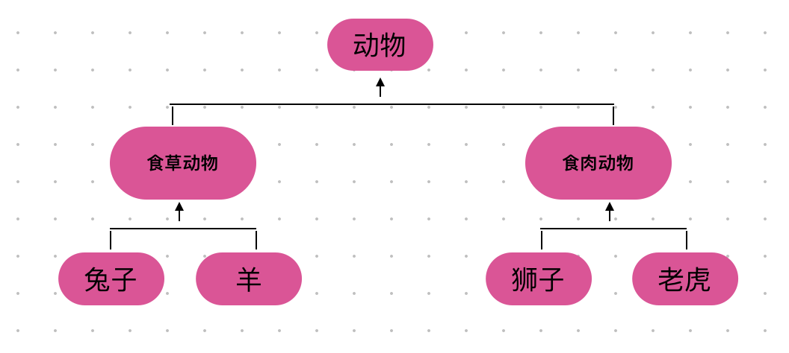

## 													golang 面试题

### 一、是么是面向对象

在了解 Go 语言 是不是面向对象（简称：OOP）之前，我们必须先知道 OOP 是啥，得先给它 ”下定义“。

根据Wikipedia的定义，我们梳理出 OOP 的几个基本认知：

- 面向对象编程（OOP）是一种基于 "对象" 概念的编程范式，它可以包含数据和代码：数据以字段的形式存在（通常称为属性或属性），代码以程序的形式存在（通常为方法）。
- 对象自己的程序可以访问并经常修改自己的数据字段。
- 对象经常被定义为类的一个实例。
- 对象利用属性和方法的私有/受保护/公共可见性，对对象的内部状态收到保护，不受外界影响（被封装）。

#### 1.1 Go语言和Java有什么区别？

1. Go上不允许函数重载，必须具有方法和函数的唯一名称，而Java允许函数重载。
2. 在速度方面，Go的速度要比Java快。
3. Java默认允许多态，而Go没有。
4. Go语言使用HTTP协议进行路由配置，而Java使用Akka.routing.ConsistentHashingRouter和Akka.routing.ScatterGatherFirstCompletedRouter进行路由配置。
5. Go代码可以自动扩展到多个核心，而Java并不总是具有足够的可扩展性。
6. Go语言的继承通过匿名组合完成，基类以 Struct 的方式定义，子类只需要把基类作为成员放在子类的定义中，支持多继承；而Java的继承通过 extends 关键字完成，不支持多继承。

#### 1.2 Go是面向对象的语言吗？

是的，也不是。原因是：

1. Go有类型和方法，并且允许面向对象的编程风格，但没有类型层次。
2. Go中的 ”接口“ 概念提供了一种不同的方法，我们认为这种方法易于使用，而且在某些方面更加通用。还有一些方法可以将类型嵌入到其他类型中，以提供类似的东西，但不等同于子类。
3. Go 中的方法比 C++ 或Java中的方法更通用：它们可以为任何类型的数据定义，甚至是内置类型，如普通的、"未装箱的"整数。它们并不局限于结构（类）。

4. Go由于缺乏类型层次，Go中的 ”对象“ 比 C++ 或 Java 等语言更加轻巧。

#### 1.3 Go实现面向对象编程

##### 1.3.1 封装

面向对象中的 ”封装“ 指的是可以隐藏对象的颞部属性和实现细节，仅对外提供公开接口调用，这样子用户就不需要关注你内部是怎么实现的。

##### 1.3.2 在 Go  语言中的属性访问权限，通过首字母大小写来控制：

- 首字母大写，代表是公共的、可被外部访问的。
- 首字母小写，代表是私有的，不可以被外部访问。

Go 语言的例子如下：

```go
type Animal struct {
  name string;
}
func NewAnimal() *Animal {
  return &Animal{}
}
func (p *Animal) SetName(name string) {
  p.name = name
}
func (p *Animal) GetName() string {
  return p.name
}
```

在上述例子中，我们生命了一个结构体Animal，其属性 name 为小写。没法通过外部方法，在配套上存在 Setter 和 Getter 的方法，用于统一的访问和设置控制。

以此实现在 Go 语言中的基本封装。

##### 1.3.3 继承

面向对象中的 ”继承“ 指的是子类继承父类的特征和行为，使得子类对象（实例）具有父类的实例域和方法，或子类从父类继承方法，使得子类具有父类相同的行为。



从实际的例子来看，就是动物是一个大父类，下面又能细分为 ”食草动物“、”食肉动物“、这两者会包含 ”动物“  这个父类的基本定义。

##### 1.3.4 **在Go语言中，是没有类似 extends 关键字的这种继承的方式，在语言设计上采用的是组合的方式**：

```go
type Animal struct {
  Name string
}
type Cat struct {
  Animal
  FeatureA string
}
type Dog struct {
  Animal 
  FeatureB string
}
```

在上述例子中，我们声明了Cat 和Dog结构体，其在内部匿名组合了 Animal 结构体。因此 Cat 和 Dog 的实例都可以调用Animal结构体的方法：

```go
func main() {
  p := NewAnimal()
  p.SetName("我是伴鱼")
  
  dog := NewDog{Animal: *p}
  fmt.Println(dog.GetName())
}
```

同时 Cat 和 Dog 的实例可以拥有自己的方法：

```go
func (dog *Dog) HelloWorld() {
  fmt.Println("hello go")
}
func (cat *Cat) HelloWorld() {
  fmt.println("hello cat")
}
```

上述例子能够正常包含调用 Animal 的相关属性和方法，也能够拥有自己的独立属性和方法，在Go语言中表达了类似继承的效果。

##### 1.3.5 **多态**

面向对象中的 ”多态“ 指的同一个行为具有多种不同表现形式或形态的能力，具体是指一个类实例（对象）的相同方法在不同情形有不同表现形式。

多态也使得不同内部结构的对象可以共享相同的外部接口，也就是都是一套外部模板，内部实际是什么，只要符合规格就可以。

**在Go语言中，多态是通过接口来实现的**：

```go
type AnimalSounder interface {
  MakeDNA()
}
// 参数是AnimalSounder接口类型
func MakeSomeDNA(aninalSounder AnimalSounder) {
  aninalSounder.MakeDNA()
}
```

在上述例子中，我们声明了一个接口类型AnimalSounder，配套一个 MakeSomeDNA 方法，其接受 AnimalSounder接口类型作为参数。

因此在go语言中，只要配套的Cat和Dog的实例也实现了 MakeSomeDNA方法，那么我们就可以认为他是AnimalSounder接口类型：

```go
type AnimalSounder interface {
  MakeSounds()
}

func MakeSomeSounds(animalSounder AnimalSounder) {
  animalSounder.MakeSounds()
}
func (c *Cat) MakeSounds() {
  fmt.println("hello cat")
}
func (c *Dog) MakeSounds() {
  fmt.println("hello dog")
}
func main() {
  MakeSomeSounds(&Cat{})
  MakeSomeSounds(&Dog{})
}
```

当Cat 和 Dog 的实例实现了 AnimalSounder 接口类型的约束后，就意味着满足了条件，它们在 go 语言中就是一个东西。能够作为入参传入 MakeSomeSounds 方法中，在根据不同的实例实现多态行为。

在日常工作中，基本了解这些概念就可以了。若是面试，可以针对三大特性：”封装、继承、多态“ 和 五大原则 ”单一职责原则（SRP)“、开发封闭原则（OCP）、里式替换原则（LSP）、依赖倒置原则（DIP）、接口隔离原则（ISP）” 进行深入理解和说明。

### 二、基础部分

#### 2.1 golang 中 make 和 new 的区别？（基本必问）

**共同点**：给变量分配内存。

**不同点**：

1. 作用变量类型不同，new 给 string， int和数组分配内存， make给切片，map，channel 分配内存；
2. 返回类型不一样，new 返回执行变量的指针， make 返回变量本身；
3. new 分配的空间被清零。make 分配空间后，会进行初始化。
4. 字节的面试官还说了一个区别，就是分配的位置，在堆上还是栈上？

只要代码逻辑允许，编译器总是倾向于把变量分配在栈上，比分配在堆上更高效。编译器倾向于让变量不逃逸。（逃逸分析是指当函数局部变量的生命周期超过函数栈帧的生命周期时，编译器把该局部变量由栈分配改为堆分配，即变量从栈上逃逸到堆上）。

下面两个函数，返回值都是在堆上动态分配的int型变量的地址，编译器进行了逃逸分析。

```go
// go:noinline
func newInt1() *int{
    var a int
    return &a
}

// go:noinline
func newInt2() *int{
    return new(int)
}

func main(){
    println(*newInt1())
}
```

newInt1() 函数如果被分配在栈上，在函数返回后，栈帧被销毁，返回的变量a的地址会变成悬挂指针，对改地址所有读写都是不合法的，会造成程序逻辑错误或崩溃。

new() 与堆分配无必然联系，代码如下：

```go
func New() int{
  p := new(int)
  return *p
}
```

这个函数的 new()进行栈分配，因为变量的生命周期没有超过函数栈帧的生命周期。

把逻辑上没有逃逸的变量分配到堆上不会造成错误，只是效率低一些，但是把逻辑上逃逸了的变量分配到栈上就会造成悬挂指针等问题，因此编译器只有在能够确定变量没有逃逸的情况下才会把变量分配到栈上，在能够确定变量已经逃逸或者无法确定是否逃逸的情况，都要按照已经逃逸处理。

#### 2.2 数组和切片的区别（基本必问）

**相同点：**

1. 只能存储一组相同类型的数据结构。
2. 都是通过下标来访问，并且容量长度，长度通过len获取，容量通过 cap 获取。

**区别：**

1. **数组**是定长，访问和复制不能超过数组定义的长度，否则就会下标越界，**切片**长度和容量可以自动扩容。
2. 数组是值类型，切片是引用类型，每个切片都引用了一个底层数组，切片本身不存储任何数据，都是这底层数组存储数据，所以修改切片的时候修改的是底层数组中的数据。切片一旦扩容，指向一个新的底层数组，内存地址也就随之改变。

**简洁的回答**：

1. 定义方式不一样。
2. 初始化方式不一样，数组需要执行大小，大小不改变。
3. 在函数传递中，数组切片都是值传递。

**数组的定义：**

```go
var a1 [3]int
var a2 [...]int{1,2,3}
```

**切片的定义：**

```go
var a1 []int
var a2 := make([]int,3,5)
```

**数组的初始化：**

 ```go
 a1 := [...]int{1,2,3}
 a2 := [5]int{1,2,3}
 ```

**切片的初始化：**

```go
b := make([]int,3,5)
```

#### 2.3 IO多路复用

#### 2.4 for range 的时候它的地址会发生变化么？

答：在 for a,b := range c 遍历中，a 和 b 在内存中只会存在一份，即之后每次循环时遍历到的数据都是以值覆盖的方式赋给a和 b，a，b的内存地址始终不变。由于这个特性，for 循环里面如果开协诚，不要直接把 a 或者 b 的姿势传给协程。解决办法：在每次循环时，创建一个临时变量。

#### 2.5 go defer ，多个 defer 的顺序，defer 在什么时候会修改返回值？

作用：defer 延迟函数，释放资源，收尾工作；如释放锁，关闭文件，关闭连接；捕获panic；

避坑指南：defer 函数紧跟在资源打开后面，否则defer 可能得不到执行，导致内存泄露。

多个defer调用顺序是 LIFO （后入先出），defer后的操作可以理解为压入栈中。

defer ，return， return value （函数返回值）执行顺序：首先return，其次return value，最后defer。defer可以修改函数最终返回值，修改时机：有名返回值或者函数返回指针 参考：

```go
func b() (i int) { 	
    defer func() { 		
        i++ 		
        fmt.Println("defer2:", i) 	
    }() 	
    defer func() { 		
        i++ 		
        fmt.Println("defer1:", i) 	
    }() 	
    return i 
    //或者直接写成
    return 
} 
func main() { 	
    fmt.Println("return:", b()) 
} 
```

**函数返回指针**

```go
func c() *int { 	
    var i int 	
    defer func() { 		
        i++ 		
        fmt.Println("defer2:", i) 	
    }() 	
    defer func() { 		
        i++ 		
        fmt.Println("defer1:", i) 	
    }() 	
    return &i 
} 
func main() { 	
    fmt.Println("return:", *(c())) 
}
```

#### 2.6 uint 类型溢出问题

超过最大存储值如 uint8 最大是 255

```go
var a uint8 = 255

var b uint8 = 1

a + b = 0 总之类型溢出会出现难以意料的事。
```


#### 2.7 能介绍下 rune 类型吗？

相当于 int32 

golang 中的字符串底层实现是通过byte数组的，中文字符再unicode 下占2个字节，在 utf-8 编码下占3个字节，而golang默认编码正好是 utf-8。

byte 等同于int8 ，常用来处理 ascii 字符。

rune 等同于 int32，常用来处理 unicode 或 utf-8 字符。

```go
package main

import (
	"fmt"
	"unicode/utf8"
)

func main() {
	var str = "hello rune 张三"
	// golang 中 str 的底层是通过 byte 数组实现的，左移直接求len，实际是按照字节长度来计算的，所以一个汉字占了3个字节，算了3个长度
	fmt.Println("len(str) = ", len(str))
	fmt.Println("RuneCountInString = ",utf8.RuneCountInString(str))
	// 前面说到，字符串在底层的表示是一个字节序列。其中，英文字符占用 1 字节，中文字符占用 3 字节，
	// 所以得到的长度 17 显然是底层占用字节长度，而不是字符串长度，这时，便需要用到rune类型。
	fmt.Println("rune = ",len([]rune(str)))
}
// 结果如下
// len(str) =  17
// RuneCountInString =  13
// rune =  13
```

#### 2.8 golang 中解析 tag 是怎么实现的？反射原理是什么？（中高级肯定会问，比较难，需要自己去总结）


```go
package main

import (
	"fmt"
	"reflect"
)

type User struct {
	name string `json:name-field`
	age int
}

func main() {
	user := &User{"John Doe The Fourth", 20}
	field, ok := reflect.TypeOf(user).Elem().FieldByName("name")
	if !ok {
		panic("Field not found")
	}
	fmt.Println(getStructTag(field))
}
func getStructTag(f reflect.StructField) string {
	return string(f.Tag)
}
```

​	Go 中解析的 tag 是通过反射实现的，反射是指计算机程序在运行时（Run time）可以访问，检测和修改它本身状态或行为的一种能力或动态知道给定数据对象的类型和结构，并有机会修改它。反射将接口变量转换成反射对象 Type 和 value ； 反射可以通过反射对象 Value 还原成原先的接口变量；反射可以用来修改一个变量的值，前提是这个值可以被修改；tag 是啥？结构体支持标记，name string json: name-field 就是 json:name-field这部分。

```go
// 都是通过反射来实现的
gorm json yaml gRPC protobuf gin.Bind()
```

#### 2.9 调用函数传入结构体时，应该传值还是指针（Golang 都是传值）

​	Go 的函数参数传递都是值传递。所谓指传递：值在调用函数时将实际参数复制一份传递到函数中，这样在函数中如果对参数进行修改，将不会影响到实际参数。参数传递还有引用传递，所谓引用传递是指在调用函数时将实际参数的地址传递到函数中，那么在函数中对参数所进行的修改，将影响到实际参数。

​	因为 Go 里面的 map，slice，chan都是引用类型。变量区分【值类型】和【引用类型】。

- 值类型：变量和变量的值存在同一个位置。
- 引用类型：变量和变量的值是不同的位置，变量的值存储的是对值得引用。

但并不是 map，slice，chan 的所有的变量在函数内都能被修改，不同数据类型的底层存储结构和实现可能不太一样，情况也就不一样。

#### 2.10 goroutine 什么情况下会阻塞？

在 Go里面阻塞主要分为一下 4 种场景：

1. 由于原子，互斥量或通告操作调用导致 Goroutine 阻塞，调度器将把当前阻塞的 Goroutine 切换出去，重新调度 LRQ 上的其它 Goroutine；
2. 由于网络请求和 IO 操作导致 Goroutine 阻塞。Go程序提供了网络轮询器（NetPoller）来处理网络请求和 IO 操作的问题，其后台通过kqueue（MacOS），epoll（Linux）或 iocp（Windows）来实现 IO 多路复用。通过使用 NetPoller 进行网络系统调用，调度器可以防止 Goroutine 在进行这些系统调用时阻塞M。这可以让 M 执行 P 的LRQ中其他的 Goroutine，而不需要创建新的 M。执行网络系统调用不需要额外的 M，网络轮询器使用系统线程，它时刻处理一个有效的事件循环，有助于减少操作系统上的调度负载。用户层严重看到的 Goroutine 中的 ”block socket” ，实现 goroutine-per-connection 简单的网络编程模式。实际上是通过 Go runtime 中的netpoller 通过Non-block socket + IO 多路复用机制 “模拟”出来的。
3. 当调用一些系统方法的时候（如文件IO），如果系统方法调用的时候发生阻塞，这种情况下，网络轮询（NetPoller）无法使用，而进行系统调用的 G1 将阻塞当前 M1.调度器引入其它 M 来服务 M1 的P。
4. 如果在 Goroutine 去执行一个 sleep 操作，导致 M 被阻塞了。Go 程序后台有一个监控线程 sysmon，它监控那些长时间运行的 G 任务然后设置可以强占的标识符，别的 Goroutine 就可以抢先进来执行。

#### 2.11 讲讲 Go 的 select 底层数据结构和一些特性？（难点，没有项目经常可能说不清，面试一般会问你项目中怎么使用select）

​	Go 的select 为golang提供了多路 IO 复用机制，和其他 IO 复用一样，用于检测是否有读写时间是否 ready。Linux 的系统 IO 模型有，select， poll，epoll， go 的 select 和 linux 系统select 非常相似。

select 结构组成主要是由 case 语句和执行的函数组成 ，select 实现的多路复用是：每个线程或者进程都先注册和接受 channel （装置）注册，然后阻塞，然后只有一个线程在运输，当注册的线程和进程准备好数据后，装置会根据注册的信息得到相应的数据。

**select 的特征**

1. select 操作至少要有一个 case 语句，出现读写nil的channel该分支会忽略，在 nil 的channel上操作则会报错。
2. select 仅支持管道，而且是单协程操作。
3. 每个case语句仅能处理一个管道，要么读要么写。
4. 多个case语句的执行顺序是随机的。
5. 存在default语句，select 将不会阻塞，但是存在 default 会影响性能。

#### 2.12 讲讲Go的defer底层数据结构和一些特性？

每个defer语句都对应一个_defer实例，多个实例使用指针连接起来形成一个单链表，保存在 goroutine 数据结构中，每次插入 _defer 实例，军插入到链表的头部，函数结束再一次从头部去除，从而形成后进先出的效果。

**defer的规则总结：**

延迟函数的参数是 defer 语句出现的时候就已经确定了的。

延迟函数执行按照后进先出的顺序执行，即先出现的 defer 最后执行。

延迟函数可能操作主函数的返回值。

申请资源后立即使用 defer 关闭资源这个好习惯。

#### 2.13 单引号、双引号、反引号的区别？

单引号，表示byte类型或rune类型，对应uint8和int32类型，默认是rune类型。byte用来强调是raw data，而不是数字；而 rune用来表示 Unicode 的 code point。

双引号，才是字符串，实际上是字符数组。可以用索引号访问某字节，也可以用 len() 函数来获取字符串所占用的字节长度。

反引号，表示字符串字面量，但不支持任何转义序列。字面量 raw literal string 的意思是，你定时写的啥样，它就啥样，你有换行，它就换行。你写转义字符，他也就砖石转义字符。


