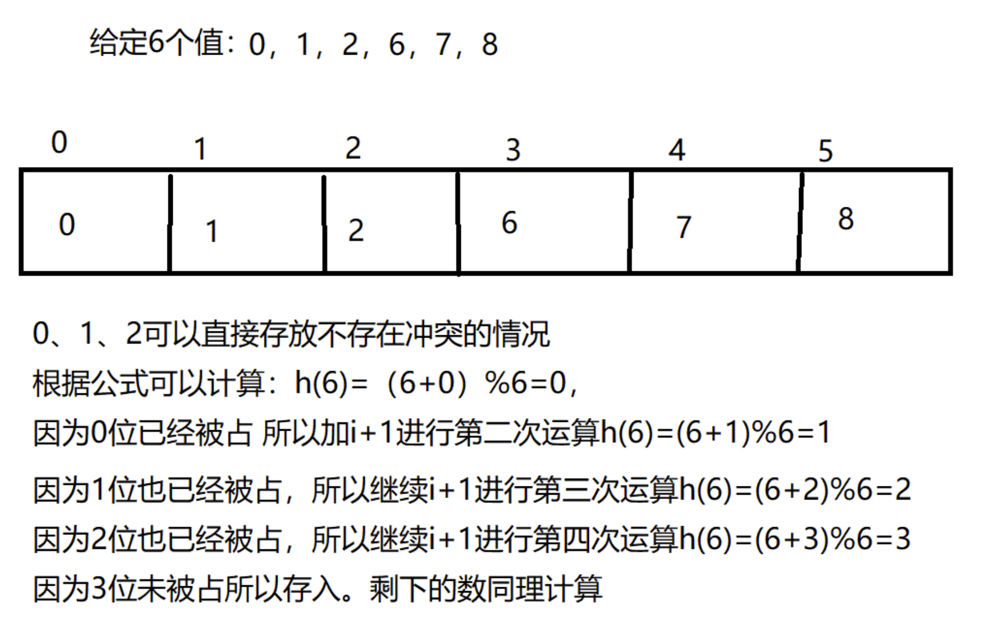
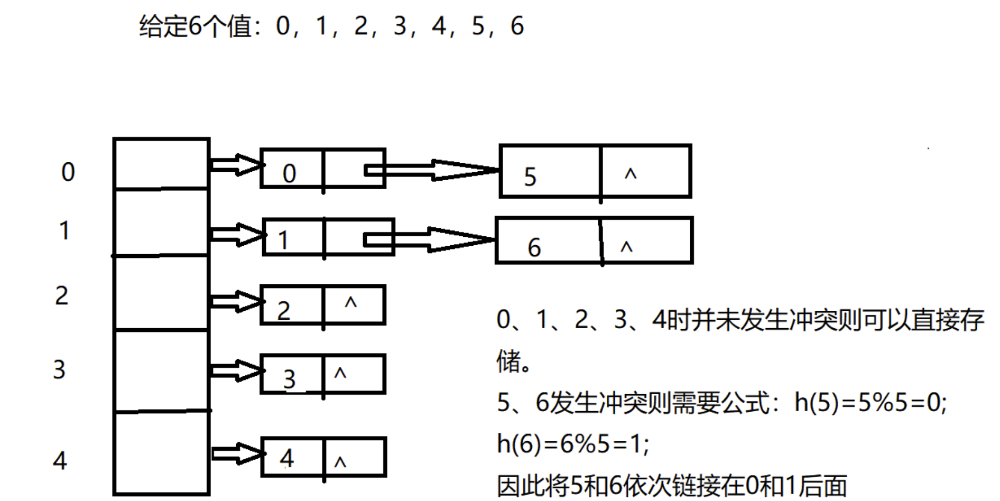
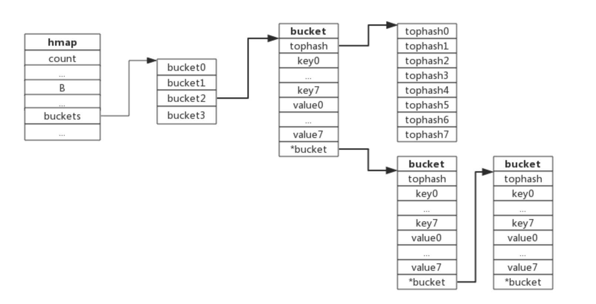
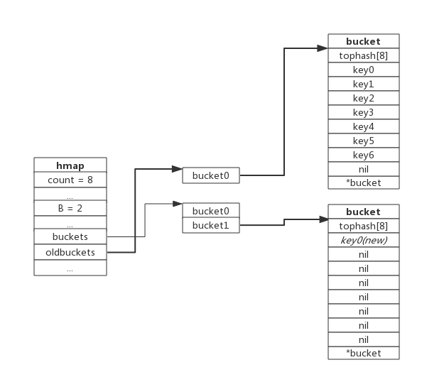
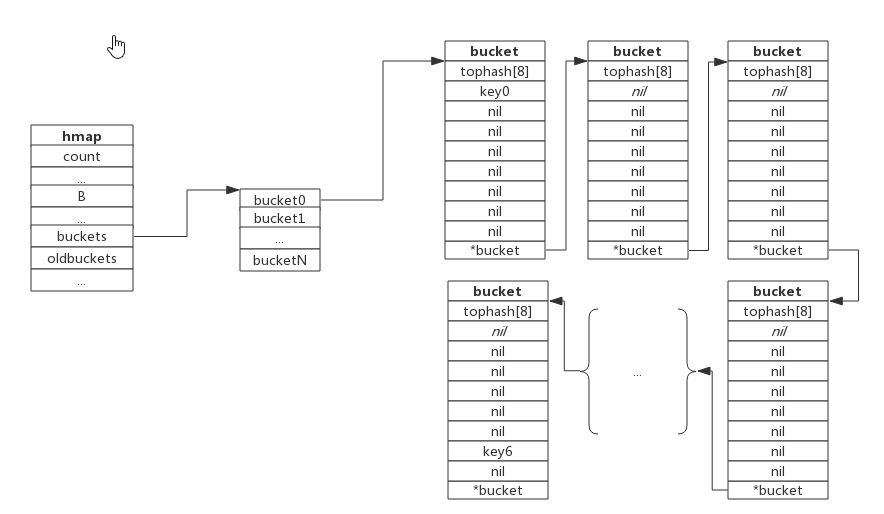

## 													golang 面试题

### 一、是么是面向对象

在了解 Go 语言 是不是面向对象（简称：OOP）之前，我们必须先知道 OOP 是啥，得先给它 ”下定义“。

根据Wikipedia的定义，我们梳理出 OOP 的几个基本认：

- 面向对象编程（OOP）是一种基于 "对象" 概念的编程范式，它可以包含数据和代码：数据以字段的形式存在（通常称为属性或属性），代码以程序的形式存在（通常为方法）。
- 对象自己的程序可以访问并经常修改自己的数据字段。
- 对象经常被定义为类的一个实例。
- 对象利用属性和方法的私有/受保护/公共可见性，对对象的内部状态收到保护，不受外界影响（被封装）。

#### 1.1 Go语言和Java有什么区别？

1. Go上不允许函数重载，必须具有方法和函数的唯一名称，而Java允许函数重载。
2. 在速度方面，Go的速度要比Java快。
3. Java默认允许多态，而Go没有。
4. Go语言使用HTTP协议进行路由配置，而Java使用Akka.routing.ConsistentHashingRouter和Akka.routing.ScatterGatherFirstCompletedRouter进行路由配置。
5. Go代码可以自动扩展到多个核心，而Java并不总是具有足够的可扩展性。
6. Go语言的继承通过匿名组合完成，基类以 Struct 的方式定义，子类只需要把基类作为成员放在子类的定义中，支持多继承；而Java的继承通过 extends 关键字完成，不支持多继承。

#### 1.2 Go是面向对象的语言吗？

是的，也不是。原因是：

1. Go有类型和方法，并且允许面向对象的编程风格，但没有类型层次。
2. Go中的 ”接口“ 概念提供了一种不同的方法，我们认为这种方法易于使用，而且在某些方面更加通用。还有一些方法可以将类型嵌入到其他类型中，以提供类似的东西，但不等同于子类。
3. Go 中的方法比 C++ 或Java中的方法更通用：它们可以为任何类型的数据定义，甚至是内置类型，如普通的、"未装箱的"整数。它们并不局限于结构（类）。

4. Go由于缺乏类型层次，Go中的 ”对象“ 比 C++ 或 Java 等语言更加轻巧。

#### 1.3 Go实现面向对象编程

##### 1.3.1 封装

面向对象中的 ”封装“ 指的是可以隐藏对象的颞部属性和实现细节，仅对外提供公开接口调用，这样子用户就不需要关注你内部是怎么实现的。

##### 1.3.2 在 Go  语言中的属性访问权限，通过首字母大小写来控制：

- 首字母大写，代表是公共的、可被外部访问的。
- 首字母小写，代表是私有的，不可以被外部访问。

Go 语言的例子如下：

```go
type Animal struct {
  name string;
}
func NewAnimal() *Animal {
  return &Animal{}
}
func (p *Animal) SetName(name string) {
  p.name = name
}
func (p *Animal) GetName() string {
  return p.name
}
```

在上述例子中，我们生命了一个结构体Animal，其属性 name 为小写。没法通过外部方法，在配套上存在 Setter 和 Getter 的方法，用于统一的访问和设置控制。

以此实现在 Go 语言中的基本封装。

##### 1.3.3 继承

面向对象中的 ”继承“ 指的是子类继承父类的特征和行为，使得子类对象（实例）具有父类的实例域和方法，或子类从父类继承方法，使得子类具有父类相同的行为。


从实际的例子来看，就是动物是一个大父类，下面又能细分为 ”食草动物“、”食肉动物“、这两者会包含 ”动物“  这个父类的基本定义。

##### 1.3.4 **在Go语言中，是没有类似 extends 关键字的这种继承的方式，在语言设计上采用的是组合的方式**：

```go
type Animal struct {
  Name string
}
type Cat struct {
  Animal
  FeatureA string
}
type Dog struct {
  Animal 
  FeatureB string
}
```

在上述例子中，我们声明了Cat 和Dog结构体，其在内部匿名组合了 Animal 结构体。因此 Cat 和 Dog 的实例都可以调用Animal结构体的方法：

```go
func main() {
  p := NewAnimal()
  p.SetName("我是伴鱼")
  
  dog := NewDog{Animal: *p}
  fmt.Println(dog.GetName())
}
```

同时 Cat 和 Dog 的实例可以拥有自己的方法：

```go
func (dog *Dog) HelloWorld() {
  fmt.Println("hello go")
}
func (cat *Cat) HelloWorld() {
  fmt.println("hello cat")
}
```

上述例子能够正常包含调用 Animal 的相关属性和方法，也能够拥有自己的独立属性和方法，在Go语言中表达了类似继承的效果。

##### 1.3.5 **多态**

面向对象中的 ”多态“ 指的同一个行为具有多种不同表现形式或形态的能力，具体是指一个类实例（对象）的相同方法在不同情形有不同表现形式。

多态也使得不同内部结构的对象可以共享相同的外部接口，也就是都是一套外部模板，内部实际是什么，只要符合规格就可以。

**在Go语言中，多态是通过接口来实现的**：

```go
type AnimalSounder interface {
  MakeDNA()
}
// 参数是AnimalSounder接口类型
func MakeSomeDNA(aninalSounder AnimalSounder) {
  aninalSounder.MakeDNA()
}
```

在上述例子中，我们声明了一个接口类型AnimalSounder，配套一个 MakeSomeDNA 方法，其接受 AnimalSounder接口类型作为参数。

因此在go语言中，只要配套的Cat和Dog的实例也实现了 MakeSomeDNA方法，那么我们就可以认为他是AnimalSounder接口类型：

```go
type AnimalSounder interface {
  MakeSounds()
}

func MakeSomeSounds(animalSounder AnimalSounder) {
  animalSounder.MakeSounds()
}
func (c *Cat) MakeSounds() {
  fmt.println("hello cat")
}
func (c *Dog) MakeSounds() {
  fmt.println("hello dog")
}
func main() {
  MakeSomeSounds(&Cat{})
  MakeSomeSounds(&Dog{})
}
```

当Cat 和 Dog 的实例实现了 AnimalSounder 接口类型的约束后，就意味着满足了条件，它们在 go 语言中就是一个东西。能够作为入参传入 MakeSomeSounds 方法中，在根据不同的实例实现多态行为。

在日常工作中，基本了解这些概念就可以了。若是面试，可以针对三大特性：”封装、继承、多态“ 和 五大原则 ”单一职责原则（SRP)“、开发封闭原则（OCP）、里式替换原则（LSP）、依赖倒置原则（DIP）、接口隔离原则（ISP）” 进行深入理解和说明。

### 二、基础部分

#### 2.1 golang 中 make 和 new 的区别？（基本必问）

**共同点**：给变量分配内存。

**不同点**：

1. 作用变量类型不同，new 给 string， int和数组分配内存， make给切片，map，channel 分配内存；
2. 返回类型不一样，new 返回执行变量的指针， make 返回变量本身；
3. new 分配的空间被清零。make 分配空间后，会进行初始化。
4. 字节的面试官还说了一个区别，就是分配的位置，在堆上还是栈上？

只要代码逻辑允许，编译器总是倾向于把变量分配在栈上，比分配在堆上更高效。编译器倾向于让变量不逃逸。（逃逸分析是指当函数局部变量的生命周期超过函数栈帧的生命周期时，编译器把该局部变量由栈分配改为堆分配，即变量从栈上逃逸到堆上）。

下面两个函数，返回值都是在堆上动态分配的int型变量的地址，编译器进行了逃逸分析。

```go
// go:noinline
func newInt1() *int{
    var a int
    return &a
}

// go:noinline
func newInt2() *int{
    return new(int)
}

func main(){
    println(*newInt1())
}
```

newInt1() 函数如果被分配在栈上，在函数返回后，栈帧被销毁，返回的变量a的地址会变成悬挂指针，对改地址所有读写都是不合法的，会造成程序逻辑错误或崩溃。

new() 与堆分配无必然联系，代码如下：

```go
func New() int{
  p := new(int)
  return *p
}
```

这个函数的 new()进行栈分配，因为变量的生命周期没有超过函数栈帧的生命周期。

把逻辑上没有逃逸的变量分配到堆上不会造成错误，只是效率低一些，但是把逻辑上逃逸了的变量分配到栈上就会造成悬挂指针等问题，因此编译器只有在能够确定变量没有逃逸的情况下才会把变量分配到栈上，在能够确定变量已经逃逸或者无法确定是否逃逸的情况，都要按照已经逃逸处理。

#### 2.2 数组和切片的区别（基本必问）

**相同点：**

1. 只能存储一组相同类型的数据结构。
2. 都是通过下标来访问，并且容量长度，长度通过len获取，容量通过 cap 获取。

**区别：**

1. **数组**是定长，访问和复制不能超过数组定义的长度，否则就会下标越界，**切片**长度和容量可以自动扩容。
2. 数组是值类型，切片是引用类型，每个切片都引用了一个底层数组，切片本身不存储任何数据，都是这底层数组存储数据，所以修改切片的时候修改的是底层数组中的数据。切片一旦扩容，指向一个新的底层数组，内存地址也就随之改变。

**简洁的回答**：

1. 定义方式不一样。
2. 初始化方式不一样，数组需要执行大小，大小不改变。
3. 在函数传递中，数组切片都是值传递。

**数组的定义：**

```go
var a1 [3]int
var a2 [...]int{1,2,3}
```

**切片的定义：**

```go
var a1 []int
var a2 := make([]int,3,5)
```

**数组的初始化：**

 ```go
 a1 := [...]int{1,2,3}
 a2 := [5]int{1,2,3}
 ```

**切片的初始化：**

```go
b := make([]int,3,5)
```

#### 2.3 IO多路复用

#### 2.4 for range 的时候它的地址会发生变化么？

答：在 for a,b := range c 遍历中，a 和 b 在内存中只会存在一份，即之后每次循环时遍历到的数据都是以值覆盖的方式赋给a和 b，a，b的内存地址始终不变。由于这个特性，for 循环里面如果开协诚，不要直接把 a 或者 b 的姿势传给协程。解决办法：在每次循环时，创建一个临时变量。

#### 2.5 go defer ，多个 defer 的顺序，defer 在什么时候会修改返回值？

作用：defer 延迟函数，释放资源，收尾工作；如释放锁，关闭文件，关闭连接；捕获panic；

避坑指南：defer 函数紧跟在资源打开后面，否则defer 可能得不到执行，导致内存泄露。

多个defer调用顺序是 LIFO （后入先出），defer后的操作可以理解为压入栈中。

defer ，return， return value （函数返回值）执行顺序：首先return，其次return value，最后defer。defer可以修改函数最终返回值，修改时机：有名返回值或者函数返回指针 参考：

```go
func b() (i int) { 	
    defer func() { 		
        i++ 		
        fmt.Println("defer2:", i) 	
    }() 	
    defer func() { 		
        i++ 		
        fmt.Println("defer1:", i) 	
    }() 	
    return i 
    //或者直接写成
    return 
} 
func main() { 	
    fmt.Println("return:", b()) 
} 
```

**函数返回指针**

```go
func c() *int { 	
    var i int 	
    defer func() { 		
        i++ 		
        fmt.Println("defer2:", i) 	
    }() 	
    defer func() { 		
        i++ 		
        fmt.Println("defer1:", i) 	
    }() 	
    return &i 
} 
func main() { 	
    fmt.Println("return:", *(c())) 
}
```

#### 2.6 uint 类型溢出问题

超过最大存储值如 uint8 最大是 255

```go
var a uint8 = 255

var b uint8 = 1

a + b = 0 总之类型溢出会出现难以意料的事。
```


#### 2.7 能介绍下 rune 类型吗？

相当于 int32 

golang 中的字符串底层实现是通过byte数组的，中文字符再unicode 下占2个字节，在 utf-8 编码下占3个字节，而golang默认编码正好是 utf-8。

byte 等同于int8 ，常用来处理 ascii 字符。

rune 等同于 int32，常用来处理 unicode 或 utf-8 字符。

```go
package main

import (
	"fmt"
	"unicode/utf8"
)

func main() {
	var str = "hello rune 张三"
	// golang 中 str 的底层是通过 byte 数组实现的，左移直接求len，实际是按照字节长度来计算的，所以一个汉字占了3个字节，算了3个长度
	fmt.Println("len(str) = ", len(str))
	fmt.Println("RuneCountInString = ",utf8.RuneCountInString(str))
	// 前面说到，字符串在底层的表示是一个字节序列。其中，英文字符占用 1 字节，中文字符占用 3 字节，
	// 所以得到的长度 17 显然是底层占用字节长度，而不是字符串长度，这时，便需要用到rune类型。
	fmt.Println("rune = ",len([]rune(str)))
}
// 结果如下
// len(str) =  17
// RuneCountInString =  13
// rune =  13
```

#### 2.8 golang 中解析 tag 是怎么实现的？反射原理是什么？（中高级肯定会问，比较难，需要自己去总结）


```go
package main

import (
	"fmt"
	"reflect"
)

type User struct {
	name string `json:name-field`
	age int
}

func main() {
	user := &User{"John Doe The Fourth", 20}
	field, ok := reflect.TypeOf(user).Elem().FieldByName("name")
	if !ok {
		panic("Field not found")
	}
	fmt.Println(getStructTag(field))
}
func getStructTag(f reflect.StructField) string {
	return string(f.Tag)
}
```

​	Go 中解析的 tag 是通过反射实现的，反射是指计算机程序在运行时（Run time）可以访问，检测和修改它本身状态或行为的一种能力或动态知道给定数据对象的类型和结构，并有机会修改它。反射将接口变量转换成反射对象 Type 和 value ； 反射可以通过反射对象 Value 还原成原先的接口变量；反射可以用来修改一个变量的值，前提是这个值可以被修改；tag 是啥？结构体支持标记，name string json: name-field 就是 json:name-field这部分。

```go
// 都是通过反射来实现的
gorm json yaml gRPC protobuf gin.Bind()
```

#### 2.9 调用函数传入结构体时，应该传值还是指针（Golang 都是传值）

​	Go 的函数参数传递都是值传递。所谓指传递：值在调用函数时将实际参数复制一份传递到函数中，这样在函数中如果对参数进行修改，将不会影响到实际参数。参数传递还有引用传递，所谓引用传递是指在调用函数时将实际参数的地址传递到函数中，那么在函数中对参数所进行的修改，将影响到实际参数。

​	因为 Go 里面的 map，slice，chan都是引用类型。变量区分【值类型】和【引用类型】。

- 值类型：变量和变量的值存在同一个位置。
- 引用类型：变量和变量的值是不同的位置，变量的值存储的是对值得引用。

但并不是 map，slice，chan 的所有的变量在函数内都能被修改，不同数据类型的底层存储结构和实现可能不太一样，情况也就不一样。

#### 2.10 goroutine 什么情况下会阻塞？

在 Go里面阻塞主要分为一下 4 种场景：

1. 由于原子，互斥量或通告操作调用导致 Goroutine 阻塞，调度器将把当前阻塞的 Goroutine 切换出去，重新调度 LRQ 上的其它 Goroutine；
2. 由于网络请求和 IO 操作导致 Goroutine 阻塞。Go程序提供了网络轮询器（NetPoller）来处理网络请求和 IO 操作的问题，其后台通过kqueue（MacOS），epoll（Linux）或 iocp（Windows）来实现 IO 多路复用。通过使用 NetPoller 进行网络系统调用，调度器可以防止 Goroutine 在进行这些系统调用时阻塞M。这可以让 M 执行 P 的LRQ中其他的 Goroutine，而不需要创建新的 M。执行网络系统调用不需要额外的 M，网络轮询器使用系统线程，它时刻处理一个有效的事件循环，有助于减少操作系统上的调度负载。用户层严重看到的 Goroutine 中的 ”block socket” ，实现 goroutine-per-connection 简单的网络编程模式。实际上是通过 Go runtime 中的netpoller 通过Non-block socket + IO 多路复用机制 “模拟”出来的。
3. 当调用一些系统方法的时候（如文件IO），如果系统方法调用的时候发生阻塞，这种情况下，网络轮询（NetPoller）无法使用，而进行系统调用的 G1 将阻塞当前 M1.调度器引入其它 M 来服务 M1 的P。
4. 如果在 Goroutine 去执行一个 sleep 操作，导致 M 被阻塞了。Go 程序后台有一个监控线程 sysmon，它监控那些长时间运行的 G 任务然后设置可以强占的标识符，别的 Goroutine 就可以抢先进来执行。

#### 2.11 讲讲 Go 的 select 底层数据结构和一些特性？（难点，没有项目经常可能说不清，面试一般会问你项目中怎么使用select）

​	Go 的select 为golang提供了多路 IO 复用机制，和其他 IO 复用一样，用于检测是否有读写时间是否 ready。Linux 的系统 IO 模型有，select， poll，epoll， go 的 select 和 linux 系统select 非常相似。

select 结构组成主要是由 case 语句和执行的函数组成 ，select 实现的多路复用是：每个线程或者进程都先注册和接受 channel （装置）注册，然后阻塞，然后只有一个线程在运输，当注册的线程和进程准备好数据后，装置会根据注册的信息得到相应的数据。

**select 的特征**

1. select 操作至少要有一个 case 语句，出现读写nil的channel该分支会忽略，在 nil 的channel上操作则会报错。
2. select 仅支持管道，而且是单协程操作。
3. 每个case语句仅能处理一个管道，要么读要么写。
4. 多个case语句的执行顺序是随机的。
5. 存在default语句，select 将不会阻塞，但是存在 default 会影响性能。

#### 2.12 讲讲Go的defer底层数据结构和一些特性？

每个defer语句都对应一个_defer实例，多个实例使用指针连接起来形成一个单链表，保存在 goroutine 数据结构中，每次插入 _defer 实例，军插入到链表的头部，函数结束再一次从头部去除，从而形成后进先出的效果。

**defer的规则总结：**

延迟函数的参数是 defer 语句出现的时候就已经确定了的。

延迟函数执行按照后进先出的顺序执行，即先出现的 defer 最后执行。

延迟函数可能操作主函数的返回值。

申请资源后立即使用 defer 关闭资源这个好习惯。

#### 2.13 单引号、双引号、反引号的区别？

单引号，表示byte类型或rune类型，对应uint8和int32类型，默认是rune类型。byte用来强调是raw data，而不是数字；而 rune用来表示 Unicode 的 code point。

双引号，才是字符串，实际上是字符数组。可以用索引号访问某字节，也可以用 len() 函数来获取字符串所占用的字节长度。

反引号，表示字符串字面量，但不支持任何转义序列。字面量 raw literal string 的意思是，你定时写的啥样，它就啥样，你有换行，它就换行。你写转义字符，他也就砖石转义字符。

#### 2.14 go出现panic的场景

https://www.cnblogs.com/paulwhw/p/15585467.html

- 数组/切片越界
- 空指针调用。比如访问一个 nil 结构体指针的成员
- 过早关闭 HTTP 响应体
- 除以 0
- 向已经关闭的 channel 发送消息
- 重复关闭 channel
- 关闭未初始化的 channel
- 未初始化 map。注意访问 map 不存在的 key 不会 panic，而是返回 map 类型对应的零值，但是不能直接赋值
- 跨协程的 panic 处理
- sync 计数为负数。
- 类型断言不匹配。`var a interface{} = 1; fmt.Println(a.(string))` 会 panic，建议用 `s,ok := a.(string)`

#### 2.15 go是否支持while循环，如何实现这种机制

Go 语言没有 while 和 do...while 语法，这一点和其他语言不同，需要格外注意一下，如果需要使用类似其它语言(比如 java / c 的 while 和 do...while )，可以通过 for 循环来实现其使用效果。

```go
package main
 
import "fmt"
 
func main() {
   // 使用while方式输出10句 "hello,world"
   // 循环变量初始化
   var i int = 1
   for {
      if i > 10 { // 循环条件
         break // 跳出for循环,结束for循环
      }
      fmt.Println("hello,world", i)
      i++ // 循环变量的迭代
   }
 
   fmt.Println("i=", i)
}
```

#### 2.15 go 里面如何实现set？

Go 中是不提供Set 类型的，Set是一个集合，其本质就是一个List，只是List里的元素不能重复。

Go 提供了 map 类型，但是我们知道，map类型的key是不能重复的，因此，我们可以利用这一点，来实现一个set。那 value 呢？value我们可以用一个常量来代替，比如一个空结构体，实际上空结构体不占任何内存，使用空结构体，能够帮我们节省内存空间，提高性能。

#### 2.16 go 如何实现类似于java当中的继承机制？

说到继承我们都知道，在Go中没有extends关键字，也就意味着Go并没有原生级别的继承支持。这也是为什么我在文章开头用了**伪继承**这个词。本质上，Go使用interface实现的功能叫组合，Go是使用组合来实现的继承，说的更精确一点，是使用组合来代替的继承，举个很简单的例子:

**通过组合实现了继承：**

```go
type Animal struct {
    Name string
}

func (a *Animal) Eat() {
    fmt.Printf("%v is eating", a.Name)
    fmt.Println()
}

type Cat struct {
    *Animal
}

cat := &Cat{
    Animal: &Animal{
        Name: "cat",
    },
}
cat.Eat() // cat is eating
```

**首先**，我们实现了一个Animal的结构体，代表动物类。并声明了Name字段，用于描述动物的名字。

**然后**，实现了一个以Animal为receiver的Eat方法，来描述动物进食的行为。

**最后**，声明了一个Cat结构体，组合了Cat字段。再实例化一个猫，调用Eat方法，可以看到会正常的输出。

可以看到，Cat结构体本身没有Name字段，也没有去实现Eat方法。唯一有的就是组合了Animal父类，至此，我们就证明了已经通过组合实现了继承。

**总结：**

- 如果一个 struct 嵌套了另一个匿名结构体，那么这个结构可以直接访问匿名结构体的属性和方法，从而实现继承。
- 如果一个 struct 嵌套了另一个有名的结构体，那么这个模式叫做组合。
- 如果一个 struct 嵌套了多个匿名结构体，那么这个结构可以直接访问多个匿名结构体的属性和方法，从而实现多重继承。

#### 2.17 怎么去复用一个接口的方法？

```go
package main

import "fmt"

type USB interface {
	Stop()
	Start()
}
type IPhone struct {
	name string
}

func (i IPhone) Start() {
	fmt.Println("IPhone Start name = ", i.name)
}
func (i IPhone) Stop() {
	fmt.Println("IPhone Stop name = ", i.name)
}

type Camera struct {
	name string
}

func (c Camera) Start() {
	fmt.Println("camera name = ", c.name)
}
func (c Camera) Stop() {
	fmt.Println("camera stop name = ", c.name)
}

type Computer struct {
	name string
}

func (cp Computer) Working(usb USB) {
	usb.Start()
	usb.Stop()
}
func main() {
	phone := IPhone{
		name: "苹果",
	}
	camera := Camera{
		name: "佳能",
	}
	computer := Computer{
		name: "Mac",
	}
	computer.Working(phone)
	computer.Working(camera)
}
```

#### 2.19 go里面的 _

1. **忽略返回值**
2. 比如某个函数返回三个参数，但是我们只需要其中的两个，另外一个参数可以忽略，这样的话代码可以这样写：

```go
v1, v2, _ := function(...)
v1, _, _ := function(...)
```

3. **用在变量(特别是接口断言)**

```go
type T struct{}
var _ X = T{}
//其中 I为interface
```

上面用来判断 type T是否实现了X,用作类型断言，如果T没有实现接口X，则编译错误.

4. **用在import package**

```go
import _ "test/food"
```

引入包时，会先调用包中的初始化函数，这种使用方式仅让导入的包做初始化，而不使用包中其他功能

#### 2.20 goroutine 创建的时候如果要传入一个参数进去有什么要注意的点？

```go
// 3. 正确示范
for _, i := range a {
    fmt.Printf("-----%s---\n", i)
    go func(a string) {
        //time.Sleep(time.Second * 4)
        testDomain(a)
    }(i)
}
// 这种操作会先将i的值传递给形参a，i的变化不会对testDomain方法的执行产生影响
```

#### 2.21 写go单元测试的规范？

1. **单元测试文件命名规则 ：**

单元测试需要创建单独的测试文件，不能在原有文件中书写，名字规则为 xxx_test.go。这个规则很好理解。

2. **单元测试包命令规则**

单元测试文件的包名为原文件的包名添加下划线接test，举例如下：

```go
// 原文件包名：
package xxx
// 单元测试文件包名：
package xxx_test
```

3. **单元测试方法命名规则**

单元测试文件中的测试方法和原文件中的待测试的方法名相对应，以Test开头，举例如下：

```go
// 原文件方法：
func Xxx(name string) error 
// 单元测试文件方法：
func TestXxx()
```

4. **单元测试方法参数**

单元测试方法的参数必须是t *testing.T，举例如下：

```go
func TestZipFiles(t *testing.T) { ...
```

#### 2.22 单步调试？

https://www.jianshu.com/p/21ed30859d80

#### 2.23 导入一个go的工程，有些依赖找不到，改怎么办？

https://www.cnblogs.com/niuben/p/16182001.html

#### 2.24 [值拷贝 与 引用拷贝，深拷贝 与 浅拷贝](https://www.cnblogs.com/yizhixiaowenzi/p/14664222.html)

map，slice，chan 是引用拷贝；引用拷贝 是 浅拷贝

其余的，都是 值拷贝；值拷贝 是 深拷贝

**深浅拷贝的本质区别**：

是否真正获取对象实体，而不是引用

**深拷贝：**

拷贝的是数据本身，创造一个新的对象，并在内存中开辟一个新的内存地址，与原对象是完全独立的，不共享内存，修改新对象时不会影响原对象的值。释放内存时，也没有任何关联。

**值拷贝：**

接收的是 整个array的值拷贝，所以方法对array中元素的重新赋值不起作用。

```go
package main  

import "fmt"  

func modify(a [3]int) {  
    a[0] = 4  
    fmt.Println("modify",a)             // modify [4 2 3]
}  

func main() {  
    a := [3]int{1, 2, 3}  
    modify(a)  
    fmt.Println("main",a)                  // main [1 2 3]
}  
```

**浅拷贝：**

拷贝的是数据地址，只复制指向的对象的指针，新旧对象的内存地址是一样的，修改一个另一个也会变。释放内存时，同时释放。

**引用拷贝：**

函数的引用拷贝与原始的引用指向同一个数组，所以对数组中元素的修改，是有效的

```go
package main  
  
import "fmt"  
  
func modify(s []int) {  
    s[0] = 4  
    fmt.Println("modify",s)          // modify [4 2 3]
}  
  
func main() {  
    s := []int{1, 2, 3}  
    modify(s)  
    fmt.Println("main",s)              // main [4 2 3]
}
```

### 三、slice 切片

#### **3.1 数组和切片的区别 （基本必问）**

1. **相同点：**

- 只能存储一组相同类型的数据结构

- 都是通过下标来访问，并且有容量长度，长度通过 len 获取，容量通过 cap 获取

2. **区别：**

- 数组是定长，访问和复制不能超过数组定义的长度，否则就会下标越界，切片长度和容量可以自动扩容

- 数组是值类型，切片是引用类型，每个切片都引用了一个底层数组，切片本身不能存储任何数据，都是这底层数组存储数据，所以修改切片的时候修改的是底层数组中的数据。切片一旦扩容，指向一个新的底层数组，内存地址也就随之改变

3. **简洁的回答：**

- 定义方式不一样 2）初始化方式不一样，数组需要指定大小，大小不改变 3）在函数传递中，数组切片都是值传递。

4. **数组的定义**

```go
var a1 [3]int

var a2 [...]int{1,2,3}
```

5. **切片的定义**

```go
var a1 []int

var a2 := make([]int,3,5)
```

6. **数组的初始化**

```go
a1 := [...]int{1,2,3}

a2 := [5]int{1,2,3}
```

7. **切片的初始化**

```go
b := make([]int,3,5)
```

#### **3.2 讲讲 Go 的 slice 底层数据结构和一些特性？**

答：Go 的 slice 底层数据结构是由一个 array 指针指向底层数组，len 表示切片长度，cap 表示切片容量。slice 的主要实现是扩容。对于 append 向 slice 添加元素时，假如 slice 容量够用，则追加新元素进去，slice.len++，返回原来的 slice。当原容量不够，则 slice 先扩容，扩容之后 slice 得到新的 slice，将元素追加进新的 slice，slice.len++，返回新的 slice。对于切片的扩容规则：当切片比较小时（容量小于 1024），则采用较大的扩容倍速进行扩容（新的扩容会是原来的 2 倍），避免频繁扩容，从而减少内存分配的次数和数据拷贝的代价。当切片较大的时（原来的 slice 的容量大于或者等于 1024），采用较小的扩容倍速（新的扩容将扩大大于或者等于原来 1.25 倍），主要避免空间浪费，网上其实很多总结的是 1.25 倍，那是在不考虑内存对齐的情况下，实际上还要考虑内存对齐，扩容是大于或者等于 1.25 倍。

（关于刚才问的 slice 为什么传到函数内可能被修改，如果 slice 在函数内没有出现扩容，函数外和函数内 slice 变量指向是同一个数组，则函数内复制的 slice 变量值出现更改，函数外这个 slice 变量值也会被修改。如果 slice 在函数内出现扩容，则函数内变量的值会新生成一个数组（也就是新的 slice，而函数外的 slice 指向的还是原来的 slice，则函数内的修改不会影响函数外的 slice。）

#### 3.3 golang中数组和slice作为参数的区别？slice作为参数传递有什么问题？

https://blog.csdn.net/weixin_44387482/article/details/119763558

1. 当使用数组作为参数和返回值的时候，传进去的是值，在函数内部对数组进行修改并不会影响原数据
2. 当切片作为参数的时候穿进去的是值，也就是值传递，但是当我在函数里面修改切片的时候，我们发现源数据也会被修改，这是因为我们在切片的底层维护这一个匿名的数组，当我们把切片当成参数的时候，会重现创建一个切片，但是创建的这个切片和我们原来的数据是共享数据源的，所以在函数内被修改，源数据也会被修改
3. 数组还是切片，在函数中传递的时候如果没有指定为指针传递的话，都是值传递，但是切片在传递的过程中，有着共享底层数组的风险，所以如果在函数内部进行了更改的时候，会修改到源数据，所以我们需要根据不同的需求来处理，如果我们不希望源数据被修改话的我们可以使用copy函数复制切片后再传入，如果希望源数据被修改的话我们应该使用指针传递的方式

### **四、map相关**

#### 4.1 map 使用注意的点，是否并发安全？

map的类型是map[key]，key类型的ke必须是可比较的，通常情况，会选择内建的基本类型，比如整数、字符串做key的类型。如果要使用struct作为key，要保证struct对象在逻辑上是不可变的。在Go语言中，map[key]函数返回结果可以是一个值，也可以是两个值。map是无序的，如果我们想要保证遍历map时元素有序，可以使用辅助的数据结构，例如orderedmap。

**第一**、 一定要先初始化，否则panic

**第二** 、map类型是容易发生并发访问问题的。不注意就容易发生程序运行时并发读写导致的panic。 Go语言内建的map对象不是线程安全的，并发读写的时候运行时会有检查，遇到并发问题就会导致panic。

#### 4.2 map 循环是有序的还是无序的？

无序的, map 因扩张⽽重新哈希时，各键值项存储位置都可能会发生改变，顺序自然也没法保证了，所以官方避免大家依赖顺序，直接打乱处理。就是 for range map 在开始处理循环逻辑的时候，就做了随机播种

#### 4.3 map 中删除一个 key，它的内存会释放么？（常问）

如果删除的元素是值类型，如int，float，bool，string以及数组和struct，map的内存不会自动释放

如果删除的元素是引用类型，如指针，slice，map，chan等，map的内存会自动释放，但释放的内存是子元素应用类型的内存占用

将map设置为nil后，内存被回收。

**这个问题还需要大家去搜索下答案，我记得有不一样的说法，谨慎采用本题答案。**

#### 4.4 怎么处理对 map 进行并发访问？有没有其他方案？ 区别是什么？

##### 4.4.1 map 是什么

map 是 Go 中用于存储key-value关系数据的数据结构，类似 C++ 中的 map。Go 中 map 的使用很简单，但是对于初学者，经常会犯两个错误：没有初始化，并发读写。

1. 未初始化的 map 都是 nil，直接赋值 panic。map 作为结构体成员的时候，很容易忘记对它的初始化。
2. 并发读写使我们使用 map 中很常见的一个错误。多个协程读写同一个 key 的时候，会出现冲突，导致 panic。

Go 内置的 map 类型并没有对并发场景进行优化，但是并发场景又很常见，如何实现线程安全（并发安全）的 map 就很重要。

##### 4.4.2 三种线程安全的 map

1. **加读写锁（RWMutex）**

这是最容易想到的一种方式。常见的 map 的操作有增删改查和遍历，这里面查和遍历是读操作，增删改是写操作，因此对查和遍历需要加读锁，对增删改需要加写锁。

以 map[int]int 为例，借助 RWMutex，具体的实现方式如下:

```go
type RWMap struct { // 一个读写锁保护的线程安全的map
    sync.RWMutex // 读写锁保护下面的map字段
    m map[int]int
}
// 新建一个RWMap
func NewRWMap(n int) *RWMap {
    return &RWMap{
        m: make(map[int]int, n),
    }
}
func (m *RWMap) Get(k int) (int, bool) { //从map中读取一个值
    m.RLock()
    defer m.RUnlock()
    v, existed := m.m[k] // 在锁的保护下从map中读取
    return v, existed
}
 
func (m *RWMap) Set(k int, v int) { // 设置一个键值对
    m.Lock()              // 锁保护
    defer m.Unlock()
    m.m[k] = v
}
 
func (m *RWMap) Delete(k int) { //删除一个键
    m.Lock()                   // 锁保护
    defer m.Unlock()
    delete(m.m, k)
}
 
func (m *RWMap) Len() int { // map的长度
    m.RLock()   // 锁保护
    defer m.RUnlock()
    return len(m.m)
}
 
func (m *RWMap) Each(f func(k, v int) bool) { // 遍历map
    m.RLock()             //遍历期间一直持有读锁
    defer m.RUnlock()
 
    for k, v := range m.m {
        if !f(k, v) {
            return
        }
    }
}
```

2. **分片加锁**

通过读写锁RWMutex 实现的线程安全的  map，功能上已经完全满足需求，但是要面对高并发的场景，仅仅功能满足可不行，性能也得跟上。锁是性能下降的万恶之源之一。所以并发编程的原则就是尽可能的减少锁的使用。当锁不得可用的时候，可以减小锁的力度和持有的时间。

在第一种方法中，加锁的对象是整个map，协程A对 map 中的 key 进行修改操作，会导致其它协程无法对其它 key 进行读写操作。一种解决思路是将这个 map 分成 n 快，每个块之间的读写操作互不干扰，从而降低冲突的可能性。

Go 比较知名的分配 map 的实现是 orcaman/concurrent-map，它的定义如下：

```go
var SHARD_COUNT = 32
   
// 分成SHARD_COUNT个分片的map
type ConcurrentMap []*ConcurrentMapShared
   
// 通过RWMutex保护的线程安全的分片，包含一个map
type ConcurrentMapShared struct {
    items        map[string]interface{}
    sync.RWMutex // Read Write mutex, guards access to internal map.
}
   
// 创建并发map
func New() ConcurrentMap {
    m := make(ConcurrentMap, SHARD_COUNT)
    for i := 0; i < SHARD_COUNT; i++ {
        m[i] = &ConcurrentMapShared{items: make(map[string]interface{})}
    }
    return m
}
   
 
// 根据key计算分片索引
func (m ConcurrentMap) GetShard(key string) *ConcurrentMapShared {
    return m[uint(fnv32(key))%uint(SHARD_COUNT)]
}
```

ConcurrentMap 其实就是一个切片，切片的每个元素都是第一种方法中携带了读写锁的 map。

这里面 GetShard 方法就是用来计算每一个 key 应该分配到哪个分片上。

再来看一下 Set 和 Get 操作。

```go
func (m ConcurrentMap) Set(key string, value interface{}) {
    // 根据key计算出对应的分片
    shard := m.GetShard(key)
    shard.Lock() //对这个分片加锁，执行业务操作
    shard.items[key] = value
    shard.Unlock()
}
 
func (m ConcurrentMap) Get(key string) (interface{}, bool) {
    // 根据key计算出对应的分片
    shard := m.GetShard(key)
    shard.RLock()
    // 从这个分片读取key的值
    val, ok := shard.items[key]
    shard.RUnlock()
    return val, ok
}
```

Get 和 Set 方法类似，都是根据 key 用 GetShard 计算出分片索引，找到对应的 map 块，执行读写操作。

3. sync 中的 map

分片加锁的思路是将大块的数据切分成小块的数据，从而减少冲突导致锁阻塞的可能性。如果在一些特殊的场景下，将读写数据分开，是不是能在进一步提升性能呢？

在内置的 sync 包中（Go 1.9+）也有一个线程安全的 map，通过将读写分离的方式实现了某些特定场景下的性能提升。

其实在生产环境中，sync.map 用的很少，官方文档推荐的两种使用场景是：

> a) when the entry for a given key is only ever written once but read many times, as in caches that only grow.
> b) when multiple goroutines read, write, and overwrite entries for disjoint sets of keys.

两种场景都比较苛刻，要么是一写多读，要么是各个协程操作的 key 集合没有交集（或者交集很少）。所以官方建议先对自己的场景做性能测评，如果确实能显著提高性能，再使用 sync.map。

sync.map 的整体思路就是用两个数据结构（只读的 read 和可写的 dirty）尽量将读写操作分开，来减少锁对性能的影响。

下面详细看下 sync.map 的定义和增删改查实现。

3. **sync.map 数据结构定义** 

```go
type Map struct {
    mu Mutex
    // 基本上你可以把它看成一个安全的只读的map
    // 它包含的元素其实也是通过原子操作更新的，但是已删除的entry就需要加锁操作了
    read atomic.Value // readOnly
 
    // 包含需要加锁才能访问的元素
    // 包括所有在read字段中但未被expunged（删除）的元素以及新加的元素
    dirty map[interface{}]*entry
 
    // 记录从read中读取miss的次数，一旦miss数和dirty长度一样了，就会把dirty提升为read，并把dirty置空
    misses int
}
 
type readOnly struct {
    m       map[interface{}]*entry
    amended bool // 当dirty中包含read没有的数据时为true，比如新增一条数据
}
 
// expunged是用来标识此项已经删掉的指针
// 当map中的一个项目被删除了，只是把它的值标记为expunged，以后才有机会真正删除此项
var expunged = unsafe.Pointer(new(interface{}))
 
// entry代表一个值
type entry struct {
    p unsafe.Pointer // *interface{}
}
```

Map 的定义中，read 字段通过 atomic.Values 存储被高频读的 readOnly 类型的数据。dirty 存储

4. **Store 方法**

Store 方法用来设置一个键值对，或者更新一个键值对。

```go
func (m *Map) Store(key, value interface{}) {
    read, _ := m.read.Load().(readOnly)
    // 如果read字段包含这个项，说明是更新，cas更新项目的值即可
    if e, ok := read.m[key]; ok && e.tryStore(&value) {
        return
    }
 
    // read中不存在，或者cas更新失败，就需要加锁访问dirty了
    m.mu.Lock()
    read, _ = m.read.Load().(readOnly)
    if e, ok := read.m[key]; ok { // 双检查，看看read是否已经存在了
        if e.unexpungeLocked() {
            // 此项目先前已经被删除了，需要添加到 dirty 中
            m.dirty[key] = e
        }
        e.storeLocked(&value) // 更新
    } else if e, ok := m.dirty[key]; ok { // 如果dirty中有此项
        e.storeLocked(&value) // 直接更新
    } else { // 否则就是一个新的key
        if !read.amended { //如果dirty为nil
            // 需要创建dirty对象，并且标记read的amended为true,
            // 说明有元素它不包含而dirty包含
            m.dirtyLocked()
            m.read.Store(readOnly{m: read.m, amended: true})
        }
        m.dirty[key] = newEntry(value) //将新值增加到dirty对象中
    }
    m.mu.Unlock()
}
 
// tryStore利用 cas 操作来更新value。
// 更新之前会判断这个键值对有没有被打上删除的标记
func (e *entry) tryStore(i *interface{}) bool {
    for {
        p := atomic.LoadPointer(&e.p)
        if p == expunged {
            return false
        }
        if atomic.CompareAndSwapPointer(&e.p, p, unsafe.Pointer(i)) {
            return true
        }
    }
}
 
// 将值设置成 nil，表示没有被删除
func (e *entry) unexpungeLocked() (wasExpunged bool) {
    return atomic.CompareAndSwapPointer(&e.p, expunged, nil)
}
 
// 通过复制 read 生成 dirty
func (m *Map) dirtyLocked() {
    if m.dirty != nil {
        return
    }
 
    read, _ := m.read.Load().(readOnly)
    m.dirty = make(map[interface{}]*entry, len(read.m))
    for k, e := range read.m {
        if !e.tryExpungeLocked() {
            m.dirty[k] = e
        }
    }
}
 
// 标记删除
func (e *entry) tryExpungeLocked() (isExpunged bool) {
    p := atomic.LoadPointer(&e.p)
    for p == nil {
        if atomic.CompareAndSwapPointer(&e.p, nil, expunged) {
            return true
        }
        p = atomic.LoadPointer(&e.p)
    }
    return p == expunged
}
```

第2-6行，通过 cas 进行键值对更新，更新成功直接返回。

第8-28行，通过互斥锁加锁来处理处理新增键值对和更新失败的场景（键值对被标记删除）。

第11行，再次检查 read 中是否已经存在要 Store 的 key（双检查是因为之前检查的时候没有加锁，中途可能有协程修改了 read）。

如果该键值对之前被标记删除，先将这个键值对写到 dirty 中，同时更新 read。

如果 dirty 中已经有这一项了，直接更新 read。

如果是一个新的 key。dirty 为空的情况下通过复制 read 创建 dirty，不为空的情况下直接更新 dirty。

5. **Load 方法**

Load 方法比较简单，先是从 read 中读数据，读不到，再通过互斥锁锁从 dirty 中读数据。

```go
func (m *Map) Load(key interface{}) (value interface{}, ok bool) {
    // 首先从read处理
    read, _ := m.read.Load().(readOnly)
    e, ok := read.m[key]
    if !ok && read.amended { // 如果不存在并且dirty不为nil(有新的元素)
        m.mu.Lock()
        // 双检查，看看read中现在是否存在此key
        read, _ = m.read.Load().(readOnly)
        e, ok = read.m[key]
        if !ok && read.amended {//依然不存在，并且dirty不为nil
            e, ok = m.dirty[key]// 从dirty中读取
            // 不管dirty中存不存在，miss数都加1
            m.missLocked()
        }
        m.mu.Unlock()
    }
    if !ok {
        return nil, false
    }
    return e.load() //返回读取的对象，e既可能是从read中获得的，也可能是从dirty中获得的
}
 
func (m *Map) missLocked() {
    m.misses++ // misses计数加一
    if m.misses < len(m.dirty) { // 如果没达到阈值(dirty字段的长度),返回
        return
    }
    m.read.Store(readOnly{m: m.dirty}) //把dirty字段的内存提升为read字段
    m.dirty = nil // 清空dirty
    m.misses = 0  // misses数重置为0
}
```

这里需要注意的是，如果出现多次从 read 中读不到数据，得到 dirty 中读取的情况，就直接把 dirty 升级成 read，以提高 read 效率。

6. **Delete 方法**

下面是 Go1.13 中 Delete 的实现方式，如果 key 在 read 中，就将值置成 nil；如果在 dirty 中，直接删除 key。

```go
func (m *Map) Delete(key interface{}) {
    read, _ := m.read.Load().(readOnly)
    e, ok := read.m[key]
    if !ok && read.amended {
        m.mu.Lock()
        read, _ = m.read.Load().(readOnly)
        e, ok = read.m[key]
        if !ok && read.amended { // 说明可能在
            delete(m.dirty, key)
        }
        m.mu.Unlock()
    }
    if ok {
        e.delete()
    }
}
 
func (e *entry) delete() (hadValue bool) {
    for {
        p := atomic.LoadPointer(&e.p)
        if p == nil || p == expunged {
            return false
        }
        if atomic.CompareAndSwapPointer(&e.p, p, nil) {
            return true
        }
    }
}
```

补充说明一下，delete() 执行完之后，e.p 变成 nil，下次 Store 的时候，执行到 dirtyLocked() 这一步的时候，会被标记成 enpunged。因此在 read 中 nil 和 enpunged 都表示删除状态。

7. **sync.map 总结**

上面对源码粗略的梳理了一遍，最后在总结一下 sync.map 的实现思路：

- 读写分离。读（更新）相关的操作尽量通过不加锁的 read 实现，写（新增）相关的操作通过 dirty 加锁实现。
- 动态调整。新写入的 key 都只存在 dirty 中，如果 dirty 中的 key 被多次读取，dirty 就会上升成不需要加锁的 read。
- 延迟删除。Delete 只是把被删除的 key 标记成 nil，新增 key-value 的时候，标记成 enpunged；dirty 上升成 read 的时候，标记删除的 key 被批量移出 map。这样的好处是 dirty 变成 read 之前，这些 key 都会命中 read，而 read 不需要加锁，无论是读还是更新，性能都很高。

总结了 sync.map 的设计思路后，我们就能理解官方文档推荐的 sync.map 的两种应用场景了。

8. **总结**

Go 内置的 map 使用起来很方便，但是在并发频繁的 Go 程序中很容易出现并发读写冲突导致的问题。本文介绍了三种常见的线程安全 map 的实现方式，分别是读写锁、分片锁和 sync.map。

较常使用的是前两种，而在特定的场景下，sync.map 的性能会有更优的表现。

##### 4.4.3 nil map和空 map 有何不同？

1. 可以对未初始化的 map 进行取值，但取出来的东西是空：

```go
var m map[string]string
fmt.println(m["1"])
```

2. 不能对为初始化的 map 进行复制，这样将会抛出一个异常：

未初始化的 map 是 nil，它与一个空 map 基本等价，只是 nil 的map 不允许往里面添加值。

```go
var m1 map[string]string
m1["1"] = "1"
panic: assignment to entry in nil map

//因此，map是nil时，取值是不会报错的（取不到而已），但增加值会报错。

//其实，还有一个区别，delete一个nil map会panic，
//但是delete 空map是一个空操作（并不会panic）
//（这个区别在最新的Go tips中已经没有了，即：delete一个nil map也不会panic）
```

3. 通过 fmt 打印 map 时，空 map 和 nil  map 结果是一样的，都为 map[]。所以，这个时候别判定 map 是空还是 nil，而应该通过map == nil 来判断。

   **nil map 未初始化，空 map 是长度为空**

##### 4.4.4 map的数据结构是什么

golang 中 map 是一个  kv 对集合。底层使用 hash table，用链表来解决冲突，出现冲突时，不是每一个 key 都申请一个结构通过链表串起来，而是以 bmap 为最小粒度挂载，一个bmap 可以放 8 个 kv。在哈希函数的选择上，会在程序启动时，检测 cpu 是否支持 aes，如果支持，则使用 aes hash，否则使用 memhash。每个 map 的底层结构是 hmap，是有若干个结构为 bmap的 bucket 组成的数组。每个 bucket 底层都采用链表结构。

**hmap 的结构如下**：

```go
type hmap struct {     
    count     int                  // 元素个数     
    flags     uint8     
    B         uint8                // 扩容常量相关字段B是buckets数组的长度的对数 2^B     
    noverflow uint16               // 溢出的bucket个数     
    hash0     uint32               // hash seed     
    buckets    unsafe.Pointer      // buckets 数组指针     
    oldbuckets unsafe.Pointer      // 结构扩容的时候用于赋值的buckets数组     
    nevacuate  uintptr             // 搬迁进度     
    extra *mapextra                // 用于扩容的指针 
}
```

**下图展示一个拥有4个bucket的map：**


本例中, hmap.B=2， 而hmap.buckets长度是2^B为4. 元素经过哈希运算后会落到某个bucket中进行存储。查找过程类似。

bucket很多时候被翻译为桶，所谓的哈希桶实际上就是bucket。

**bucket数据结构**

bucket数据结构由runtime/map.go:bmap定义：

```go
type bmap struct {
    tophash [8]uint8 //存储哈希值的高8位
    data    byte[1]  //key value数据:key/key/key/.../value/value/value...
    overflow *bmap   //溢出bucket的地址
}
```

每个bucket可以存储8个键值对。

- tophash是个长度为8的数组，哈希值相同的键（准确的说是哈希值低位相同的键）存入当前bucket时会将哈希值的高位存储在该数组中，以方便后续匹配。
- data区存放的是key-value数据，存放顺序是key/key/key/…value/value/value，如此存放是为了节省字节对齐带来的空间浪费。
- overflow 指针指向的是下一个bucket，据此将所有冲突的键连接起来。

注意：上述中data和overflow并不是在结构体中显示定义的，而是直接通过指针运算进行访问的。

下图展示bucket存放8个key-value对：


**解决哈希冲突（四种方法）**

1. **了解哈希表及哈希冲突**

> 哈希表：是一种实现关联数组抽象数据类型的数据结构，这种结构可以将关键码映射到给定值。简单来说哈希表（key-value）之间存在一个映射关系，是键值对的关系，一个键对应一个值。
>
> 哈希冲突：当两个不同的数经过哈希函数计算后得到了同一个结果，即他们会被映射到哈希表的同一个位置时，即称为发生了哈希冲突。简单来说就是哈希函数算出来的地址被别的元素占用了。

2. **解决哈希冲突办法**

> ①：开放地址法：我们在遇到哈希冲突时，去寻找一个新的空闲的哈希地址。
>
> 举例：就是当我们去教室上课，发现该位置已经存在人了，所以我们应该寻找新的位子坐下，这就是开放定址法的思路。如何寻找新的位置就通过以下几种方法实现
>
> - 线性探测法
>
>   当我们所需要存放值的位置被占用了，我们就往后面一直加 1 并对 m 取模直到存在一个空余的地址供我们存放值，取模是为了保证找到的位置 0~m-1 的有效空间之中。
>
>   
>
>   存在问题：出现非同义词冲突（两个不想同的哈希值，抢占同一个后续的哈希地址）被称为堆积或聚集现象。
>
> - 平方探测法（二次探测）
>
>   当我们的所需要存放值的位置被占了，会前后寻找而不是单独方向的寻找。
>
>           公式：h(x)=(Hash(x) +i)mod (Hashtable.length);（i依次为+(i^2)和-(i^2)）
>             
>           举例：
>
>   

​	

> ②：再哈希法：同时构造多个不同的哈希函数，等发生哈希冲突时就使用第二个、第三个……等其他的哈希函数计算地址，直到不发生冲突为止。虽然不易发生聚集，但是增加了计算时间。
>
> ③：链地址法：将所有哈希地址相同的记录都链接在同一链表中。
>
> 公式：h(x)=xmod(Hashtable.length);
>
> 
>
> ④：建立公共溢出区：将哈希表分为基本表和溢出表，将发生冲突的都存放在溢出表中。

3. **哈希冲突**

当有两个或以上数量的键被哈希到了同一个bucket时，我们称这些键发生了冲突。Go使用链地址法来解决键冲突。 由于每个bucket可以存放8个键值对，所以同一个bucket存放超过8个键值对时就会再创建一个键值对，用类似链表的方式将bucket连接起来。

下图展示产生冲突后的map：



bucket数据结构指示下一个bucket的指针称为overflow bucket，意为当前bucket盛不下而溢出的部分。事实上哈希冲突并不是好事情，它降低了存取效率，好的哈希算法可以保证哈希值的随机性，但冲突过多也是要控制的，后面会再详细介绍。

4. 负载因子

负载因子用于衡量一个哈希表冲突情况，公式为：

负载因子 = 键数量/bucket数量

例如，对于一个bucket数量为4，包含4个键值对的哈希表来说，这个哈希表的负载因子为1.

哈希表需要将负载因子控制在合适的大小，超过其阀值需要进行rehash，也即键值对重新组织：

- 哈希因子过小，说明空间利用率低
- 哈希因子过大，说明冲突严重，存取效率低

每个哈希表的实现对负载因子容忍程度不同，比如Redis实现中负载因子大于1时就会触发rehash，而Go则在在负载因子达到6.5时才会触发rehash，因为Redis的每个bucket只能存1个键值对，而Go的bucket可能存8个键值对，所以Go可以容忍更高的负载因子。

##### 4.4.5 map 怎么实现扩容？

- map的容量大小：

  底层调用 makemap 函数，计算得到合适的 B，map 容量最多可容纳 6.25^B个元素，6.5 为装载因子阈值常量。装载因子的计算公式是：装载因子 = 装入表中的元素个数/散列表的长度，装载因子越大，说明空闲位置越少，冲突越多，散列表的性能会下降。底层调用 makemap 函数，计算得到合适的B，map 容量最多可容纳 6.25^B 个元素，6.5 为装载因子阈值常量。装载因子的计算公式是：装载因子 = 填入表中的元素个数/散列表的长度，装载因子越大，说明空闲位置越少，冲突越多，散列表的性能会下降。

- 触发 map 扩容的条件：

  为了保证访问效率，当新元素将要添加进 map 时，都会检查是否需要扩容，扩容实际上是以空间换时间的手段。触发扩容的条件有二个：

  1. 负载因子 > 6.5时，也即平均每个bucket存储的键值对达到6.5个。
  2. overflow数量 > 2^15时，也即overflow数量超过32768时。

**增量扩容**

当负载因子过大时，就新建一个bucket，新的bucket长度是原来的2倍，然后旧bucket数据搬迁到新的bucket。 考虑到如果map存储了数以亿计的key-value，一次性搬迁将会造成比较大的延时，Go采用逐步搬迁策略，即每次访问map时都会触发一次搬迁，每次搬迁2个键值对。

下图展示了包含一个bucket满载的map(为了描述方便，图中bucket省略了value区域):


当前map存储了7个键值对，只有1个bucket。此地负载因子为7。再次插入数据时将会触发扩容操作，扩容之后再将新插入键写入新的bucket。

当第8个键值对插入时，将会触发扩容，扩容后示意图如下：



hmap 数据结构中 oldbuckets成员值身bucket，而buckets指向了新申请的bucket。新的键值对被插入新的bucket中。后续对map的访问操作会触发迁移，将oldbuckets中的键值对逐步的搬迁过来。当 oldbuckets的键值对全部搬迁完毕之后，删除oldbuckets。

搬迁完成后的示意图如下：


数据搬迁过程中原bucket中的键值对将存在于新bucket的前面，新插入的键值对将存在于新bucket的后面。实际搬迁过程中比较复杂，将在后序源码分析中详细介绍。

**等量扩容**

所谓等量扩容，实际上并不是扩大容量，buckets数量不变，重新做一遍类似增量扩容的搬迁动作，把松散的键值对重新排列一次，以便bucket的使用率更高，进而保证更快的存取。在极端场景下，比如不断地增删，而键值对正好集中在一小部分的bucket，这样会造成overflow的bucket数量增多，但负载因又不高，从而无法执行增量搬迁的情况，如下图所示：



上图课件，overflow的bucket中大部分是空的，访问效率会很差。此时进行一次等量扩容，即buckets数量不变，经过重新组织后overflow的bucket数量会减少，即节省了空间又提高访问效率。


