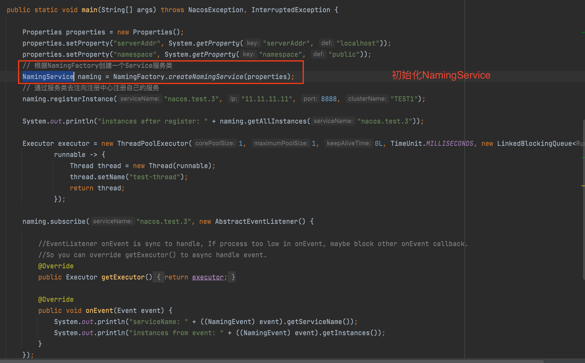
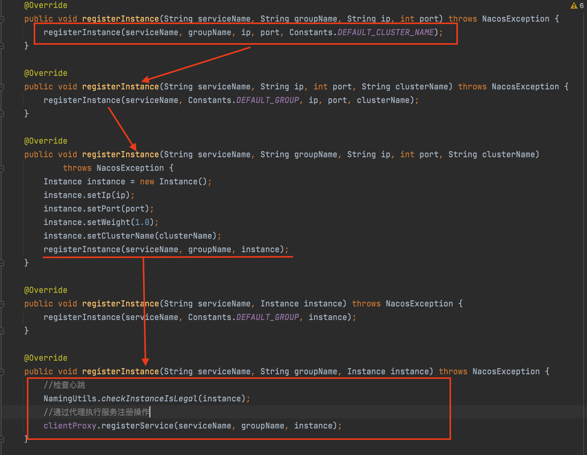
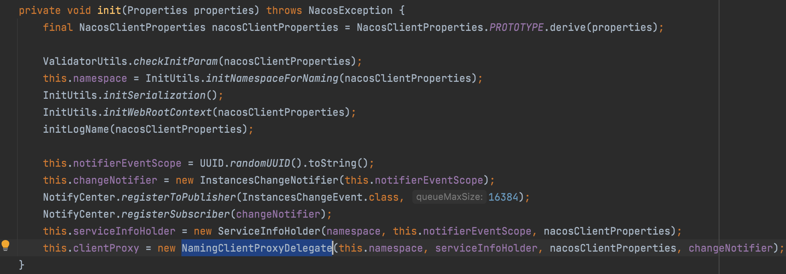
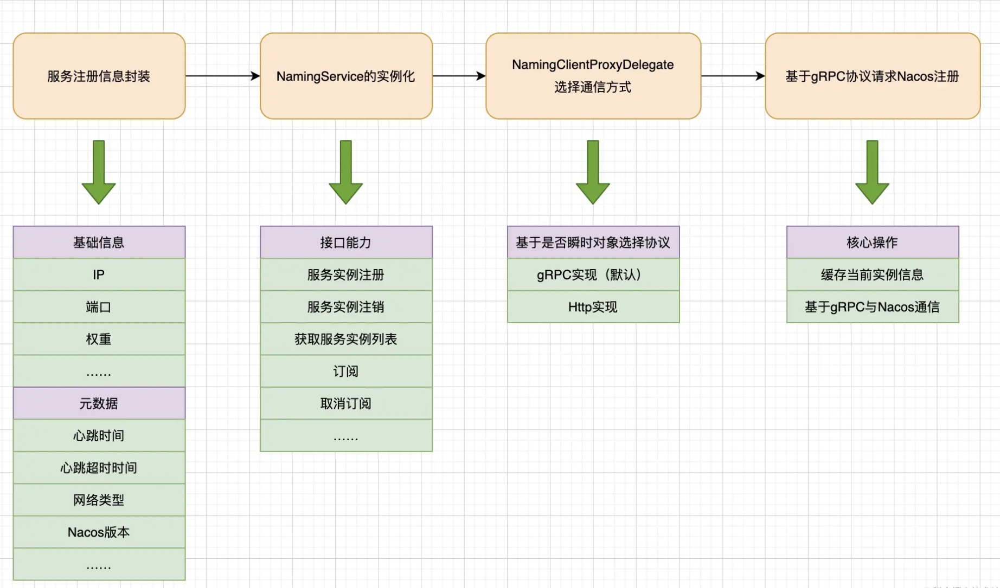

### 深度解析nacos源码之注册中心（服务注册）

### 一、Nacos核心功能点有哪些

#### 1.1 服务注册

Nacos Client 端会通过发送 Rest 请求的方式，向 Nacos Server 端注册自己的服务，提供自身的元数据，比如 ip 地址，端口等信息，Nacos Server 收到注册信息后，就会把这些元数据信息存储到一个双层的内存Map中。

#### 1.2 服务心跳

在服务注册后，Nacos Client 会维护一个定时心跳来持续通知 Nacos Server，说明服务一直处于可用状态，防止被剔除，默认5s发送一次心跳。

#### 1.3 服务健康检查

Nacos Server 会开启一个定时任务，用来检查注册服务实例的健康情况，对与超过15s没有收到客户端心跳的实力，会将它的healthy属性位置false（客户端服务发现的时候不会发现），如果某个势力超过30s没有收到心跳，直接剔除该实例，被踢出的实例如果恢复的话发送心跳重新注册。

#### 1.4 服务发现

Nacos Client 端在调用服务提供者提供的服务时，会发送一个 Rest 请求给 Nacos Server，获取上面注册服务清单，并且缓存Nacos Client本地，同时会在 Nacos Client 本地开启一个定时任务，定时拉去服务端最新的注册表信息，更新到本地缓存。

#### 1.5 服务同步

Nacos Server 集群之间会互相同步实例，用来保证服务信息的唯一性。

#### 1.6 Nacos服务端原理


#### 1.7 Nacos客户端原理


### 二、acos源码之注册中心

#### 2.1 前言

我们这里就是直接使用 nacos 源码中的 example 子项目里面的一个 NamingExample 例子来剖析下服务注册的源码，在解析服务注册源码的时候我们会将整个注册流程从客户端发送注册请求，到Nacos服务端接受注册请求串起来介绍。

##### 2.1.1 client端发送服务注册请求

我们这里就直接以NamingExample里面的这个例子出发

```java
Properties properties = new Properties();
properties.setProperty("serverAddr", System.getProperty("serverAddr", "localhost"));
properties.setProperty("namespace", System.getProperty("namespace", "public"));
// 根据NamingFactory创建一个Service服务类
NamingService naming = NamingFactory.createNamingService(properties);
// 通过服务类去注向注册中心注册自己的服务
naming.registerInstance("nacos.test.3", "11.11.11.11", 8888, "TEST1");
```

这里先是创建一个Properties，塞入两个kv，一个是 serverAddr，一个是 namespace ，这个serverAddr是nacos服务端的地址，可以设置多个，用都好隔开就行，这个 namespace 是命名空间的意思，可以用来区分不同的环境，比如说测试环境，预发布环境，我们看下官方的推荐。

##### 2.1.2 命名空间

用于进行租户力度的配置隔离。不同的命名空间下，可以存在相同的 Group 或 Data ID 的配置。Namespace 的常用场景之一是不同环境的配置的区分隔离，例如开发测试环境和生产环境的资源（如配置，服务）隔离等。

这里我们就不做过多的介绍，接着就是使用NamingFactory这个工厂创建出来的一个NamingService（NacosNamingService），这里不做过多的介绍，我们只介绍NamingService创建的时候，里面都初始化了哪些组件。

1. 示例代码：

   

2. NacosNamingService 实现NamingService，NacosNamingService构建对象初始化的init()方法

```java
// 创建NacosNamingService
public NacosNamingService(Properties properties) throws NacosException {
        init(properties);
    }
// 创建NacosNamingService初始化的条件
private void init(Properties properties) throws NacosException {
  // 配置客户端属性
  final NacosClientProperties nacosClientProperties = NacosClientProperties.PROTOTYPE.derive(properties);

  ValidatorUtils.checkInitParam(nacosClientProperties);
  this.namespace = InitUtils.initNamespaceForNaming(nacosClientProperties);
  // 初始序列化
  InitUtils.initSerialization();
  // 初始化 web root context
  InitUtils.initWebRootContext(nacosClientProperties);
  // 初始化Log日志
  initLogName(nacosClientProperties);
  // 声明事件范围
  this.notifierEventScope = UUID.randomUUID().toString();
  // 实例更改通知
  this.changeNotifier = new (this.notifierEventScope);
  //注册实例到发布者
  NotifyCenter.registerToPublisher(InstancesChangeEvent.class, 16384);
  // 注册订阅通知
  NotifyCenter.registerSubscriber(changeNotifier);
  //服务信息的持有者
  this.serviceInfoHolder = new ServiceInfoHolder(namespace, this.notifierEventScope, nacosClientProperties);
  //命名客户端代理
  this.clientProxy = new NamingClientProxyDelegate(this.namespace, serviceInfoHolder, nacosClientProperties, changeNotifier);
}
```

这是一个客户端注册的一个测试类，它模仿了一个真实的服务注册进Nacos的过程，包括NacosServer链接、实例的创建爱你，实例属性的复制，注册实例，所以在这个其中包含了服务注册的核心代码，仅从此处的代码分析，可以看出，Nacos注册服务实例时，包含了两大类信息：Nacos Server 连接信息和实例信息。

##### 2.1.3  Nacos Server连接信息

Nacos Server连接信息，存储在Properties当中，包含以下信息：

- Server地址：Nacos服务器地址，属性的key为serverAddr；
- 用户名：连接Nacos服务的用户名，属性key为username，默认值为nacos；
- 密码：连接Nacos服务的密码，属性key为password，默认值为nacos；

##### 2.1.4 实例信息

注册实例信息用Instance对象承载，注册的实例信息又分两部分：实例基础信息和元数据。

**实例基础信息包括**：

- instanceId：实例的唯一ID；
- ip：实例IP，提供给消费者进行通信的地址；
- port： 端口，提供给消费者访问的端口；
- weight：权重，当前实例的权限，浮点类型（默认1.0D）；
- healthy：健康状况，默认true；
- enabled：实例是否准备好接收请求，默认true；
- ephemeral：实例是否为瞬时的，默认为true；
- clusterName：实例所属的集群名称；
- serviceName：实例的服务信息；

Instance类包含了实例的基础信息之外，还包含了用于存储元数据metadata（描述数据的数据），类型为HfashMap。


在Instance类中还定义了一些默认信息，这些信息通过get方法提供：

```java
    public long getInstanceHeartBeatInterval() {
        return getMetaDataByKeyWithDefault(PreservedMetadataKeys.HEART_BEAT_INTERVAL,
                Constants.DEFAULT_HEART_BEAT_INTERVAL);
    }
    
    public long getInstanceHeartBeatTimeOut() {
        return getMetaDataByKeyWithDefault(PreservedMetadataKeys.HEART_BEAT_TIMEOUT,
                Constants.DEFAULT_HEART_BEAT_TIMEOUT);
    }
    
    public long getIpDeleteTimeout() {
        return getMetaDataByKeyWithDefault(PreservedMetadataKeys.IP_DELETE_TIMEOUT,
                Constants.DEFAULT_IP_DELETE_TIMEOUT);
    }
    
    public String getInstanceIdGenerator() {
        return getMetaDataByKeyWithDefault(PreservedMetadataKeys.INSTANCE_ID_GENERATOR,
                Constants.DEFAULT_INSTANCE_ID_GENERATOR);
    }
```

```java
public static final String HEART_BEAT_INTERVAL = "preserved.heart.beat.interval";   
public static final String HEART_BEAT_TIMEOUT = "preserved.heart.beat.timeout";
public static final String IP_DELETE_TIMEOUT = "preserved.ip.delete.timeout";
public static final String INSTANCE_ID_GENERATOR = "preserved.instance.id.generator";
```

上面的get方法在需要元数据默认值时会被用到：

- preserved.heart.beat.interval：心跳间隙的key，默认为5s，也就是默认5秒进行一次心跳；
- preserved.heart.beat.timeout：心跳超时的key，默认为15s，也就是默认15秒收不到心跳，实例将会标记为不健康；
- preserved.ip.delete.timeout：实例IP被删除的key，默认为30s，也就是30秒收不到心跳，实例将会被移除；
- preserved.instance.id.generator：实例ID生成器key，默认为simple；

这些都是Nacos默认提供的值，也就是当前实例注册时会告诉Nacos Server说：我的心跳间隙、心跳超时等对应的值是多少，你按照这个值来判断我这个实例是否健康。

有了这些信息，我们基本是已经知道注册实例时需要传递什么参数，需要配置什么参数了。

#### 2.2 核心NamingService接口

NamingService 接口是Nacos命名服务对外提供的一个统一接口，看对应的源码就可以发现，它提供了大量实例相关的接口方法：

1. 服务实例注册：

   ```java
   void registerInstance(...) throws NacosException;
   ```

2. 服务实例注销：

   ```java
   void deregisterInstance(...) throws NacosException;
   ```

3. 查询健康服务实例:

   ```java
   List<Instance> selectInstances(...) throws NacosException;
   ```

4. 查询集群中健康的服务实例

   ```java
   List<Instance> selectInstances(....List<String> clusters....)throws NacosException;
   ```

5. 使用负载均衡策略选择一个健康的服务实例

   ```java
   Instance selectOneHealthyInstance(...) throws NacosException;
   ```

6. 订阅服务事件:

   ```java
   void subscribe(...) throws NacosException;
   ```

7. 取消订阅服务事件:

   ```java
   void unsubscribe(...) throws NacosException;
   ```

8. 获取所有（或指定）服务名称:

   ```java
   ListView<String> getServicesOfServer(...) throws NacosException;
   ```

9. 获取所有订阅的服务:

   ```java
    List<ServiceInfo> getSubscribeServices() throws NacosException;
   ```

10. 获取Nacos服务的状态：

    ```java
    String getServerStatus();
    ```

11. 主动关闭服务:

    ```java
    void shutDown() throws NacosException
    ```

在这些方法中提供了大量的重载方法，应用于不同场景和不同类型实例或服务的筛选，所以我们只需要在不同的情况下使用不同的方法即可。

NamingService 的实例化是通过NamingFactory类和上面的Nacos服务信息，从代码中可以看出这里采用了反射机制来实例化 NamingService，具体的实现类为 NacosNamingService：

```java
public static NamingService createNamingService(Properties properties) throws NacosException {
    try {
        Class<?> driverImplClass = Class.forName("com.alibaba.nacos.client.naming.NacosNamingService");
        Constructor constructor = driverImplClass.getConstructor(Properties.class);
        return (NamingService) constructor.newInstance(properties);
    } catch (Throwable e) {
        throw new NacosException(NacosException.CLIENT_INVALID_PARAM, e);
    }
}
```

#### 2.3 NacosNamingService的实现

在示例代码中使用了NamingService的registerInstance方法来进行服务实例的注册，该方法接受两个参数，服务名称和实例对象。这个方法的最大作用是设置了当前实力的分组信息。我们知道，在Nacos中，通过Namespace，group，Service，Cluster等一层层的将实力进行环境的隔离。这里设置了默认的分组为 "DEFAULT_GROUP"

紧接着调用的 **registerInstance** 方法如下，这个方法实现了两个功能：



 第一，检查心跳时间设置的对不对（心跳默认为5秒）

 第二，通过NamingClientProxy这个代理来执行服务注册操作

```java
@Override
public void registerInstance(String serviceName, String groupName, Instance instance) throws NacosException {
    NamingUtils.checkInstanceIsLegal(instance);//检查心跳
    clientProxy.registerService(serviceName, groupName, instance);//通过代理执行服务注册操作
}
```

通过clientProxy我们发现NamingClientProxy这个代理接口的具体实现是有NamingClientProxyDelegate来完成的，这个可以从NacosNamingService构造方法中来看出。

```java
public NacosNamingService(Properties properties) throws NacosException {
    init(properties);
}
```

初始化在init方法中



#### 2.4 NamingClientProxyDelegate中实现

根据上方的分析和源码的阅读，我们可以发现NamingClientProxy调用registerService实际上调用的就是NamingClientProxyDelegate的对应方法：

```java
 @Override
    public void registerService(String serviceName, String groupName, Instance instance) throws NacosException {
        getExecuteClientProxy(instance).registerService(serviceName, groupName, instance);
    }
```

真正调用注册服务的并不是代理实现类，而是根据当前实例是否为瞬时对象，来选择对应的客户端代理来进行请求的：

如果当前实例为瞬时对象，则采用gRPC协议（NamingGrpcClientProxy）进行请求，否则采用http协议（NamingHttpClientProxy）进行请求。默认为瞬时对象，也就是说，2.0版本中默认采用了gRPC协议进行与Nacos服务进行交互。


```java
@Override
    public void registerService(String serviceName, String groupName, Instance instance) throws NacosException {
        getExecuteClientProxy(instance).registerService(serviceName, groupName, instance);
    }
```

##### 2.4.1 NamingGrpcClientProxy中实现

从Nacos2.0开始，Nacos增加了关于gRPC协议（NamingGrpcClientProxy）的支持，我们主要关注一下registerService方法实现，这里其实做了两件事情：

1. 缓存当前注册的实例信息用于恢复，缓存的数据结构为ConcurrentMap<String, Instance>，key为“serviceName@@groupName”，value就是前面封装的实例信息。
2. 另外一件事就是封装了参数，基于gRPC进行服务的调用和结果的处理。

```java
    @Override
    public void registerService(String serviceName, String groupName, Instance instance) throws NacosException {
        NAMING_LOGGER.info("[REGISTER-SERVICE] {} registering service {} with instance {}", namespaceId, serviceName,
                instance);
      //缓存数据
        redoService.cacheInstanceForRedo(serviceName, groupName, instance);
      //基于gRPC进行服务的调用
        doRegisterService(serviceName, groupName, instance);
    }
```

在注册之前可以看到调用redoService将我们的注册信息在内存中进行缓存。redoService缓存数据后，默认情况下回每隔3s去执行RediScheduleTask任务，如果发现当前连接处于断开状态，则根据缓存中的数据执行实例重新注册和实例订阅的处理。

调用 doRegisterService()之心真正的注册逻辑，通过GRPC请求注册接口，同时调用redoService类，标记缓存中的数据为当前信息已经注册过。

```java
    public void doBatchRegisterService(String serviceName, String groupName, List<Instance> instances)
            throws NacosException {
        BatchInstanceRequest request = new BatchInstanceRequest(namespaceId, serviceName, groupName,
                NamingRemoteConstants.BATCH_REGISTER_INSTANCE, instances);
        requestToServer(request, BatchInstanceResponse.class);
        redoService.instanceRegistered(serviceName, groupName);
    }
```

#####  2.4.2 NamingHttpClientProxy中实现

在Nacos2.0以前，是通过HTTP的方式完成服务的注册，注册代码如下：


对于HTTP方式来说，核心的reqApi是我们需要关注的内容，并且知道了，他向服务端发起了心跳检测任务请求和注册请求2中逻辑。HTTP方式的注册请求代码如下，核心关注的就是他进行了Nacos的域名解析与随机负载请求代码处理：

如果当前支持域名方式的处理，则根据重试的次数请求，直到成功，且达到重试次数。

如果当前不是服务域名方式的处理，则根据服务的数量进行随机轮训请求，直到请求成功，且服务器轮训结束。

```java
    public String reqApi(String api, Map<String, String> params, Map<String, String> body, List<String> servers,
            String method) throws NacosException {
        
        params.put(CommonParams.NAMESPACE_ID, getNamespaceId());
        
        if (CollectionUtils.isEmpty(servers) && !serverListManager.isDomain()) {
            throw new NacosException(NacosException.INVALID_PARAM, "no server available");
        }
        
        NacosException exception = new NacosException();
        
        if (serverListManager.isDomain()) {
            String nacosDomain = serverListManager.getNacosDomain();
            for (int i = 0; i < maxRetry; i++) {
                try {
                    return callServer(api, params, body, nacosDomain, method);
                } catch (NacosException e) {
                    exception = e;
                    if (NAMING_LOGGER.isDebugEnabled()) {
                        NAMING_LOGGER.debug("request {} failed.", nacosDomain, e);
                    }
                }
            }
        } else {
            Random random = new Random();
            int index = random.nextInt(servers.size());
            
            for (int i = 0; i < servers.size(); i++) {
                String server = servers.get(index);
                try {
                    return callServer(api, params, body, server, method);
                } catch (NacosException e) {
                    exception = e;
                    if (NAMING_LOGGER.isDebugEnabled()) {
                        NAMING_LOGGER.debug("request {} failed.", server, e);
                    }
                }
                index = (index + 1) % servers.size();
            }
        }
        
        NAMING_LOGGER.error("request: {} failed, servers: {}, code: {}, msg: {}", api, servers, exception.getErrCode(),
                exception.getErrMsg());
        
        throw new NacosException(exception.getErrCode(),
                "failed to req API:" + api + " after all servers(" + servers + ") tried: " + exception.getMessage());
        
    }
```

##### 2.4.3 总结流程

通过本文分析，可以清楚的知道，对于Nacos客户端注册来说，涉及到的核心关键点如下：

1. Nacos多种通信方式的处理（GRPC or HTTP）
2. GRPC 通信室的 RedoService 缓存数据，任务重做业务处理。
3. HTTP 通信是的向服务端发现心跳任务请求的处理。
4. 通信是采用的委派设计模式的应用等。



### 三、Nacos服务端服务注册制基本处理流程

在Nacos中2.x以前默认情况下客户端采用HTTP的方式进行服务与实例的注册，从2.x开始，对于临时实例则采用支GRPC的方式进行服务注册，持久化实例依然用HTTP方式注册。

#### 3.1 HTTP方式的服务注册

通过阅读官方文档可以知道，对于HTTP注册来说，服务端处理的API地址为：

http://ip:port/nacos/v1/ns/instance/register

##### 3.1.1 服务注册控制器 Controller

查看 naming 模块的 InstanceController 类的接口实现的代码如下所示：

```java
  	@CanDistro
    @PostMapping
    @Secured(action = ActionTypes.WRITE)
    public String register(HttpServletRequest request) throws Exception {
        // 获得当前请求中的命名空间信息，如果不存在则使用默认的命名空间
       final String namespaceId = WebUtils
                .optional(request, CommonParams.NAMESPACE_ID, Constants.DEFAULT_NAMESPACE_ID);
      // 获得当前请求中的服务名称，如果不存在则使用默认的服务名称
       final String serviceName = WebUtils.required(request, CommonParams.SERVICE_NAME);
      // 检查服务名称是否合法  
      NamingUtils.checkServiceNameFormat(serviceName);
       // 将当前信息构造为一个Instance实例对象
      final Instance instance = HttpRequestInstanceBuilder.newBuilder()
                .setDefaultInstanceEphemeral(switchDomain.isDefaultInstanceEphemeral()).setRequest(request).build();
       // 根据当前对GRPC的支持情况 调用符合条件的处理，支持GRPC特征则调用InstanceOperatorClientImpl
       getInstanceOperator().registerInstance(namespaceId, serviceName, instance);
       NotifyCenter.publishEvent(new RegisterInstanceTraceEvent(System.currentTimeMillis(), "", false, namespaceId,
                NamingUtils.getGroupName(serviceName), NamingUtils.getServiceName(serviceName), instance.getIp(),
                instance.getPort()));
        return "ok";
    }
```

对于最后一行的getInstanceOperator()方法，就是根据当前对GRPC的支持选择：

- 如果当前支持GRPC，则调用V2版本的InstanceOperatorClientImpl类的registerInstance方法
- 如果当前不支持GRPC特征，则调用V1版本的InstanceOperatorServiceImpl类的registerInstance方法

这里我们看V1版本的逻辑，service层的代码如下：

```java
 @Override
 public void registerInstance(String namespaceId, String serviceName, Instance instance) throws NacosException {
        NamingUtils.checkInstanceIsLegal(instance);
        boolean ephemeral = instance.isEphemeral();
        String clientId = IpPortBasedClient.getClientId(instance.toInetAddr(), ephemeral);
        createIpPortClientIfAbsent(clientId);
        Service service = getService(namespaceId, serviceName, ephemeral);
        clientOperationService.registerInstance(service, instance, clientId);
 }
```

这个方法中，核心的逻辑在服务创建的createEmptyService方法、实例创建的addInstance方法

##### 3.1.2 服务信息Service创建

调用关系处理如下：

```java
createEmptyService
		createServiceIfAbsent
				putServiceAndInit
        addOrReplaceService
```

其中createEmptyService方法中createServiceIfAbsent的核心逻辑

```java
 public void createServiceIfAbsent(String namespaceId, String serviceName, boolean local, Cluster cluster)
            throws NacosException {
        //从缓存中获取服务信息
        Service service = getService(namespaceId, serviceName);
        if (service == null) {
            
            Loggers.SRV_LOG.info("creating empty service {}:{}", namespaceId, serviceName);
            //初始化service
            service = new Service();
            service.setName(serviceName);
            service.setNamespaceId(namespaceId);
            service.setGroupName(NamingUtils.getGroupName(serviceName));
            // now validate the service. if failed, exception will be thrown
            service.setLastModifiedMillis(System.currentTimeMillis());
            service.recalculateChecksum();
            if (cluster != null) {
                //关联服务和集群的关系
                cluster.setService(service);
                service.getClusterMap().put(cluster.getName(), cluster);
            }
            //校验服务名称等是否合规
            service.validate();
            //初始话服务信息，创建心跳检测任务
            putServiceAndInit(service);
            if (!local) {
                //是否是临时服务，一致性处理
                addOrReplaceService(service);
            }
        }
```

在putServiceAndInit方法中的核心逻辑就是将当前服务信息放置到缓存中，同时调用初始化方法开启服务端的心跳检测任务，用于判断当前服务下的实例信息的变化，如果有变化则同时客户端.

```java
public void init() {
		// 开启当前服务的心跳检测任务
    HealthCheckReactor.scheduleCheck(clientBeatCheckTask);
    for (Map.Entry<String, Cluster> entry : clusterMap.entrySet()) {
        entry.getValue().setService(this);
        entry.getValue().init();
    }
}
```

对于clientBeatCheckTask任务的具体实现后续在进行说明。

##### 3.1.3 服务实例信息Instance创建

调用关系处理如下：

```java
addInstance
		addIpAddresses
		consistencyService.put(key, instances)
```

addInstance方法核心逻辑说明如下所示：

```java
public void addInstance(String namespaceId, String serviceName, boolean ephemeral, Instance... ips)
        throws NacosException {
    //构建key
    String key = KeyBuilder.buildInstanceListKey(namespaceId, serviceName, ephemeral);
    //从缓存中获得服务信息
    Service service = getService(namespaceId, serviceName);
    //为服务设置一把锁
    synchronized (service) {
        //这个方法里面就是最核心的对命名空间->服务->cluster->instance
        //基于这套数据结构和模型完成内存服务注册,就是在这里
        List<Instance> instanceList = addIpAddresses(service, ephemeral, ips);
        
        Instances instances = new Instances();
        instances.setInstanceList(instanceList);
        // 真正你的Distro协议生效，主要是在这里，会去走distro的put逻辑
        // 会把你的服务实例数据页放在内存里,同时发起一个延迟异步任务的sync的数据复制任务
        // 延迟一段时间
        consistencyService.put(key, instances);
    }
}
```

对于addIpAddresses方法来说，核心的就是创建起相关的关联关系

```java
public List<Instance> updateIpAddresses(Service service, String action, boolean ephemeral, Instance... ips)
        throws NacosException {
    
    Datum datum = consistencyService
            .get(KeyBuilder.buildInstanceListKey(service.getNamespaceId(), service.getName(), ephemeral));
    
    List<Instance> currentIPs = service.allIPs(ephemeral);
    Map<String, Instance> currentInstances = new HashMap<>(currentIPs.size());
    Set<String> currentInstanceIds = CollectionUtils.set();
    
    for (Instance instance : currentIPs) {
        currentInstances.put(instance.toIpAddr(), instance);
        currentInstanceIds.add(instance.getInstanceId());
    }
    
    Map<String, Instance> instanceMap;
    if (datum != null && null != datum.value) {
        instanceMap = setValid(((Instances) datum.value).getInstanceList(), currentInstances);
    } else {
        instanceMap = new HashMap<>(ips.length);
    }
    
    for (Instance instance : ips) {
        if (!service.getClusterMap().containsKey(instance.getClusterName())) {
            Cluster cluster = new Cluster(instance.getClusterName(), service);
            cluster.init();
            service.getClusterMap().put(instance.getClusterName(), cluster);
            Loggers.SRV_LOG
                    .warn("cluster: {} not found, ip: {}, will create new cluster with default configuration.",
                            instance.getClusterName(), instance.toJson());
        }
        
        if (UtilsAndCommons.UPDATE_INSTANCE_ACTION_REMOVE.equals(action)) {
            instanceMap.remove(instance.getDatumKey());
        } else {
            Instance oldInstance = instanceMap.get(instance.getDatumKey());
            if (oldInstance != null) {
                instance.setInstanceId(oldInstance.getInstanceId());
            } else {
                instance.setInstanceId(instance.generateInstanceId(currentInstanceIds));
            }
            instanceMap.put(instance.getDatumKey(), instance);
        }
        
    }
    
    if (instanceMap.size() <= 0 && UtilsAndCommons.UPDATE_INSTANCE_ACTION_ADD.equals(action)) {
        throw new IllegalArgumentException(
                "ip list can not be empty, service: " + service.getName() + ", ip list: " + JacksonUtils
                        .toJson(instanceMap.values()));
    }
    
    return new ArrayList<>(instanceMap.values());
}
```

该方法结束以后，命名空间->服务->cluster->instance，这个存储结构的关系就确定了。

#### 二、GRPC方式的服务注册

对于V2版本的服务端的服务注册的实现类，会由InstanceOperatorClientImpl类进行处理。


